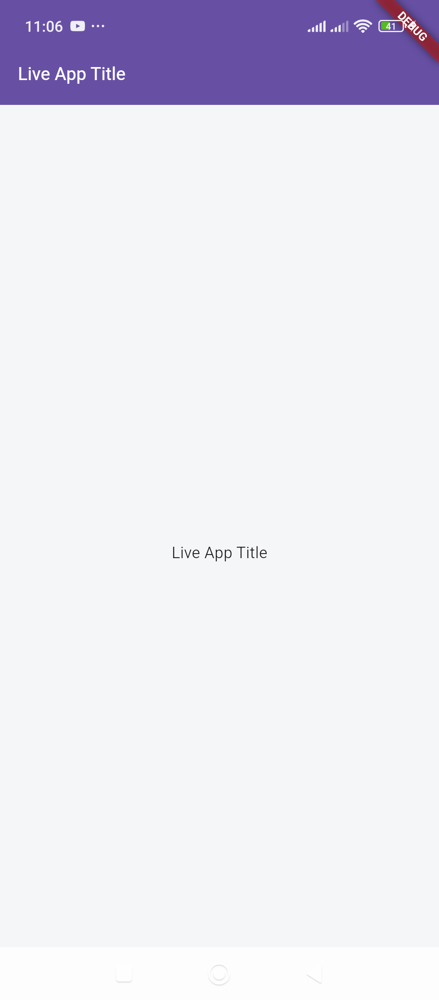

`lib/utils/Constants.dart`

```dart
class Constants {

  static const String SERVER_DOMAIN= "http://192.168.0.108:8000";

  static const String BASE_URL = SERVER_DOMAIN + "/api";

  static const String HOME_ROUTE = "/home";
}
```

`lib/models/HomeResponse.dart`

```dart
class HomeResponse {
  final String app_name;

  HomeResponse({
    required this.app_name,
  });

  factory HomeResponse.fromJson(Map<String, dynamic> json) {
    return HomeResponse(
      app_name: json['app_name']
    );
  }
}
```

`lib/services/HomeService.dart`

```dart
import 'dart:convert';
import 'package:http/http.dart' as http;
import 'package:shared_preferences/shared_preferences.dart';
import '../models/HomeResponse.dart';
import '../utils/Constants.dart';

class HomeService {
  static const String apiUrl = Constants.BASE_URL + Constants.HOME_ROUTE;

  static const String _tokenKey = 'auth_token';

  /// Load token
  static Future<String?> getToken() async {
    final prefs = await SharedPreferences.getInstance();
    return prefs.getString(_tokenKey);
  }

  /// Auth headers
  static Future<Map<String, String>> authHeaders() async {
    final token = await getToken();
    return {
      "Content-Type": "application/json",
      "Accept": "application/json",
      if (token != null) "Authorization": "Bearer $token",
    };
  }

  static Future<HomeResponse> fetchHome() async {
    final response = await http.get(
      Uri.parse(apiUrl),
      // headers: await authHeaders(),
    );

    if (response.statusCode == 200) {
      final body = jsonDecode(response.body);
      return HomeResponse.fromJson(body['data']);
    } else {
      throw Exception('Home API failed');
    }
  }
}
```

`lib/screens/HomeScreen.dart`

```dart
import 'package:device_region/device_region.dart';
import 'package:flutter/material.dart';
import 'package:untitled/services/HomeService.dart';

import 'models/HomeResponse.dart';

class HomeScreen extends StatefulWidget {
  final String title;

  const HomeScreen({super.key, required this.title});

  @override
  State<HomeScreen> createState() => _HomeScreenState();
}

class _HomeScreenState extends State<HomeScreen> {

  @override
  Widget build(BuildContext context) {
    return FutureBuilder<HomeResponse>(
      future: HomeService.fetchHome(),
      builder: (context, snapshot) {

        if (!snapshot.hasData) {

          print("Error : " + snapshot.error.toString());

          return const Scaffold(
            body: Center(child: CircularProgressIndicator()),
          );
        }

        final data = snapshot.data!;

        return PopScope(
            canPop: false, // 🔥 prevents system back
            onPopInvoked: (didPop) {
              // This will not pop because canPop is false
            },
            child: Scaffold(
              backgroundColor: const Color(0xffF4F6F8),

              appBar: AppBar(
                automaticallyImplyLeading: false,
                // backgroundColor: Colors.black,
                backgroundColor: Theme.of(context).primaryColor,
                foregroundColor: Colors.white,
                // title: Image.network(data.logo, height: 28),
                title: Row(
                  children: [
                    // Image.network(data.logo, height: 28),
                    // const SizedBox(width: 8),
                    Expanded(
                      child: Text(
                        data.app_name,
                        overflow: TextOverflow.ellipsis,
                        style: const TextStyle(
                          fontSize: 16,
                          fontWeight: FontWeight.w600,
                        ),
                      ),
                    ),
                  ],
                ),
              ),

              body: Center(
                child: Text(data.app_name,),
              ),
            )
        );
      },
    );
  }
}
```

