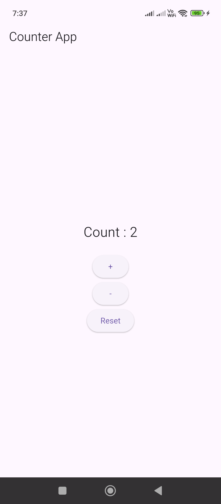

# Folder Setup

lib -> screens

lib -> provider

# 1 . `Counter.dart`

```dart
import 'package:flutter/cupertino.dart';

class Counter extends ChangeNotifier {

  int counter = 0;

  void increment() {
    counter++;
    notifyListeners();
  }

  void decrement() {
    counter--;
    notifyListeners();
  }

  void reset() {
    counter = 0;
    notifyListeners();
  }

}
```

# 2 . `HomeScreen.dart`

```dart
import 'package:flutter/material.dart';
import 'package:provider/provider.dart';

import '../provider/Counter.dart';

class HomeScreen extends StatefulWidget {

  final String title;

  const HomeScreen({super.key, required this.title});

  @override
  State<HomeScreen> createState() => _HomeScreenState();
}

class _HomeScreenState extends State<HomeScreen> {

  @override
  Widget build(BuildContext context) {
    final counter = context.watch<Counter>();

    return Scaffold(
      appBar: AppBar(title: Text(widget.title)),
      body: Center(
        child: Column(
          mainAxisAlignment: MainAxisAlignment.center,
          children: [
            Text('Count : ${counter.counter}', style: TextStyle(fontSize: 24)),
            const SizedBox(height: 20),
            ElevatedButton(
              onPressed: () => context.read<Counter>().increment(),
              child: const Text("+"),
            ),
            ElevatedButton(
              onPressed: () => context.read<Counter>().decrement(),
              child: const Text("-"),
            ),
            ElevatedButton(
              onPressed: () => context.read<Counter>().reset(),
              child: const Text("Reset"),
            ),
          ],
        ),
      ),
    );
  }
}
```

# 3 - `main.dart`

```dart
import 'package:flutter/material.dart';
import 'package:provider/provider.dart';
import 'package:untitled1/provider/Counter.dart';
import 'package:untitled1/screens/HomeScreen.dart';

void main() {
  // runApp(const MyApp());

  runApp(
    ChangeNotifierProvider(
      create: (_) => Counter(),
      child: const MyApp(),
    ),
  );
}

class MyApp extends StatelessWidget {
  const MyApp({super.key});

  // This widget is the root of your application.
  @override
  Widget build(BuildContext context) {
    return MaterialApp(
      debugShowCheckedModeBanner: false,
      home: HomeScreen(title: 'Counter App'),
    );
  }
}
```




