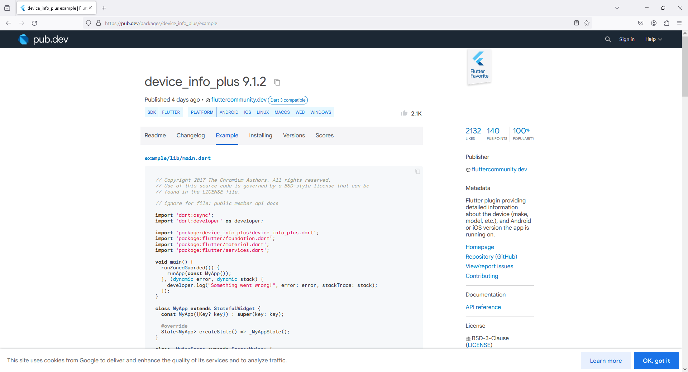

```dart
import 'package:device_info_plus/device_info_plus.dart';

// Get Device Info
DeviceInfoPlugin deviceInfo = DeviceInfoPlugin();
String _deviceName = '';

void getDeviceName() async {

  try {

    if(Platform.isAndroid)
    {

      AndroidDeviceInfo androidInfo = await deviceInfo.androidInfo;

      // e.g. "Moto G (4)"
      _deviceName = androidInfo.model;

    }
    else if(Platform.isIOS)
    {

      IosDeviceInfo iosInfo = await deviceInfo.iosInfo;

      // e.g. "iPod7,1"
      _deviceName = iosInfo.utsname.machine;

    }

  }
  catch (e) {

  }

}
```
