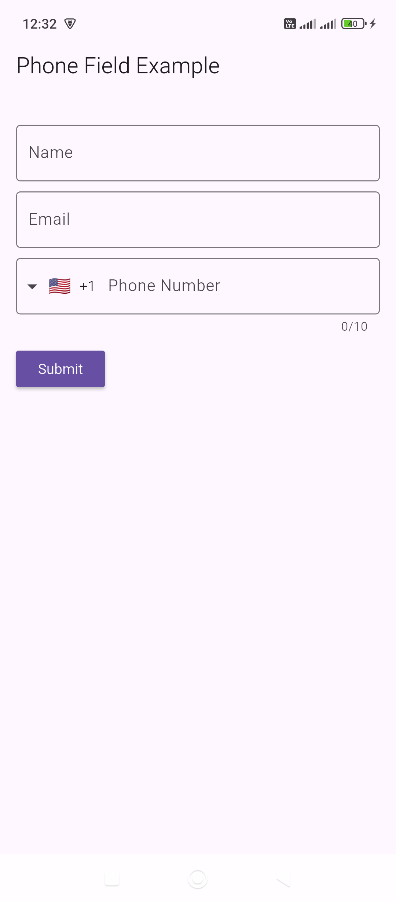
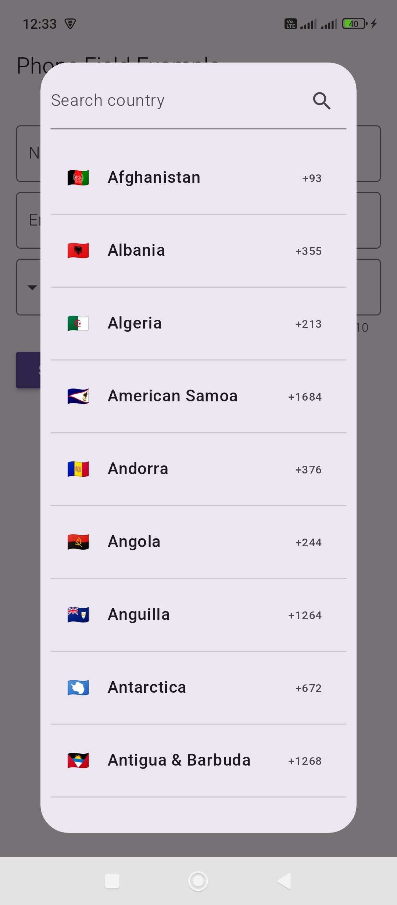
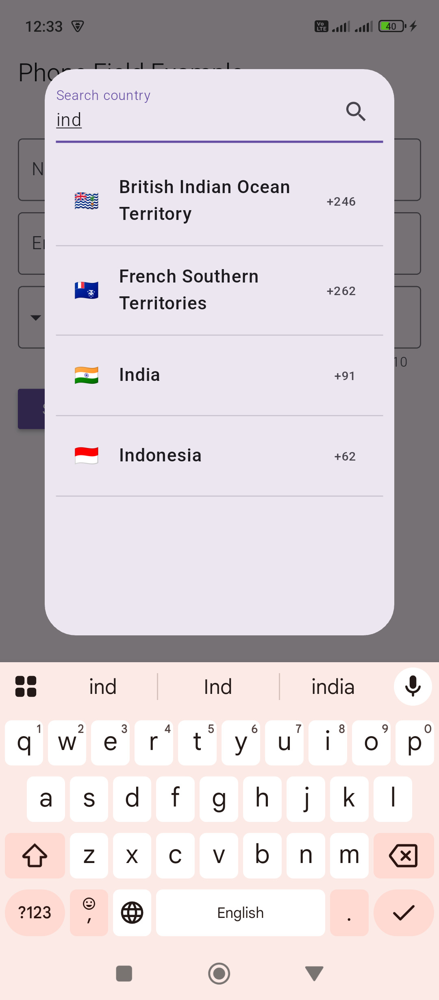
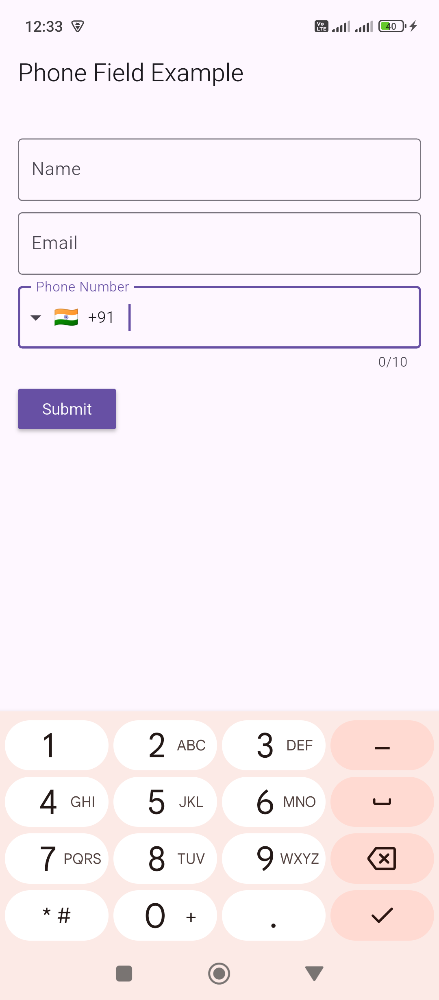
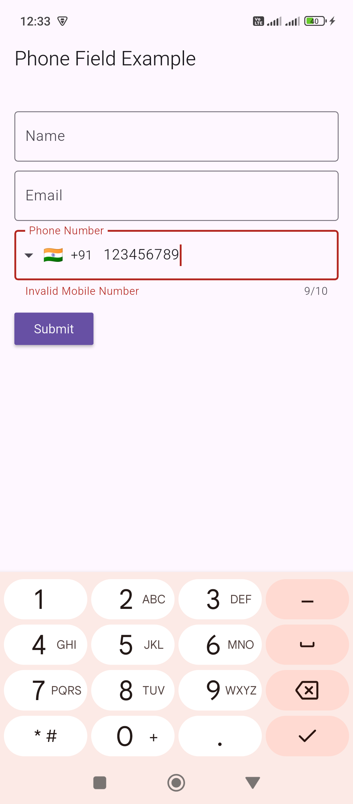
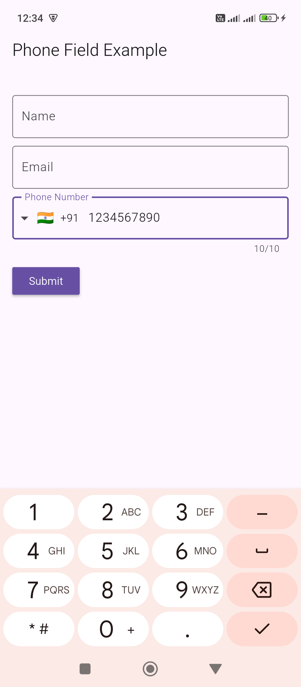

```
https://pub.dev/packages/intl_phone_field
```

`RegisterScreen.dart`

```
import 'package:flutter/material.dart';

import 'package:intl_phone_field/intl_phone_field.dart';

class RegisterScreen extends StatefulWidget {
  const RegisterScreen({super.key});

  @override
  State<RegisterScreen> createState() => _RegisterScreenState();
}

class _RegisterScreenState extends State<RegisterScreen> {

  GlobalKey<FormState> _formKey = GlobalKey();

  FocusNode focusNode = FocusNode();

  @override
  Widget build(BuildContext context) {
    return Scaffold(
      appBar: AppBar(
        title: Text('Phone Field Example'),
      ),
      body: Padding(
        padding: const EdgeInsets.symmetric(horizontal: 16.0),
        child: Form(
          key: _formKey,
          child: Column(
            crossAxisAlignment: CrossAxisAlignment.start,
            children: <Widget>[
              SizedBox(height: 30),
              TextField(
                decoration: InputDecoration(
                  labelText: 'Name',
                  border: OutlineInputBorder(
                    borderSide: BorderSide(),
                  ),
                ),
              ),
              SizedBox(
                height: 10,
              ),
              TextField(
                decoration: InputDecoration(
                  labelText: 'Email',
                  border: OutlineInputBorder(
                    borderSide: BorderSide(),
                  ),
                ),
              ),
              SizedBox(
                height: 10,
              ),
              IntlPhoneField(
                focusNode: focusNode,
                decoration: InputDecoration(
                  labelText: 'Phone Number',
                  border: OutlineInputBorder(
                    borderSide: BorderSide(),
                  ),
                ),
                languageCode: "en",
                onChanged: (phone) {
                  print(phone.completeNumber);
                },
                onCountryChanged: (country) {
                  print('Country changed to: ' + country.name);
                },
              ),
              SizedBox(
                height: 10,
              ),
              MaterialButton(
                child: Text('Submit'),
                color: Theme.of(context).primaryColor,
                textColor: Colors.white,
                onPressed: () {
                  _formKey.currentState?.validate();
                },
              ),
            ],
          ),
        ),
      ),
    );
  }
}
```








