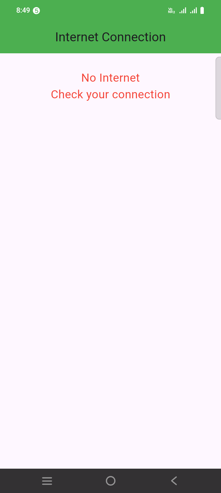
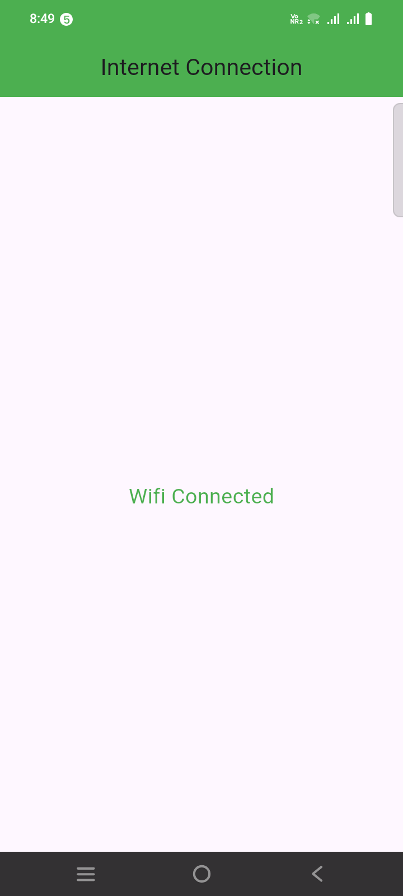
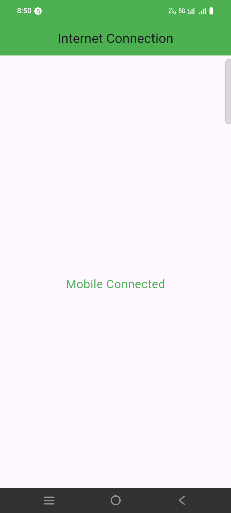

###  How to check Internet Connection in Flutter App? (Android & IOS) 
```
https://www.youtube.com/watch?v=JxG252-ERv0
```

```yaml
connectivity_plus: ^4.0.1
```

```dart
import "package:connectivity_plus/connectivity_plus.dart";
import "package:flutter/material.dart";

class HomeScreen extends StatefulWidget {
  const HomeScreen({super.key});

  @override
  State<HomeScreen> createState() => _HomeScreenState();
}

class _HomeScreenState extends State<HomeScreen> {

  @override
  Widget build(BuildContext context) {
    return Scaffold(
      appBar: AppBar(
        title: Text("Internet Connection"),
        backgroundColor: Colors.green,
        centerTitle: true,
      ),
      body: Container(
        margin: EdgeInsets.all(28),
        width: double.infinity,
        height: double.infinity,
        child: StreamBuilder(
            stream: Connectivity().onConnectivityChanged,
            builder: (context, AsyncSnapshot<ConnectivityResult> snapshot) {

              print(snapshot.toString());

              if(snapshot.hasData) {
                ConnectivityResult? result = snapshot.data;

                if(result == ConnectivityResult.mobile) {
                  // connected to mobile internet
                  return connected("Mobile");
                } else if (result == ConnectivityResult.wifi) {
                  // connected to wifi internet
                  return connected("Wifi");
                } else {
                  // no internet
                  return noInternet();
                }
              }
              else {
                // show loading
                return loading();
              }

            }
        ),
      ),
    );
  }

  Widget loading() {
    return Center(
      child: CircularProgressIndicator(
          valueColor: AlwaysStoppedAnimation<Color>(Colors.green)
      ),
    );
  }

  Widget connected(String type) {
    return Center(
      child: Text(
        "$type Connected",
        style: TextStyle(color: Colors.green, fontSize: 20)
      ),
    );
  }

  Widget noInternet() {
    return Column(
      children: [
        Text(
            "No Internet",
            style: TextStyle(color: Colors.red, fontSize: 20)
        ),
        Text(
            "Check your connection",
            style: TextStyle(color: Colors.red, fontSize: 20)
        ),
      ],
    );
  }
}
```



