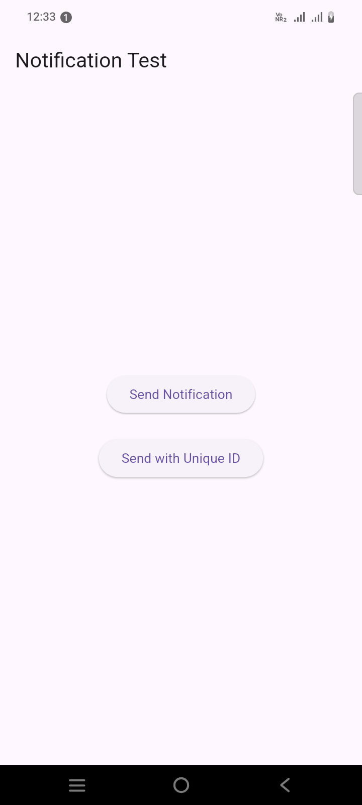
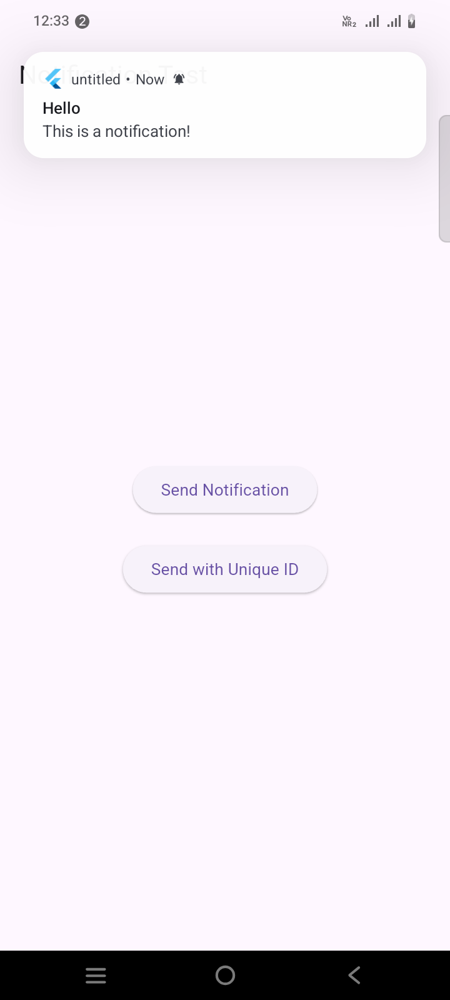
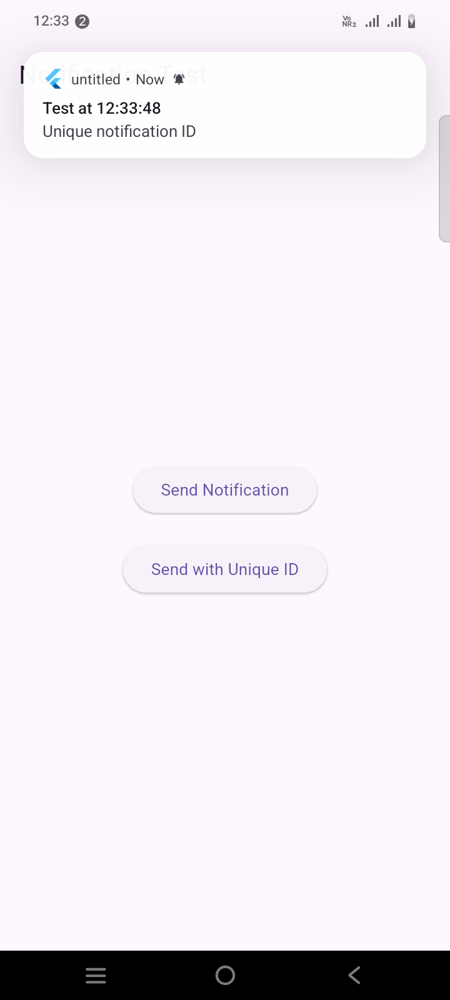

```
https://pub.dev/packages/flutter_local_notifications
```

# 🔔📱 Local Notifications • Flutter Tutorial 
```
https://www.youtube.com/watch?v=uKz8tWbMuUw
```

Add notification permission to `android/app/src/main/AndroidManifest.xml`:

```xml
<manifest xmlns:android="http://schemas.android.com/apk/res/android">
    <!-- Add these permissions -->
    <uses-permission android:name="android.permission.VIBRATE" />
    <uses-permission android:name="android.permission.RECEIVE_BOOT_COMPLETED"/>
    
    <!-- For Android 13+ (API 33+) -->
    <uses-permission android:name="android.permission.POST_NOTIFICATIONS" />
    
    <application>
        <!-- ... rest of your app ... -->
    </application>
</manifest>
```

`NotificationService.dart`
```dart
import 'package:flutter_local_notifications/flutter_local_notifications.dart';
import 'package:permission_handler/permission_handler.dart'; // Add this package

class NotificationService {
  // Singleton instance
  static final NotificationService _instance = NotificationService._internal();
  factory NotificationService() => _instance;
  NotificationService._internal();

  final _notificationsPlugin = FlutterLocalNotificationsPlugin();
  bool _isInitialized = false;

  bool get isInitialized => _isInitialized;

  Future<void> _requestPermissions() async {
    // For Android 13+
    if (await Permission.notification.isDenied) {
      final status = await Permission.notification.request();
      print('Notification permission status: $status');
    }
  }

  // Initialize
  Future<void> initNotification() async {
    if (_isInitialized) return; // prevent re-initialization

    // Request permission for Android 13+
    await _requestPermissions();

    // prepare android init settings
    const initSettingsAndroid = AndroidInitializationSettings('@mipmap/ic_launcher');

    // prepare ios init settings
    const initSettingsIOS = DarwinInitializationSettings(
      requestAlertPermission: true,
      requestBadgePermission: true,
      requestSoundPermission: true,
    );

    // init settings
    const initSettings = InitializationSettings(
      android: initSettingsAndroid,
      iOS: initSettingsIOS,
    );

    // finally, initialize the plugin!
    await _notificationsPlugin.initialize(settings: initSettings);
    _isInitialized = true;
    print('Notification service initialized');
  }

  // Notification Detail Setup
  NotificationDetails notificationDetails() {
      return const NotificationDetails(
        android: AndroidNotificationDetails(
            'daily_channel_id',
            'Daily Notification',
            channelDescription: 'Daily Notification Channel',
            importance: Importance.max,
            priority: Priority.high
        ), // Android Notification Detail
        iOS: DarwinNotificationDetails(),
      );
  }

  // Show Notification
  Future<void> showNotification({
    int id = 0,
    String? title,
    String? body,
  }) async {

    try {
      // Ensure initialization before showing notification
      if (!_isInitialized) {
        await initNotification();
      }

      // Ensure unique ID to prevent conflicts
      final int notificationId = id == 0
          ? DateTime.now().millisecondsSinceEpoch ~/ 1000
          : id;

      print('📤 Showing notification: $title - $body (ID: $notificationId)');

      print('✅ Notification shown successfully');

      return _notificationsPlugin.show(
        id: id,
        title: title,
        body: body,
        notificationDetails: notificationDetails(), // ✅ Fixed: Use configured details
      );
      
    }
    catch (e) {
      print('❌ Error showing notification: $e');
    }

  }

  // For debugging - check if channel exists
  Future<void> checkChannelExists() async {
    try {
      final bool? exists = await _notificationsPlugin
          .resolvePlatformSpecificImplementation<
          AndroidFlutterLocalNotificationsPlugin>()
          ?.areNotificationsEnabled();
      print('🔔 Notifications enabled: $exists');
    } catch (e) {
      print('❌ Error checking channel: $e');
    }
  }

  // On Notification Tap

}
```

`HomeScreen.dart`
```dart
import 'package:flutter/material.dart';
import 'package:untitled/NotificationService.dart';

class HomeScreen extends StatefulWidget {
  const HomeScreen({super.key});

  @override
  State<HomeScreen> createState() => _HomeScreenState();
}

class _HomeScreenState extends State<HomeScreen> {
  final NotificationService _notificationService = NotificationService();

  @override
  void initState() {
    super.initState();
    _initNotifications();
  }

  Future<void> _initNotifications() async {
    await _notificationService.initNotification();
    await _notificationService.checkChannelExists(); // For debugging
  }

  @override
  Widget build(BuildContext context) {
    return Scaffold(
      appBar: AppBar(title: const Text('Notification Test')),
      body: Center(
        child: Column(
          mainAxisAlignment: MainAxisAlignment.center,
          children: [
            ElevatedButton(
              onPressed: () {
                print("🟢 Button pressed");
                _notificationService.showNotification(
                    title: "Hello",
                    body: "This is a notification!"
                );
              },
              child: const Text("Send Notification"),
            ),
            const SizedBox(height: 20),
            ElevatedButton(
              onPressed: () async {
                // Test with custom ID and current time
                await _notificationService.showNotification(
                    id: DateTime.now().millisecondsSinceEpoch ~/ 1000,
                    title: "Test at ${DateTime.now().toString().substring(11, 19)}",
                    body: "Unique notification ID"
                );
              },
              child: const Text("Send with Unique ID"),
            ),
          ],
        ),
      ),
    );
  }
}
```

`main.dart`
```dart
import 'package:flutter/material.dart';
import 'package:untitled/NotificationService.dart';
import 'package:untitled/screens/HomeScreen.dart';

void main() {
  WidgetsFlutterBinding.ensureInitialized();

  // Init Notifications
  NotificationService().initNotification();

  runApp(const MyApp());
}

class MyApp extends StatelessWidget {
  const MyApp({Key? key}) : super(key: key);

  @override
  Widget build(BuildContext context) {
    return MaterialApp(
      debugShowCheckedModeBanner: false,
      home: HomeScreen()
    );
  }
}
```




