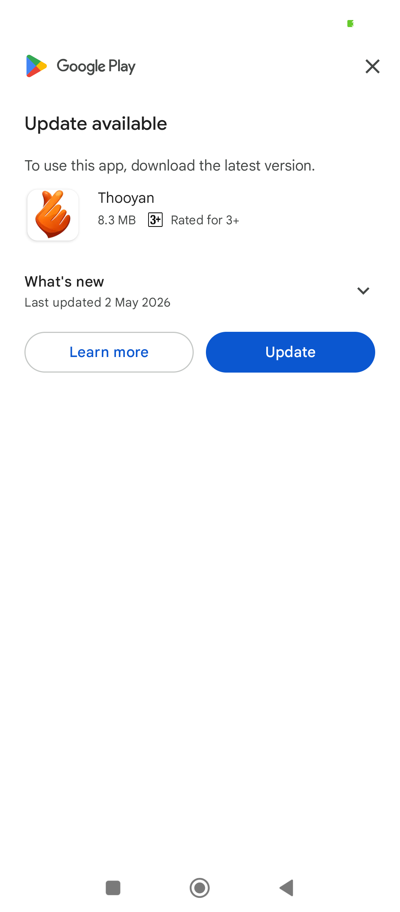

# `SplashScreen.dart`

```dart
import 'dart:developer';

import 'package:flutter/material.dart';
import 'package:in_app_update/in_app_update.dart';
import 'package:package_info_plus/package_info_plus.dart';
import 'dart:async';

import '../services/AuthService.dart';
import 'auth/LockScreen.dart';
import 'auth/MobileNumberScreen.dart';

class SplashScreen extends StatefulWidget {
  @override
  _SplashScreenState createState() => _SplashScreenState();
}

class _SplashScreenState extends State<SplashScreen> {

  String appVersion = "";

  @override
  void initState() {
    super.initState();

    _checkForUpdate();
    loadVersion();
    // startApp();
    _init(); // ✅ call async method separately

    // Timer(Duration(seconds: 3), () {
    //   // Navigate to HomeScreen
    //   Navigator.pushReplacement(
    //     context,
    //     MaterialPageRoute(builder: (context) => MobileNumberScreen()),
    //   );
    // });
  }

  Future<void> _init() async {
    await loadVersion();

    bool canContinue = await _checkForUpdate();

    if (canContinue) {
      startApp();
    }
  }

  Future<bool> _checkForUpdate() async {
    log('Checking for Update!');

    try {
      AppUpdateInfo info = await InAppUpdate.checkForUpdate();

      if (info.updateAvailability == UpdateAvailability.updateAvailable) {
        if (info.immediateUpdateAllowed) {
          log('Immediate update allowed');

          await _update();

          // ❗ Do NOT continue app until update completes
          // ❗ Block app flow
          return false;
        }
      }
    } catch (error) {
      log(error.toString());
    }

    // ✅ No update → continue app
    return true;
  }

  Future<void> _update() async {
    log('Performing immediate update');

    try {
      await InAppUpdate.performImmediateUpdate();
    } catch (e) {
      log("Immediate update error: $e");
    }
  }

  Future<void> loadVersion() async {
    PackageInfo packageInfo = await PackageInfo.fromPlatform();

    setState(() {
      appVersion =
      "Version ${packageInfo.version}+${packageInfo.buildNumber}";
    });
  }

  void startApp() async {
    await Future.delayed(Duration(seconds: 3));

    if (!mounted) return; // ✅ Prevent crash

    checkLogin();
  }

  void checkLogin() async {
    final token = await AuthService.getToken();

    // print("Check Login: $token");

    if (!mounted) return; // ✅ Important

    if (token != null && token.isNotEmpty) {
      Navigator.pushReplacement(
        context,
        MaterialPageRoute(builder: (_) => LockScreen()),
      );
    } else {
      Navigator.pushReplacement(
        context,
        MaterialPageRoute(builder: (_) => MobileNumberScreen()),
      );
    }
  }

  @override
  Widget build(BuildContext context) {
    return Scaffold(
      backgroundColor: Colors.white,
      body: SafeArea(
          child: Stack(
            children: [

              Center(
                child: Image.asset(
                  'assets/thooyan_logo.png',
                  width: 150,
                ),
              ),

              Positioned(
                bottom: 30,
                left: 0,
                right: 0,
                child: Text(
                  appVersion,
                  textAlign: TextAlign.center,
                  style: TextStyle(
                    fontSize: 14,
                    color: Colors.grey,
                  ),
                ),
              ),
            ],
          )
      ),
    );
  }
}
```

