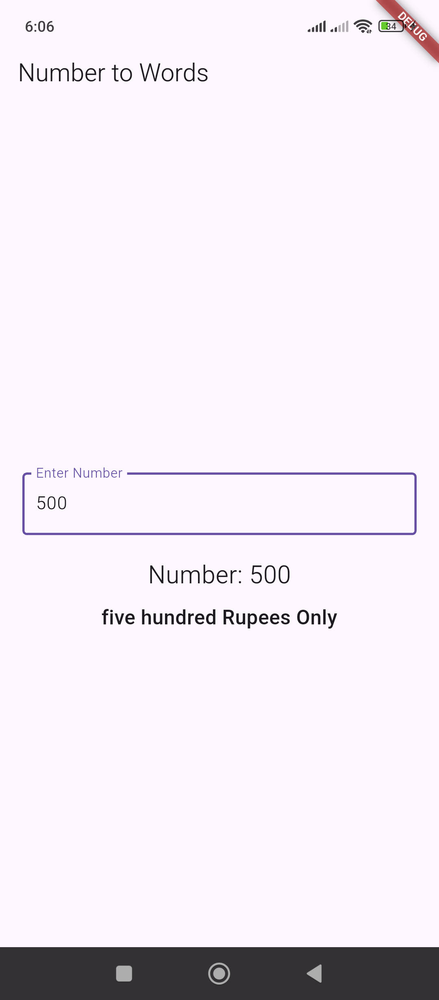

```
https://pub.dev/packages/number_to_words_english
```

```php
import 'package:flutter/material.dart';
import 'package:number_to_words_english/number_to_words_english.dart';

class HomeScreen extends StatefulWidget {
  const HomeScreen({super.key});

  @override
  State<HomeScreen> createState() => _HomeScreenState();
}

class _HomeScreenState extends State<HomeScreen> {
  final TextEditingController _controller = TextEditingController();

  String numberText = '';
  String words = '';

  void _convertNumber(String value) {
    setState(() {
      numberText = value;

      if (value.isEmpty) {
        words = '';
      } else {
        int number = int.tryParse(value) ?? 0;
        words = NumberToWordsEnglish.convert(number) + " Rupees Only";
      }
    });
  }

  @override
  Widget build(BuildContext context) {
    return MaterialApp(
      home: Scaffold(
        appBar: AppBar(title: const Text('Number to Words')),
        body: Padding(
          padding: const EdgeInsets.all(20),
          child: Column(
            mainAxisAlignment: MainAxisAlignment.center,
            children: [
              TextField(
                controller: _controller,
                keyboardType: TextInputType.number,
                decoration: const InputDecoration(
                  border: OutlineInputBorder(),
                  labelText: 'Enter Number',
                ),
                onChanged: _convertNumber,
              ),
              const SizedBox(height: 20),

              Text(
                'Number: $numberText',
                style: const TextStyle(fontSize: 22),
              ),
              const SizedBox(height: 10),

              Text(
                words.isEmpty ? 'Words will appear here' : words,
                textAlign: TextAlign.center,
                style: const TextStyle(
                  fontSize: 18,
                  fontWeight: FontWeight.bold,
                ),
              ),
            ],
          ),
        ),
      ),
    );
  }
}
```


