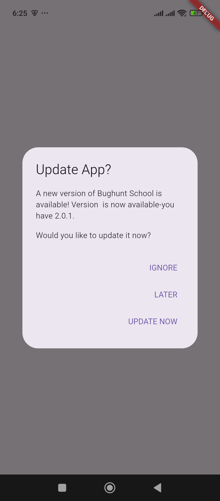

# Flutter App Updater

```
https://www.youtube.com/watch?v=YQ7DOJj7Fn0
```

```
https://pub.dev/packages/upgrader
```

# `main.dart`
```dart
import 'package:flutter/material.dart';
import 'package:upgrader/upgrader.dart';

void main() async {
  WidgetsFlutterBinding.ensureInitialized();

  // Only call clearSavedSettings() during testing to reset internal values.
  await Upgrader.clearSavedSettings(); // REMOVE this for release builds

  // On Android, the default behavior will be to use the Google Play Store
  // version of the app.
  // On iOS, the default behavior will be to use the App Store version of
  // the app, so update the Bundle Identifier in example/ios/Runner with a
  // valid identifier already in the App Store.
  runApp(const MyApp());
}

class MyApp extends StatelessWidget {
  const MyApp({super.key});

  @override
  Widget build(BuildContext context) {
    return MaterialApp(
      home: UpgradeAlert(
        upgrader: Upgrader(
          debugDisplayAlways: true,
        ),
        child: const Scaffold(
          body: Center(child: Text('Testing update dialog')),
        ),
      ),
    );
  }
}
```



# `main.dart`
```dart
import 'package:flutter/material.dart';
import 'package:upgrader/upgrader.dart';

void main() async {
  WidgetsFlutterBinding.ensureInitialized();

  // 🧪 TESTING ONLY – reset upgrader cache
  await Upgrader.clearSavedSettings();

  runApp(const MyApp());
}

class MyApp extends StatelessWidget {
  const MyApp({super.key});

  @override
  Widget build(BuildContext context) {
    return MaterialApp(
      debugShowCheckedModeBanner: false,
      home: UpgradeAlert(
        barrierDismissible: false, // ⛔ cannot dismiss
        showIgnore: false,
        showLater: false,
        dialogStyle: UpgradeDialogStyle.material,
        upgrader: Upgrader(
          debugDisplayAlways: true, // 🧪 testing only

        ),
        child: const Scaffold(
          body: Center(
            child: Text(
              'Checking for updates...',
              style: TextStyle(fontSize: 18),
            ),
          ),
        ),
      ),
    );
  }
}
```
