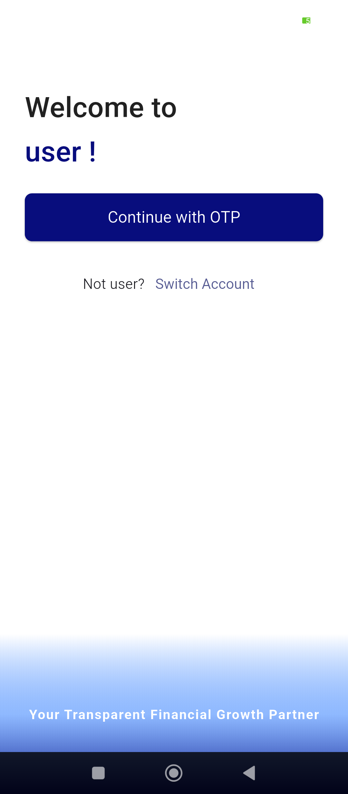

```dart
import 'package:flutter/material.dart';
import 'package:flutter_cp_thooyan/screens/auth/MobileNumberScreen.dart';
import 'package:flutter_cp_thooyan/screens/auth/OTPVerificationScreen.dart';

class LockScreen extends StatefulWidget {
  const LockScreen({super.key});

  @override
  State<LockScreen> createState() => _LockScreenState();
}

class _LockScreenState extends State<LockScreen> {
  
  @override
  Widget build(BuildContext context) {
    return Stack(
      children: [
        Scaffold(
          backgroundColor: Colors.white,
          body: SafeArea(
            child: Padding(
              padding: const EdgeInsets.symmetric(horizontal: 28),
              child: Column(
                crossAxisAlignment: CrossAxisAlignment.start,
                children: [
                  const SizedBox(height: 60),

                  Text(
                    "Welcome to",
                    style: TextStyle(
                      fontSize: 32,
                      color: Colors.grey.shade900,
                      fontWeight: FontWeight.w700,
                    ),
                  ),
                  const SizedBox(height: 4),
                  Text(
                    "user !",
                    style: TextStyle(
                      fontSize: 32,
                      // color: Color(0xfff15a24),
                      color: Theme.of(context).primaryColor,
                      fontWeight: FontWeight.w700,
                    ),
                  ),

                  const SizedBox(height: 24),

                  SizedBox(
                    width: double.infinity,
                    child: ElevatedButton(
                      style: ElevatedButton.styleFrom(
                        backgroundColor: Theme.of(context).primaryColor,
                        padding: const EdgeInsets.symmetric(vertical: 14),
                        shape: RoundedRectangleBorder(
                          borderRadius: BorderRadius.circular(8),
                        ),
                      ),
                      onPressed: () {
                        Navigator.push(
                          context,
                          MaterialPageRoute(
                            builder: (_) => OTPVerificationScreen(mobile_no: ""),
                          ),
                        );
                      },
                      child: const Text(
                        "Continue with OTP",
                        style: TextStyle(fontSize: 18, color: Colors.white),
                      ),
                    ),
                  ),

                  const SizedBox(height: 24),

                  Row(
                    mainAxisAlignment: MainAxisAlignment.center,
                    children: [
                      const Text(
                        "Not user?",
                        style: TextStyle(fontSize: 16),
                      ),
                      TextButton(
                        onPressed: () {
                          // Navigate to login / mobile number screen
                          Navigator.push(
                            context,
                            MaterialPageRoute(
                              builder: (_) => MobileNumberScreen(),
                            ),
                          );
                        },
                        child: const Text(
                          "Switch Account",
                          style: TextStyle(fontSize: 16),
                        ),
                      ),
                    ],
                  ),


                ],
              ),
            ),
          ),
          bottomNavigationBar: Container(
            height: 180,
            decoration: BoxDecoration(
              gradient: LinearGradient(
                begin: Alignment.topCenter,
                end: Alignment.bottomCenter,
                colors: [
                  Colors.white,
                  // Colors.orange.withOpacity(0.6),
                  // const Color(0xfff15a24),

                  Colors.blueAccent.withOpacity(0.6),
                  Theme.of(context).primaryColor,
                ],
              ),
            ),
            child: const Center(
              child: Text(
                "Your Transparent Financial Growth Partner",
                style: TextStyle(
                  fontSize: 15,
                  fontWeight: FontWeight.w900,
                  color: Colors.white,
                  letterSpacing: 1,
                ),
              ),
            ),
          ),
        ),
      ],
    );
  }
}
```


## 🚀 Bonus Improvements (Highly Recommended)

### ✔ Auto Lock when app resumes

Add this in `HomePage`:

```dart
class HomePage extends StatefulWidget {
  @override
  _HomePageState createState() => _HomePageState();
}

class _HomePageState extends State<HomePage> with WidgetsBindingObserver {

  @override
  void initState() {
    super.initState();
    WidgetsBinding.instance.addObserver(this);
  }

  @override
  void didChangeAppLifecycleState(AppLifecycleState state) {
    if (state == AppLifecycleState.resumed) {
      Navigator.push(
        context,
        MaterialPageRoute(builder: (_) => LockScreen()),
      );
    }
  }

  @override
  void dispose() {
    WidgetsBinding.instance.removeObserver(this);
    super.dispose();
  }
}
```

