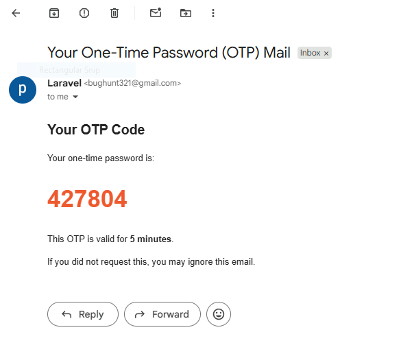

`users` migration

```php
$table->string('mobile_no')->unique()->nullable();
$table->string('otp')->nullable();
$table->timestamp('otp_expires_at')->nullable();
```

# `DatabaseSeeder`
```php
<?php

namespace Database\Seeders;

use App\Models\User;
use Illuminate\Database\Console\Seeds\WithoutModelEvents;
use Illuminate\Database\Seeder;

use Illuminate\Support\Facades\Hash;

class DatabaseSeeder extends Seeder
{
    use WithoutModelEvents;

    /**
     * Seed the application's database.
     */
    public function run(): void
    {
        // User::factory(10)->create();

        User::factory()->create([
            'name' => 'admin',
            'email' => 'admin@gmail.com',
            'password' => Hash::make('admin'),
        ]);

        User::factory()->create([
            'name' => 'prabhu',
            'email' => 'bughunt321@gmail.com',
            'password' => Hash::make('admin'),
            'mobile_no' => "9944177142"
        ]);
    }
}

```

# Auth

```bash
php artisan make:controller api/AuthController
```

# ✉️ 2️⃣ Mailable — Create OTP Email Template

```bash
php artisan make:mail OtpMail
```

# `OtpMail`

```php
<?php

namespace App\Mail;

use Illuminate\Bus\Queueable;
use Illuminate\Contracts\Queue\ShouldQueue;
use Illuminate\Mail\Mailable;
use Illuminate\Mail\Mailables\Content;
use Illuminate\Mail\Mailables\Envelope;
use Illuminate\Queue\SerializesModels;

class OtpMail extends Mailable
{
    use Queueable, SerializesModels;

     public $otp;

    /**
     * Create a new message instance.
     */
    public function __construct($otp)
    {
        $this->otp = $otp;
    }

    /**
     * Get the message envelope.
     */
    public function envelope(): Envelope
    {
        return new Envelope(
            subject: 'Your One-Time Password (OTP) Mail',
        );
    }

    /**
     * Get the message content definition.
     */
    public function content(): Content
    {
        return new Content(
            view: 'emails.otp',
            with: [
                'otp' => $this->otp,
            ]
        );
    }

    /**
     * Get the attachments for the message.
     *
     * @return array<int, \Illuminate\Mail\Mailables\Attachment>
     */
    public function attachments(): array
    {
        return [];
    }
}
```

# `resources\views\emails\otp.blade.php`

```php
<!DOCTYPE html>
<html>
<head>
    <title>OTP Verification</title>
</head>
<body>
    <h2>Your OTP Code</h2>
    <p>Your one-time password is:</p>

    <h1 style="font-size: 35px; color:#f15a24;">
        {{ $otp }}
    </h1>

    <p>This OTP is valid for <strong>5 minutes</strong>.</p>
    <p>If you did not request this, you may ignore this email.</p>
</body>
</html>
```



# 📬 6️⃣ Configure Mail in .env

Example using Gmail:
```bash
MAIL_MAILER=smtp
MAIL_HOST=smtp.gmail.com
MAIL_PORT=587
MAIL_USERNAME=your_email@gmail.com
MAIL_PASSWORD=your_gmail_app_password
MAIL_ENCRYPTION=tls
MAIL_FROM_ADDRESS=your_email@gmail.com
MAIL_FROM_NAME="Your App Name"
```

⚠ Gmail requires an "App Password" if 2FA is enabled