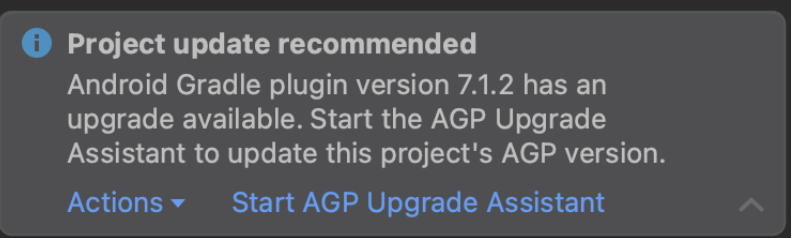
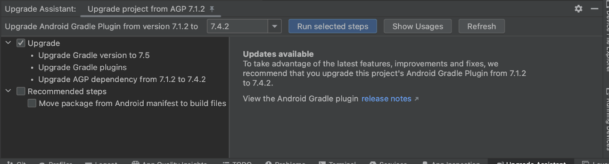

# Type 1

```
android studio -> Terminal -> flutter upgrade
```

# Type 2

To fix the code, you need to update the `local.properties` file by changing the Flutter SDK path to the correct version. Here's the corrected version of the `local.properties` file:

### Before:
```ini
sdk.dir=C:\\Users\\windows_rig3\\AppData\\Local\\Android\\sdk
flutter.sdk=C:\\flutter_windows_3.16.5-stable\\flutter
flutter.buildMode=debug
flutter.versionName=1.0.0
flutter.versionCode=1
```

### After:
```ini
sdk.dir=C:\\Users\\windows_rig3\\AppData\\Local\\Android\\sdk
flutter.sdk=C:\\flutter_windows_3.24.3-stable\\flutter
flutter.buildMode=debug
flutter.versionName=1.0.0
flutter.versionCode=1
```

This changes the Flutter SDK from version `3.16.5` to `3.24.3`. Now your project will use the updated version of Flutter.

### Next Steps:
1. Run `flutter clean` in the terminal to clean the project.
2. Run `flutter pub get` to fetch the dependencies again.
3. You can now proceed with `flutter run` or continue your development.

Let me know if you encounter any issues!

# Type 3

```
Android Studio -> Close Project
```

```
Android Studio -> Open -> project -> android ->
```

Upgrade the Gradle version in Android Studio Flamingo as follows:

In Android Studio, open the android folder. This should bring up the following dialog:

Update to a Gradle release between 7.3 through 7.6.1, inclusive.



Follow the guided workflow to update Gradle.




Solution #2: Manual fix at the command line
#

Do the following from the top of your Flutter project.

```
Go to the Android directory for your project.
```

```
cd android
```

Update Gradle to the preferred version. Choose between 7.3 through 7.6.1, inclusive.

```
./gradlew wrapper --gradle-version=7.6.1
```

Notes
#

A few notes to be aware of:

Repeat this step for each affected Android app.
This issue can be experienced by those who don't download Java and the Android SDK through Android studio. If you've manually upgraded your Java SDK to version 17 but haven't upgraded Gradle, you can also encounter this issue. The fix is the same: upgrade Gradle to a release between 7.3 and 7.6.1.
Your development machine might contain more than one copy of the Java SDK:
    The Android Studio app includes a version of Java, which Flutter uses by default.
    If you don't have Android Studio installed, Flutter relies on the version defined by your shell script's JAVA_HOME environment variable.
    If JAVA_HOME isn't defined, Flutter looks for any java executable in your path. Once issue 122609 lands, the flutter doctor command reports which version of Java is used.
If you upgrade Gradle to a release newer than 7.6.1, you might (though it's unlikely) encounter issues that result from changes to Gradle, such as deprecated Gradle classes, or changes to the Android file structure, such as splitting out ApplicationId from PackageName. If this occurs, downgrade to a release of Gradle between 7.3 and 7.6.1, inclusive.
Upgrading to Flutter 3.10 won't fix this issue.