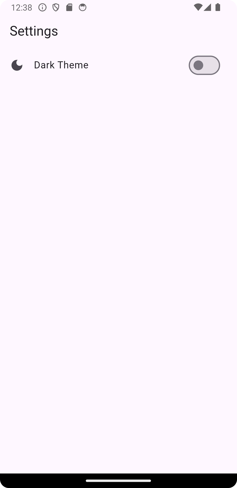
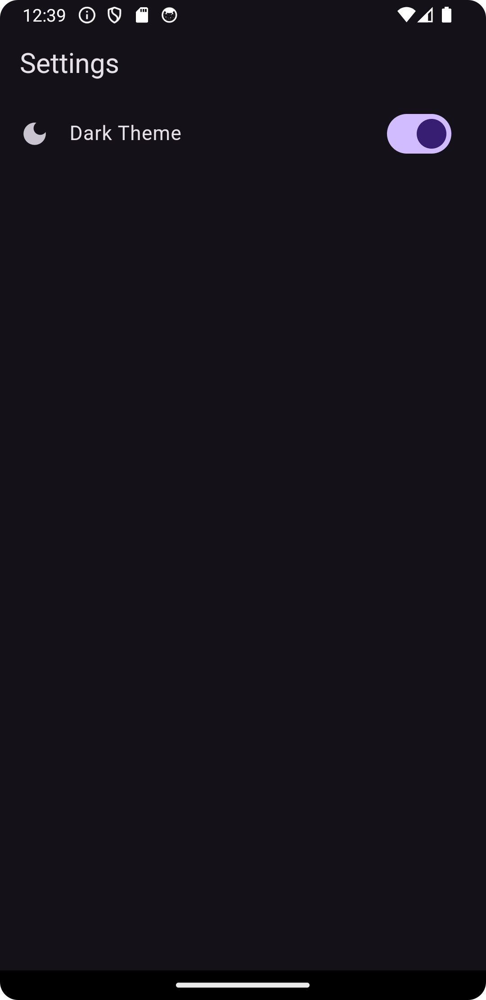

```
https://www.youtube.com/watch?v=c7mlpSW0HYI
```

```
https://pub.dev/packages/shared_preferences/install
```

```
https://pub.dev/packages/provider/install
```

Folder Setup

lib -> services

lib -> screens


File Setup

lib -> services -> UiProvider.dart

lib -> screens -> SettingScreen.dart


`UiProvider.dart`

```dart
import 'package:flutter/material.dart';
import 'package:shared_preferences/shared_preferences.dart';

class UiProvider extends ChangeNotifier{

  bool _isDark = false;
  bool get isDark => _isDark;

  late SharedPreferences storage;

  //Custom dark theme
  final darkTheme = ThemeData(
    primaryColor: Colors.black12,
    brightness: Brightness.dark,
    primaryColorDark: Colors.black12,
  );

  //Custom light theme
  final lightTheme = ThemeData(
      primaryColor: Colors.white,
      brightness: Brightness.light,
      primaryColorDark: Colors.white
  );

  //Now we want to save the last changed theme value


  //Dark mode toggle action
  changeTheme(){
    _isDark = !isDark;

    //Save the value to secure storage
    storage.setBool("isDark", _isDark);
    notifyListeners();
  }

  //Init method of provider
  init()async{
    //After we re run the app
    storage = await SharedPreferences.getInstance();
    _isDark = storage.getBool("isDark")??false;
    notifyListeners();
  }
}
```

`SettingScreen.dart`

```dart
import 'package:flutter/material.dart';
import 'package:flutter_local_service/services/UiProvider.dart';
import 'package:provider/provider.dart';

class SettingScreen extends StatefulWidget {

  final String title;

  const SettingScreen({super.key, required this.title});

  @override
  State<SettingScreen> createState() => _SettingScreenState();
}

class _SettingScreenState extends State<SettingScreen> {

  @override
  Widget build(BuildContext context) {
    return Scaffold(
      appBar: AppBar(
        title: Text(widget.title),
      ),
      body: Consumer<UiProvider>(
        builder: (context, UiProvider notifier, child) {
          return Column(
            children: [
              ListTile(
                leading: Icon(Icons.dark_mode),
                title: Text("Dark Theme"),
                trailing: Switch(
                  onChanged: (value) { notifier.changeTheme(); },
                  value: notifier.isDark,
                ),
              )
            ],
          );
        },
      ),
    );
  }
}
```

`main.dart`

```dart
import 'package:flutter/material.dart';
import 'package:flutter_local_service/services/UiProvider.dart';
import 'package:flutter_local_service/screens/SettingScreen.dart';
import 'package:provider/provider.dart';

void main() {

  WidgetsFlutterBinding.ensureInitialized();

  runApp(const MyApp());
}

class MyApp extends StatelessWidget {
  const MyApp({super.key});

  // This widget is the root of your application.
  @override
  Widget build(BuildContext context) {
    return ChangeNotifierProvider(
      create: (BuildContext context)=>UiProvider()..init(),
      child: Consumer<UiProvider>(
        builder: (context, UiProvider notifier, child) {
          return MaterialApp(

            debugShowCheckedModeBanner: false,

            title: 'Dark Theme',
            //By default theme setting, you can also set system
            // when your mobile theme is dark the app also become dark

            themeMode: notifier.isDark ? ThemeMode.dark : ThemeMode.light,

            //Our custom theme applied
            darkTheme: notifier.isDark ? notifier.darkTheme : notifier.lightTheme,

            theme: ThemeData(
              colorScheme: ColorScheme.fromSeed(seedColor: Colors.deepPurple),
              useMaterial3: true,
            ),

            home: SettingScreen(title: 'Settings'),

          );
        },
      ),
    );
  }
}
```




