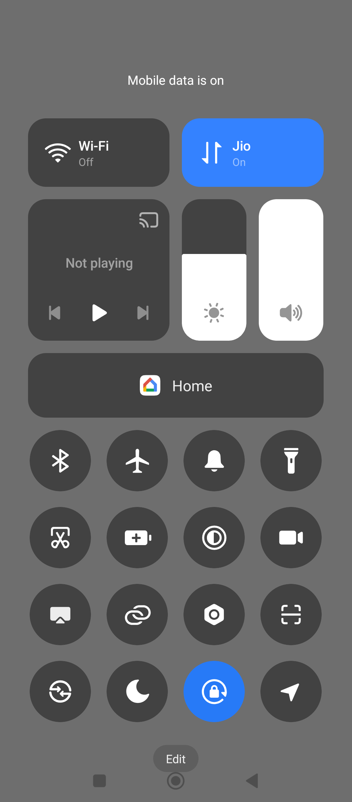
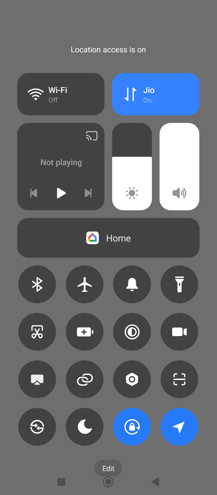
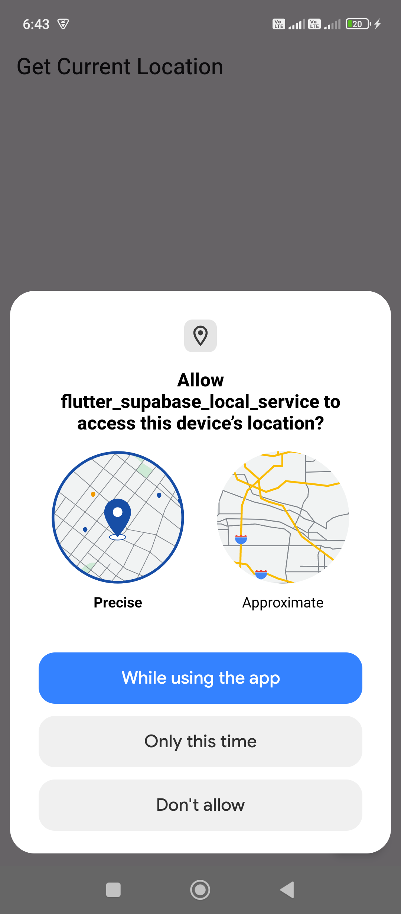

To get the **current location details** in Flutter, you can use the **`geolocator`** package. It provides easy access to the device’s location services, including latitude, longitude, and address information.

---

### ✅ **Steps to get the current location:**

1. **Add the dependency** to your `pubspec.yaml`:
   ```yaml
   dependencies:
     geolocator: ^11.0.0 # Use the latest version
   ```

2. **Configure platform-specific settings:**

   **Android:**
   - Add permissions in `android/app/src/main/AndroidManifest.xml`:
     ```xml
     <uses-permission android:name="android.permission.ACCESS_FINE_LOCATION" />
     <uses-permission android:name="android.permission.ACCESS_COARSE_LOCATION" />
     ```

   **iOS:**
   - Add these keys to `ios/Runner/Info.plist`:
     ```xml
     <key>NSLocationWhenInUseUsageDescription</key>
     <string>We need your location to provide better services.</string>
     <key>NSLocationAlwaysUsageDescription</key>
     <string>We need your location to provide better services.</string>
     ```

---

### 🚀 **Code to get current location:**

```dart
import 'package:flutter/material.dart';
import 'package:geolocator/geolocator.dart';

class LocationScreen extends StatefulWidget {
  @override
  _LocationScreenState createState() => _LocationScreenState();
}

class _LocationScreenState extends State<LocationScreen> {
  String _location = "Press the button to get location";

  Future<void> _getCurrentLocation() async {
    bool serviceEnabled;
    LocationPermission permission;

    // Check if location services are enabled
    serviceEnabled = await Geolocator.isLocationServiceEnabled();
    if (!serviceEnabled) {
      setState(() {
        _location = "Location services are disabled.";
      });
      return;
    }

    // Check location permission
    permission = await Geolocator.checkPermission();
    if (permission == LocationPermission.denied) {
      permission = await Geolocator.requestPermission();
      if (permission == LocationPermission.denied) {
        setState(() {
          _location = "Location permissions are denied.";
        });
        return;
      }
    }

    if (permission == LocationPermission.deniedForever) {
      setState(() {
        _location = "Location permissions are permanently denied.";
      });
      return;
    }

    // Get the current position
    Position position = await Geolocator.getCurrentPosition(
        desiredAccuracy: LocationAccuracy.high);

    setState(() {
      _location = "Latitude: ${position.latitude}, Longitude: ${position.longitude}";
    });
  }

  @override
  Widget build(BuildContext context) {
    return Scaffold(
      appBar: AppBar(title: Text("Get Current Location")),
      body: Center(child: Text(_location, textAlign: TextAlign.center)),
      floatingActionButton: FloatingActionButton(
        onPressed: _getCurrentLocation,
        child: Icon(Icons.location_on),
      ),
    );
  }
}
```

---

### 📝 **Explanation:**
- **Permissions:** Checks and requests location permissions.
- **`Geolocator.getCurrentPosition`**: Retrieves the current latitude and longitude.
- **Accuracy:** `LocationAccuracy.high` ensures more precise location data.

---

### 🌍 **To get address details (reverse geocoding):**

Add the **`geocoding`** package to `pubspec.yaml`:
```yaml
dependencies:
  geocoding: ^3.0.0
```

Then, use it to get address details:
```dart
import 'package:geocoding/geocoding.dart';

Future<void> _getAddressFromLatLng(Position position) async {
  try {
    List<Placemark> placemarks = await placemarkFromCoordinates(
      position.latitude,
      position.longitude,
    );

    Placemark place = placemarks[0];
    setState(() {
      _location = "${place.street}, ${place.locality}, ${place.country}";
    });
  } catch (e) {
    setState(() {
      _location = "Failed to get address: $e";
    });
  }
}
```

Call `_getAddressFromLatLng(position)` after retrieving the location to display the address.

---

💡 **Done!** With this setup, you can get the user's current location and address in Flutter.





