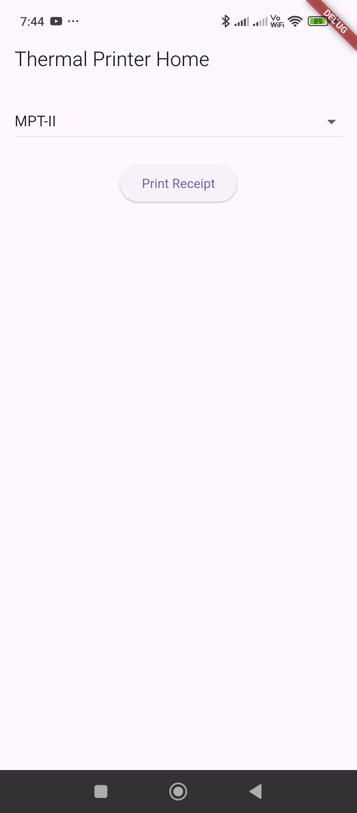
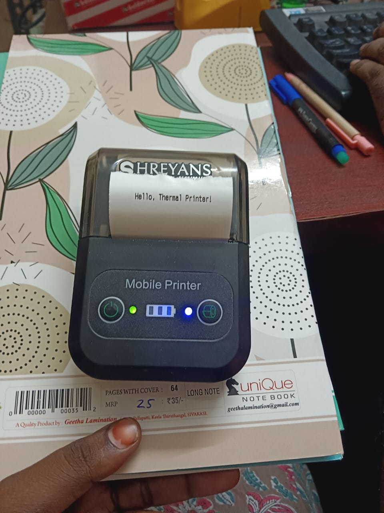

# Type 1

`AndroidManifest.xml`

```
<manifest xmlns:android="http://schemas.android.com/apk/res/android">

    <uses-permission android:name="android.permission.BLUETOOTH"/>
    <uses-permission android:name="android.permission.BLUETOOTH_ADMIN"/>
    <uses-permission android:name="android.permission.BLUETOOTH_CONNECT" />
    <uses-permission android:name="android.permission.BLUETOOTH_SCAN" />

    <uses-permission android:name="android.permission.BLUETOOTH_ADVERTISE" />

    <application
```

`PrinterService.dart`

```dart
import 'package:blue_thermal_printer/blue_thermal_printer.dart';

class PrinterService {
  final BlueThermalPrinter bluetooth = BlueThermalPrinter.instance;

  Future<List<BluetoothDevice>> getDevices() async {
    return await bluetooth.getBondedDevices();
  }

  Future<void> connect(BluetoothDevice device) async {
    if (!(await bluetooth.isConnected)!) {
      await bluetooth.connect(device);
    }
  }

  Future<void> disconnect() async {
    if ((await bluetooth.isConnected)!) {
      await bluetooth.disconnect();
    }
  }

  Future<void> printText(String text) async {
    if ((await bluetooth.isConnected)!) {
      bluetooth.printNewLine();
      bluetooth.printCustom(text, 1, 1); // (Text, Size, Alignment)
      bluetooth.printNewLine();
      bluetooth.paperCut();
    }
  }
}
```

`HomeScreen.dart`

```dart
import 'package:flutter/material.dart';
import 'package:blue_thermal_printer/blue_thermal_printer.dart';

import '../../services/PrinterService.dart';

class HomeScreen extends StatefulWidget {
  final String title;

  const HomeScreen({super.key, required this.title});

  @override
  State<HomeScreen> createState() => _HomeScreenState();
}

class _HomeScreenState extends State<HomeScreen> {
  final PrinterService printerService = PrinterService();
  List<BluetoothDevice> devices = [];
  BluetoothDevice? selectedDevice;

  @override
  void initState() {
    super.initState();
    _getDevices();
  }

  Future<void> _getDevices() async {
    List<BluetoothDevice> availableDevices = await printerService.getDevices();
    print(availableDevices.toString());
    setState(() {
      devices = availableDevices;
    });
  }

  Future<void> _connectToDevice(BluetoothDevice device) async {
    await printerService.connect(device);
    setState(() {
      selectedDevice = device;
    });
  }

  Future<void> _print() async {
    if (selectedDevice != null) {
      await printerService.printText("Hello, Thermal Printer!");
    } else {
      ScaffoldMessenger.of(context).showSnackBar(
        SnackBar(content: Text("Please select a printer first")),
      );
    }
  }

  @override
  Widget build(BuildContext context) {
    return Scaffold(
      appBar: AppBar(title: Text(widget.title)),
      body: Padding(
        padding: const EdgeInsets.all(16.0),
        child: Column(
          children: [
            DropdownButton<BluetoothDevice>(
              isExpanded: true,
              hint: const Text("Select Printer"),
              value: selectedDevice,
              items: devices.map((device) {
                return DropdownMenuItem(
                  value: device,
                  child: Text(device.name ?? "Unknown"),
                );
              }).toList(),
              onChanged: (device) {
                if (device != null) _connectToDevice(device);
              },
            ),
            const SizedBox(height: 20),
            ElevatedButton(
              onPressed: _print,
              child: const Text("Print Receipt"),
            ),
          ],
        ),
      ),
    );
  }
}
```

`main.dart`

```dart
import 'package:flutter/material.dart';
import 'package:flutter_receipt_print/screens/HomeScreen.dart';

void main() {
  runApp(const MyApp());
}

class MyApp extends StatelessWidget {
  const MyApp({super.key});

  // This widget is the root of your application.
  @override
  Widget build(BuildContext context) {
    return MaterialApp(
      home: HomeScreen(title: "Thermal Printer Home",),
    );
  }
}
```


