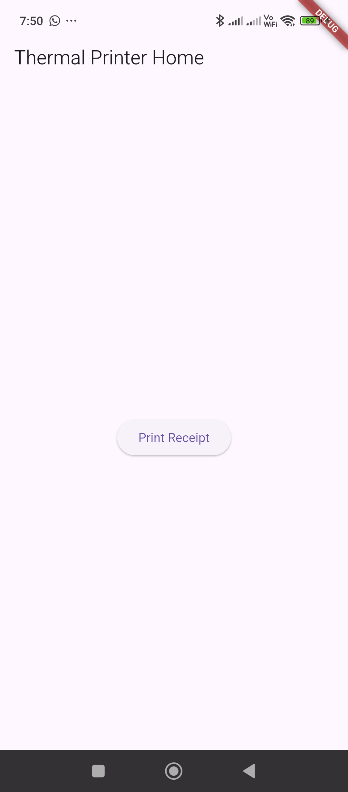

# Type 2

`PrinterService.dart`

```dart
import 'package:blue_thermal_printer/blue_thermal_printer.dart';

import 'package:intl/intl.dart';

class PrinterService {
  final BlueThermalPrinter bluetooth = BlueThermalPrinter.instance;

  Future<List<BluetoothDevice>> getDevices() async {
    return await bluetooth.getBondedDevices();
  }

  Future<void> connect(BluetoothDevice device) async {
    if (!(await bluetooth.isConnected)!) {
      await bluetooth.connect(device);
    }
  }

  Future<void> disconnect() async {
    if ((await bluetooth.isConnected)!) {
      await bluetooth.disconnect();
    }
  }

  Future<void> printText(String text) async {
    if ((await bluetooth.isConnected)!) {
      bluetooth.printNewLine();
      bluetooth.printCustom(text, 1, 1); // (Text, Size, Alignment)
      bluetooth.printNewLine();
      bluetooth.paperCut();
    }
  }

  Future<void> printSampleReceipt() async {
    bool isConnected = await bluetooth.isConnected ?? false;

    if (!isConnected) {
      print('Bluetooth not connected');
      return;
    }

    bluetooth.printNewLine();
    bluetooth.printCustom("MY SHOP NAME", 3, 1);
    bluetooth.printCustom("123 Market Street", 1, 1);
    bluetooth.printCustom("Chennai - 600001", 1, 1);
    bluetooth.printNewLine();
    bluetooth.printCustom("Receipt No: 000123", 1, 0);
    bluetooth.printCustom("Date: 2025-06-05", 1, 0);
    bluetooth.printCustom("-----------------------------", 1, 1);

    bluetooth.printLeftRight("Item", "Total", 1);
    bluetooth.printLeftRight("Burger", "50.00", 1);
    bluetooth.printLeftRight("Coke", "30.00", 1);
    bluetooth.printLeftRight("Fries", "40.00", 1);
    bluetooth.printCustom("-----------------------------", 1, 1);
    bluetooth.printLeftRight("Subtotal", "120.00", 1);
    bluetooth.printLeftRight("Tax (5%)", "6.00", 1);
    bluetooth.printLeftRight("Total", "126.00", 2);

    bluetooth.printNewLine();
    bluetooth.printCustom("Thank you!", 2, 1);
    bluetooth.printCustom("Visit Again", 1, 1);
    bluetooth.printNewLine();
    bluetooth.printNewLine();
    bluetooth.printNewLine();
    bluetooth.printNewLine();
    bluetooth.paperCut();
  }

}
```

`HomeScreen.dart`

```dart
import 'package:flutter/material.dart';
import 'package:blue_thermal_printer/blue_thermal_printer.dart';
import '../../services/PrinterService.dart';

class HomeScreen extends StatefulWidget {

  final String title;

  const HomeScreen({super.key, required this.title});

  @override
  State<HomeScreen> createState() => _HomeScreenState();
}

class _HomeScreenState extends State<HomeScreen> {
  final PrinterService printerService = PrinterService();
  List<BluetoothDevice> devices = [];
  BluetoothDevice? selectedDevice;

  @override
  void initState() {
    super.initState();
    _getDevices();
  }

  Future<void> _getDevices() async {
    List<BluetoothDevice> availableDevices = await printerService.getDevices();
    print(availableDevices.toString());
    setState(() {
      devices = availableDevices;
    });
  }

  Future<void> _connectToDevice(BluetoothDevice device) async {
    await printerService.connect(device);
    setState(() {
      selectedDevice = device;
    });
  }

  Future<void> _printReceipt() async {
    if (selectedDevice == null) {
      ScaffoldMessenger.of(context).showSnackBar(
        SnackBar(content: Text('No printer selected!')),
      );
      return;
    }

    try {
      await printerService.printSampleReceipt();
      ScaffoldMessenger.of(context).showSnackBar(
        SnackBar(content: Text('Printing Receipt')),
      );
    } catch (e) {
      ScaffoldMessenger.of(context).showSnackBar(
        SnackBar(content: Text('Error: $e')),
      );
    }
  }

  Future<void> _showPrinterSelectionDialog() async {
    showDialog(
      context: context,
      builder: (BuildContext context) {
        return AlertDialog(
          title: Text("Select Printer"),
          content: devices.isEmpty
              ? Text("No available printers found.")
              : Column(
            mainAxisSize: MainAxisSize.min,
            children: devices.map((device) {
              return ListTile(
                title: Text(device.name ?? "Unknown"),
                onTap: () async {
                  await _connectToDevice(device);
                  Navigator.pop(context);
                  _printReceipt();
                },
              );
            }).toList(),
          ),
          actions: [
            TextButton(
              child: Text("Cancel"),
              onPressed: () => Navigator.pop(context),
            ),
          ],
        );
      },
    );
  }

  @override
  Widget build(BuildContext context) {
    return Scaffold(
      appBar: AppBar(
        title: Text(widget.title),
      ),
      body: Center(
        child: ElevatedButton(
          child: Text('Print Receipt'),
          onPressed: _showPrinterSelectionDialog,
        ),
      ),
    );
  }
}
```

`main.dart`

```dart
import 'package:flutter/material.dart';
import 'package:flutter_receipt_print/screens/HomeScreen.dart';

void main() {
  runApp(const MyApp());
}

class MyApp extends StatelessWidget {
  const MyApp({super.key});

  // This widget is the root of your application.
  @override
  Widget build(BuildContext context) {
    return MaterialApp(
      home: HomeScreen(title: "Thermal Printer Home",),
    );
  }
}
```


