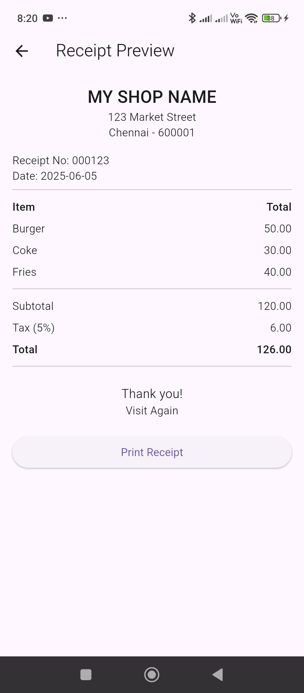
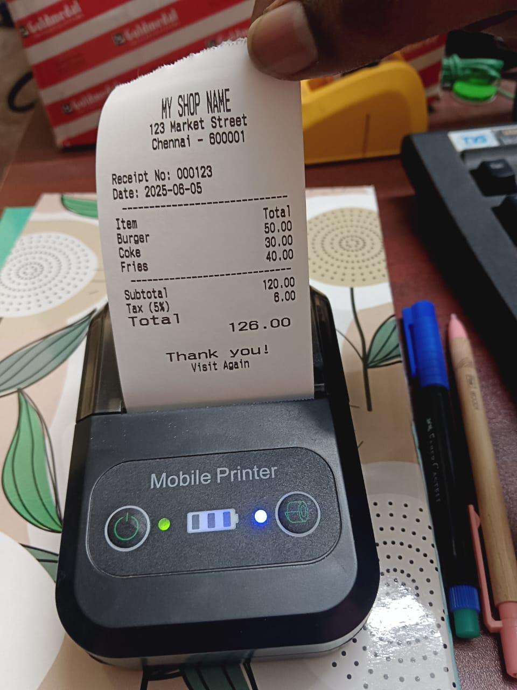

# Type 3

`PrinterService.dart`

```dart
import 'package:blue_thermal_printer/blue_thermal_printer.dart';

import 'package:intl/intl.dart';

class PrinterService {
  final BlueThermalPrinter bluetooth = BlueThermalPrinter.instance;

  Future<List<BluetoothDevice>> getDevices() async {
    return await bluetooth.getBondedDevices();
  }

  Future<void> connect(BluetoothDevice device) async {
    if (!(await bluetooth.isConnected)!) {
      await bluetooth.connect(device);
    }
  }

  Future<void> disconnect() async {
    if ((await bluetooth.isConnected)!) {
      await bluetooth.disconnect();
    }
  }

  Future<void> printText(String text) async {
    if ((await bluetooth.isConnected)!) {
      bluetooth.printNewLine();
      bluetooth.printCustom(text, 1, 1); // (Text, Size, Alignment)
      bluetooth.printNewLine();
      bluetooth.paperCut();
    }
  }

  Future<void> printSampleReceipt() async {
    bool isConnected = await bluetooth.isConnected ?? false;

    if (!isConnected) {
      print('Bluetooth not connected');
      return;
    }

    bluetooth.printNewLine();
    bluetooth.printCustom("MY SHOP NAME", 3, 1);
    bluetooth.printCustom("123 Market Street", 1, 1);
    bluetooth.printCustom("Chennai - 600001", 1, 1);
    bluetooth.printNewLine();
    bluetooth.printCustom("Receipt No: 000123", 1, 0);
    bluetooth.printCustom("Date: 2025-06-05", 1, 0);
    bluetooth.printCustom("-----------------------------", 1, 1);

    bluetooth.printLeftRight("Item", "Total", 1);
    bluetooth.printLeftRight("Burger", "50.00", 1);
    bluetooth.printLeftRight("Coke", "30.00", 1);
    bluetooth.printLeftRight("Fries", "40.00", 1);
    bluetooth.printCustom("-----------------------------", 1, 1);
    bluetooth.printLeftRight("Subtotal", "120.00", 1);
    bluetooth.printLeftRight("Tax (5%)", "6.00", 1);
    bluetooth.printLeftRight("Total", "126.00", 2);

    bluetooth.printNewLine();
    bluetooth.printCustom("Thank you!", 2, 1);
    bluetooth.printCustom("Visit Again", 1, 1);
    bluetooth.printNewLine();
    bluetooth.printNewLine();
    bluetooth.printNewLine();
    bluetooth.printNewLine();
    bluetooth.paperCut();
  }

}
```

`ReceiptPreview.dart`

```dart
import 'package:flutter/material.dart';

class ReceiptPreview extends StatelessWidget {
  const ReceiptPreview({super.key});

  @override
  Widget build(BuildContext context) {
    return Scaffold(
      appBar: AppBar(title: const Text("Receipt Preview")),
      body: Padding(
        padding: const EdgeInsets.all(16.0),
        child: ListView(
          children: [
            Center(child: Text("MY SHOP NAME", style: TextStyle(fontSize: 22, fontWeight: FontWeight.bold))),
            Center(child: Text("123 Market Street")),
            Center(child: Text("Chennai - 600001")),
            const SizedBox(height: 16),
            Text("Receipt No: 000123"),
            Text("Date: 2025-06-05"),
            const Divider(thickness: 1),
            _buildRow("Item", "Total", isBold: true),
            _buildRow("Burger", "50.00"),
            _buildRow("Coke", "30.00"),
            _buildRow("Fries", "40.00"),
            const Divider(thickness: 1),
            _buildRow("Subtotal", "120.00"),
            _buildRow("Tax (5%)", "6.00"),
            _buildRow("Total", "126.00", isBold: true),
            const Divider(thickness: 1),
            const SizedBox(height: 16),
            Center(child: Text("Thank you!", style: TextStyle(fontSize: 16))),
            Center(child: Text("Visit Again")),
            const SizedBox(height: 20),
            ElevatedButton(
              onPressed: () {
                Navigator.pop(context, true); // Pass true when printing
              },
              child: const Text("Print Receipt"),
            )
          ],
        ),
      ),
    );
  }

  Widget _buildRow(String left, String right, {bool isBold = false}) {
    return Padding(
      padding: const EdgeInsets.symmetric(vertical: 4.0),
      child: Row(
        mainAxisAlignment: MainAxisAlignment.spaceBetween,
        children: [
          Text(left, style: TextStyle(fontWeight: isBold ? FontWeight.bold : FontWeight.normal)),
          Text(right, style: TextStyle(fontWeight: isBold ? FontWeight.bold : FontWeight.normal)),
        ],
      ),
    );
  }
}
```

`HomeScreen.dart`

```dart
import 'package:flutter/material.dart';
import 'package:blue_thermal_printer/blue_thermal_printer.dart';
import '../../services/PrinterService.dart';
import 'ReceiptPreview.dart';

class HomeScreen extends StatefulWidget {

  final String title;

  const HomeScreen({super.key, required this.title});

  @override
  State<HomeScreen> createState() => _HomeScreenState();
}

class _HomeScreenState extends State<HomeScreen> {
  final PrinterService printerService = PrinterService();
  List<BluetoothDevice> devices = [];
  BluetoothDevice? selectedDevice;

  @override
  void initState() {
    super.initState();
    _getDevices();
  }

  Future<void> _getDevices() async {
    List<BluetoothDevice> availableDevices = await printerService.getDevices();
    print(availableDevices.toString());
    setState(() {
      devices = availableDevices;
    });
  }

  void _connectAndPrint() async {
    if (selectedDevice == null) return;

    await printerService.connect(selectedDevice!);

    final shouldPrint = await Navigator.push(
      context,
      MaterialPageRoute(builder: (_) => const ReceiptPreview()),
    );

    if (shouldPrint == true) {
      await printerService.printSampleReceipt();
    }
  }

  @override
  Widget build(BuildContext context) {
    return Scaffold(
      appBar: AppBar(title: Text(widget.title)),
      body: Column(
        children: [
          const SizedBox(height: 20),
          DropdownButton<BluetoothDevice>(
            hint: const Text("Select Printer"),
            value: selectedDevice,
            onChanged: (device) {
              setState(() => selectedDevice = device);
            },
            items: devices
                .map((device) => DropdownMenuItem(
              value: device,
              child: Text(device.name ?? device.address!),
            ))
                .toList(),
          ),
          const SizedBox(height: 20),
          ElevatedButton(
            onPressed: _connectAndPrint,
            child: const Text("Preview & Print Receipt"),
          ),
        ],
      ),
    );
  }
}
```

`main.dart`

```dart
import 'package:flutter/material.dart';
import 'package:flutter_receipt_print/screens/HomeScreen.dart';

void main() {
  runApp(const MyApp());
}

class MyApp extends StatelessWidget {
  const MyApp({super.key});

  // This widget is the root of your application.
  @override
  Widget build(BuildContext context) {
    return MaterialApp(
      home: HomeScreen(title: "Home",),
    );
  }
}
```



