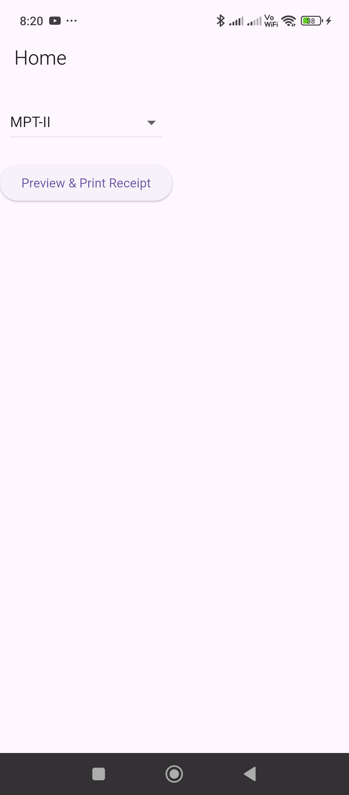
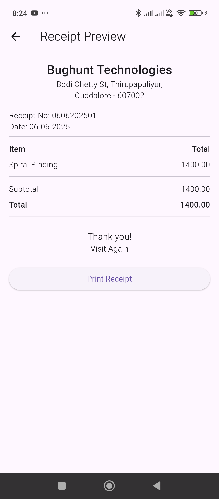

To **pass a list of order items (as a class or map)** to both the UI preview and the thermal printer in Flutter, you can create a class like `OrderItem`, and use that list in both `ReceiptPreview` and `PrinterService`.

---

### ✅ 1. Define `OrderItem` Class

```dart
class OrderItem {
  final String name;
  final double price;

  OrderItem({required this.name, required this.price});
}
```

---

### ✅ 2. Modify `printSampleReceipt` to Accept Data

In your `PrinterService`, update the function:

```dart
import 'package:blue_thermal_printer/blue_thermal_printer.dart';

import '../models/OrderItem.dart';

import 'package:intl/intl.dart';

class PrinterService {
  final BlueThermalPrinter bluetooth = BlueThermalPrinter.instance;

  Future<List<BluetoothDevice>> getDevices() async {
    return await bluetooth.getBondedDevices();
  }

  Future<void> connect(BluetoothDevice device) async {
    if (!(await bluetooth.isConnected)!) {
      await bluetooth.connect(device);
    }
  }

  Future<void> disconnect() async {
    if ((await bluetooth.isConnected)!) {
      await bluetooth.disconnect();
    }
  }

  Future<void> printText(String text) async {
    if ((await bluetooth.isConnected)!) {
      bluetooth.printNewLine();
      bluetooth.printCustom(text, 1, 1); // (Text, Size, Alignment)
      bluetooth.printNewLine();
      bluetooth.paperCut();
    }
  }

  Future<void> printSampleReceipt() async {
    bool isConnected = await bluetooth.isConnected ?? false;

    if (!isConnected) {
      print('Bluetooth not connected');
      return;
    }

    bluetooth.printNewLine();
    bluetooth.printCustom("MY SHOP NAME", 3, 1);
    bluetooth.printCustom("123 Market Street", 1, 1);
    bluetooth.printCustom("Chennai - 600001", 1, 1);
    bluetooth.printNewLine();
    bluetooth.printCustom("Receipt No: 000123", 1, 0);
    bluetooth.printCustom("Date: 2025-06-05", 1, 0);
    bluetooth.printCustom("-----------------------------", 1, 1);

    bluetooth.printLeftRight("Item", "Total", 1);
    bluetooth.printLeftRight("Burger", "50.00", 1);
    bluetooth.printLeftRight("Coke", "30.00", 1);
    bluetooth.printLeftRight("Fries", "40.00", 1);
    bluetooth.printCustom("-----------------------------", 1, 1);
    bluetooth.printLeftRight("Subtotal", "120.00", 1);
    bluetooth.printLeftRight("Tax (5%)", "6.00", 1);
    bluetooth.printLeftRight("Total", "126.00", 2);

    bluetooth.printNewLine();
    bluetooth.printCustom("Thank you!", 2, 1);
    bluetooth.printCustom("Visit Again", 1, 1);
    bluetooth.printNewLine();
    bluetooth.printNewLine();
    bluetooth.printNewLine();
    bluetooth.printNewLine();
    bluetooth.paperCut();
  }

  Future<void> printReceipt({
    required List<OrderItem> items,
    required String receiptNo,
    required String date,
    required String shopName,
    required String address,
    required String city,
    required String zipcode
  }) async {
    bool isConnected = await bluetooth.isConnected ?? false;

    if (!isConnected) {
      print('Bluetooth not connected');
      return;
    }

    double subtotal = items.fold(0, (sum, item) => sum + item.price);
    // double tax = subtotal * 0.05;
    double tax = subtotal * 0.00;
    double total = subtotal + tax;

    // Format the date to dd-MM-yyyy
    String formattedDate;
    try {
      formattedDate = DateFormat('dd-MM-yyyy').format(DateTime.parse(date));
    } catch (e) {
      formattedDate = date; // fallback if parsing fails
    }

    bluetooth.printNewLine();
    bluetooth.printCustom(shopName, 3, 1); // Use dynamic shop name
    bluetooth.printCustom(address, 1, 1);
    bluetooth.printCustom("$city - $zipcode", 1, 1);
    bluetooth.printNewLine();
    bluetooth.printCustom("Receipt No: $receiptNo", 1, 0);
    bluetooth.printCustom("Date: $date", 1, 0);
    bluetooth.printCustom("-----------------------------", 1, 1);

    bluetooth.printLeftRight("Item", "Total", 1);
    for (var item in items) {
      bluetooth.printLeftRight(item.name, item.price.toStringAsFixed(2), 1);
    }

    bluetooth.printCustom("-----------------------------", 1, 1);
    bluetooth.printLeftRight("Subtotal", subtotal.toStringAsFixed(2), 1);
    // bluetooth.printLeftRight("Tax (5%)", tax.toStringAsFixed(2), 1);
    bluetooth.printLeftRight("Total", total.toStringAsFixed(2), 2);

    bluetooth.printNewLine();
    bluetooth.printCustom("Thank you!", 2, 1);
    bluetooth.printCustom("Visit Again", 1, 1);
    bluetooth.printNewLine();
    bluetooth.printNewLine();
    bluetooth.printNewLine();
    bluetooth.printNewLine();
    bluetooth.paperCut();
  }

}
```

---

### ✅ 3. Pass Data to `ReceiptPreview`

Update your `ReceiptPreview` widget:

```dart
import 'package:flutter/material.dart';

import '../models/OrderItem.dart';
import 'package:intl/intl.dart';

class ReceiptPreview extends StatefulWidget {
  final List<OrderItem> items;
  final String receiptNo;
  final String date; // Expecting "yyyy-MM-dd"
  final String shopName;
  final String address;
  final String city;
  final String zipcode;

  const ReceiptPreview({
    super.key,
    required this.items,
    required this.receiptNo,
    required this.date,
    required this.shopName,
    required this.address,
    required this.city,
    required this.zipcode,
  });

  @override
  State<ReceiptPreview> createState() => _ReceiptPreviewState();
}

class _ReceiptPreviewState extends State<ReceiptPreview> {
  late double subtotal;
  late double tax;
  late double total;
  late String formattedDate;

  @override
  void initState() {
    super.initState();
    subtotal = widget.items.fold(0, (sum, item) => sum + item.price);
    // tax = subtotal * 0.05;
    tax = subtotal * 0.00;
    total = subtotal + tax;

    // Format the date safely
    try {
      final date = DateTime.parse(widget.date);
      formattedDate = DateFormat('dd-MM-yyyy').format(date);
    } catch (e) {
      formattedDate = widget.date; // fallback if parse fails
    }
  }

  @override
  Widget build(BuildContext context) {
    return Scaffold(
      appBar: AppBar(title: const Text("Receipt Preview")),
      body: Padding(
        padding: const EdgeInsets.all(16.0),
        child: ListView(
          children: [
            Center(
              child: Text(widget.shopName,
                  style: const TextStyle(fontSize: 22, fontWeight: FontWeight.bold)),
            ),
            Center(child: Text(widget.address)),
            Center(child: Text("${widget.city} - ${widget.zipcode}")),
            SizedBox(height: 16),
            Text("Receipt No: ${widget.receiptNo}"),
            Text("Date: ${formattedDate}"),
            const Divider(thickness: 1),
            _buildRow("Item", "Total", isBold: true),
            ...widget.items.map(
                  (item) => _buildRow(item.name, item.price.toStringAsFixed(2)),
            ),
            const Divider(thickness: 1),
            _buildRow("Subtotal", subtotal.toStringAsFixed(2)),
            // _buildRow("Tax (5%)", tax.toStringAsFixed(2)),
            _buildRow("Total", total.toStringAsFixed(2), isBold: true),
            const Divider(thickness: 1),
            const SizedBox(height: 16),
            const Center(
              child: Text("Thank you!", style: TextStyle(fontSize: 16)),
            ),
            const Center(child: Text("Visit Again")),
            const SizedBox(height: 20),
            ElevatedButton(
              onPressed: () {
                Navigator.pop(context, true);
              },
              child: const Text("Print Receipt"),
            ),
          ],
        ),
      ),
    );
  }

  Widget _buildRow(String left, String right, {bool isBold = false}) {
    return Padding(
      padding: const EdgeInsets.symmetric(vertical: 4.0),
      child: Row(
        mainAxisAlignment: MainAxisAlignment.spaceBetween,
        children: [
          Text(left,
              style: TextStyle(
                  fontWeight: isBold ? FontWeight.bold : FontWeight.normal)),
          Text(right,
              style: TextStyle(
                  fontWeight: isBold ? FontWeight.bold : FontWeight.normal)),
        ],
      ),
    );
  }
}
```

---

### ✅ 4. Example Usage in `HomeScreen`

```dart
import 'package:flutter/material.dart';

import 'package:blue_thermal_printer/blue_thermal_printer.dart';
import '../../services/PrinterService.dart';
import '../models/OrderItem.dart';
import 'ReceiptPreview.dart';

class HomeScreen extends StatefulWidget {
  final String title;
  const HomeScreen({super.key, required this.title});

  @override
  State<HomeScreen> createState() => _HomeScreenState();
}

class _HomeScreenState extends State<HomeScreen> {
  final PrinterService printerService = PrinterService();
  List<BluetoothDevice> devices = [];
  BluetoothDevice? selectedDevice;

  @override
  void initState() {
    super.initState();
    _loadDevices();
  }

  Future<void> _loadDevices() async {
    List<BluetoothDevice> list = await printerService.getDevices();
    setState(() {
      devices = list;
    });
  }

  void _connectAndPrint() async {
    if (selectedDevice == null) {
      ScaffoldMessenger.of(context).showSnackBar(
        const SnackBar(content: Text("Please select a printer.")),
      );
      return;
    }

    await printerService.connect(selectedDevice!);

    List<OrderItem> orderItems = [
      OrderItem(name: "Spiral Binding", price: 1400.0),
      // OrderItem(name: "Coke", price: 30.0),
      // OrderItem(name: "Fries", price: 40.0),
    ];

    final shouldPrint = await Navigator.push(
      context,
      MaterialPageRoute(
        builder: (_) => ReceiptPreview(
          items: orderItems,
          receiptNo: "0606202501",
          date: "2025-06-06",
          shopName: 'Bughunt Technologies',
          address: 'Bodi Chetty St, Thirupapuliyur,',
          city: 'Cuddalore',
          zipcode: '607002',
        ),
      ),
    );

    if (shouldPrint == true) {
      await printerService.printReceipt(
        items: orderItems,
        receiptNo: "0606202501",
        date: "2025-06-06",
        shopName: 'Bughunt Technologies',
        address: 'No 39, Bodi Chetty St, Thirupapuliyur,',
        city: 'Cuddalore',
        zipcode: '607002',
      );
    }
  }


  @override
  Widget build(BuildContext context) {
    return Scaffold(
      appBar: AppBar(title: Text(widget.title)),
      body: Column(
        children: [
          const SizedBox(height: 20),
          DropdownButton<BluetoothDevice>(
            hint: const Text("Select Printer"),
            value: selectedDevice,
            onChanged: (device) {
              setState(() => selectedDevice = device);
            },
            items: devices
                .map((device) => DropdownMenuItem(
              value: device,
              child: Text(device.name ?? device.address!),
            ))
                .toList(),
          ),
          const SizedBox(height: 20),
          ElevatedButton(
            onPressed: _connectAndPrint,
            child: const Text("Preview & Print Receipt"),
          ),
        ],
      ),
    );
  }
}
```

`main.dart`

```dart
import 'package:flutter/material.dart';
import 'package:flutter_receipt_print/screens/HomeScreen.dart';

void main() {
  runApp(const MyApp());
}

class MyApp extends StatelessWidget {
  const MyApp({super.key});

  // This widget is the root of your application.
  @override
  Widget build(BuildContext context) {
    return MaterialApp(
      home: HomeScreen(title: "Home",),
    );
  }
}
```

---

✅ **Now your thermal receipt supports dynamic order items as class objects!** Let me know if you want to include discounts or item quantities too.


