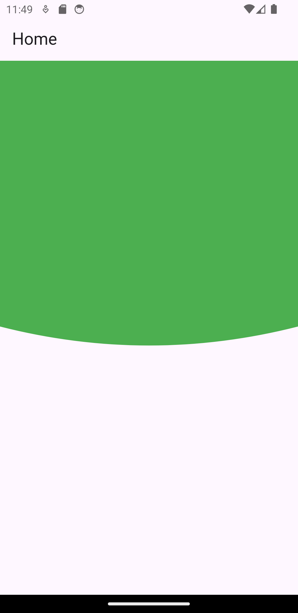

```dart
import 'package:flutter/material.dart';

class HomeScreen extends StatefulWidget {
  final String title;
  const HomeScreen({Key? key, required this.title}) : super(key: key);

  @override
  State<HomeScreen> createState() => _HomeScreenState();
}

class _HomeScreenState extends State<HomeScreen> {

  @override
  Widget build(BuildContext context) {
    return Scaffold(
      appBar: AppBar(
        title: Text(widget.title),
      ),
      body: SingleChildScrollView(
        child: Column(
          children: [
            ClipPath(
              clipper: CustomClipPath(),
              child: Container(
                color: Colors.green,
                height: 400,
              ),
            ),
          ],
        ),
      ),
    );
  }
}

class CustomClipPath extends CustomClipper<Path> {
  @override
  Path getClip(Size size) {
    Path path = Path();
    path.lineTo(0, size.height - 50);
    path.quadraticBezierTo(
        size.width / 2, size.height, size.width, size.height - 50);
    path.lineTo(size.width, 0);
    path.close();
    return path;
  }

  @override
  bool shouldReclip(CustomClipper<Path> oldClipper) => false;
}
```

