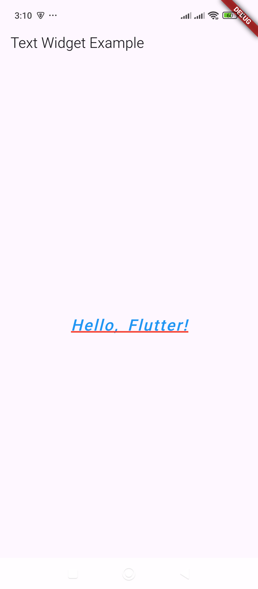

# Text – Displays text with styling options.

Here's an example of using the `Text` widget in Flutter with various styling options:  

### **Basic Example**  
```dart
import 'package:flutter/material.dart';

void main() {
  runApp(MyApp());
}

class MyApp extends StatelessWidget {
  @override
  Widget build(BuildContext context) {
    return MaterialApp(
      home: Scaffold(
        appBar: AppBar(title: Text("Text Widget Example")),
        body: Center(
          child: Text(
            "Hello, Flutter!",
            style: TextStyle(
              fontSize: 24,          // Set text size
              fontWeight: FontWeight.bold,  // Bold text
              color: Colors.blue,     // Text color
              letterSpacing: 2.0,     // Space between letters
              wordSpacing: 5.0,       // Space between words
              fontStyle: FontStyle.italic, // Italic text
              decoration: TextDecoration.underline, // Underline text
              decorationColor: Colors.red, // Color of the underline
              decorationThickness: 2, // Thickness of underline
            ),
          ),
        ),
      ),
    );
  }
}
```

### **Breakdown of Styling Options**  
- **`fontSize`** → Sets the text size.  
- **`fontWeight`** → Controls boldness (`FontWeight.bold`, `FontWeight.w400`, etc.).  
- **`color`** → Sets the text color.  
- **`letterSpacing`** → Adjusts spacing between letters.  
- **`wordSpacing`** → Adjusts spacing between words.  
- **`fontStyle`** → Can be `FontStyle.normal` or `FontStyle.italic`.  
- **`decoration`** → Adds underlines, overlines, or strike-throughs.  
- **`decorationColor`** → Changes the decoration color.  
- **`decorationThickness`** → Controls the thickness of decoration.  

Would you like to see an example with gradients, shadows, or text inside a button? 😊

