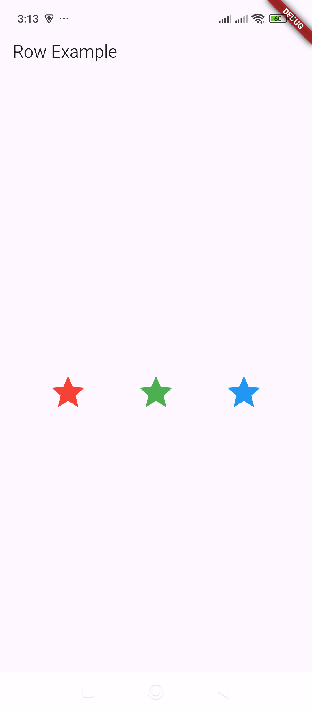
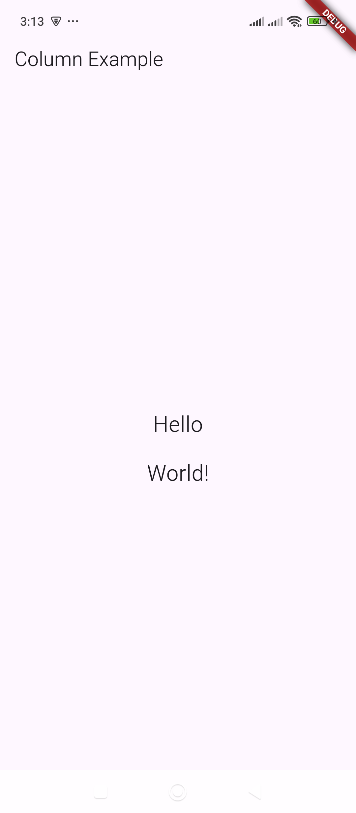
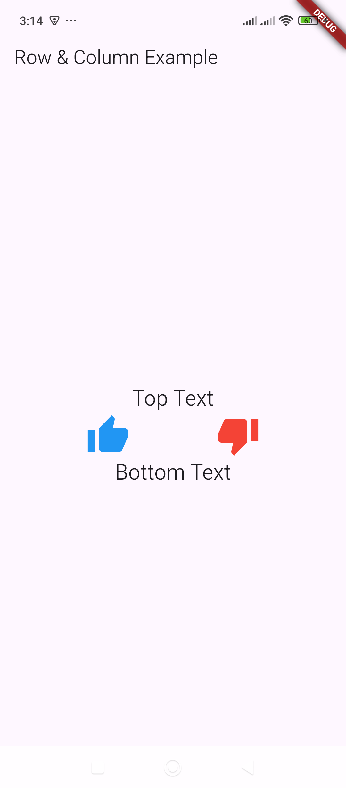

# Row & Column – Arrange children horizontally and vertically.

Here are examples of how to use **Row** and **Column** in Flutter:

---

### **1. Row Example (Horizontal Layout)**
```dart
import 'package:flutter/material.dart';

void main() {
  runApp(MyApp());
}

class MyApp extends StatelessWidget {
  @override
  Widget build(BuildContext context) {
    return MaterialApp(
      home: Scaffold(
        appBar: AppBar(title: Text("Row Example")),
        body: Center(
          child: Row(
            mainAxisAlignment: MainAxisAlignment.spaceEvenly,
            children: [
              Icon(Icons.star, size: 50, color: Colors.red),
              Icon(Icons.star, size: 50, color: Colors.green),
              Icon(Icons.star, size: 50, color: Colors.blue),
            ],
          ),
        ),
      ),
    );
  }
}
```
🔹 **Explanation:**  
- `Row` arranges its children **horizontally**.  
- `mainAxisAlignment: MainAxisAlignment.spaceEvenly` spaces items evenly.  
- Three **Icons** are placed side by side.  


---

### **2. Column Example (Vertical Layout)**
```dart
import 'package:flutter/material.dart';

void main() {
  runApp(MyApp());
}

class MyApp extends StatelessWidget {
  @override
  Widget build(BuildContext context) {
    return MaterialApp(
      home: Scaffold(
        appBar: AppBar(title: Text("Column Example")),
        body: Center(
          child: Column(
            mainAxisAlignment: MainAxisAlignment.center,
            children: [
              Text("Hello", style: TextStyle(fontSize: 24)),
              SizedBox(height: 20),
              Text("World!", style: TextStyle(fontSize: 24)),
            ],
          ),
        ),
      ),
    );
  }
}
```
🔹 **Explanation:**  
- `Column` arranges its children **vertically**.  
- `mainAxisAlignment: MainAxisAlignment.center` centers items.  
- `SizedBox(height: 20)` adds spacing between elements.  


---

### **3. Row & Column Together**
```dart
import 'package:flutter/material.dart';

void main() {
  runApp(MyApp());
}

class MyApp extends StatelessWidget {
  @override
  Widget build(BuildContext context) {
    return MaterialApp(
      home: Scaffold(
        appBar: AppBar(title: Text("Row & Column Example")),
        body: Center(
          child: Column(
            mainAxisAlignment: MainAxisAlignment.center,
            children: [
              Text("Top Text", style: TextStyle(fontSize: 24)),
              Row(
                mainAxisAlignment: MainAxisAlignment.spaceEvenly,
                children: [
                  Icon(Icons.thumb_up, size: 50, color: Colors.blue),
                  Icon(Icons.thumb_down, size: 50, color: Colors.red),
                ],
              ),
              Text("Bottom Text", style: TextStyle(fontSize: 24)),
            ],
          ),
        ),
      ),
    );
  }
}
```
🔹 **Explanation:**  
- **Column** places text above and below.  
- Inside it, a **Row** displays icons side by side.  

Would you like to customize the layout further? 🚀

