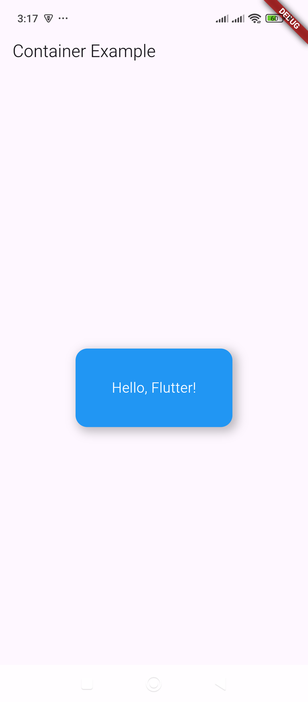

# Container – A versatile box with padding, margin, decoration, and constraints.

Here's a simple example of a `Container` in Flutter:

### Example:
```dart
import 'package:flutter/material.dart';

void main() {
  runApp(MyApp());
}

class MyApp extends StatelessWidget {
  @override
  Widget build(BuildContext context) {
    return MaterialApp(
      home: Scaffold(
        appBar: AppBar(title: Text("Container Example")),
        body: Center(
          child: Container(
            width: 200,
            height: 100,
            padding: EdgeInsets.all(16),
            margin: EdgeInsets.all(20),
            decoration: BoxDecoration(
              color: Colors.blue,
              borderRadius: BorderRadius.circular(15),
              boxShadow: [
                BoxShadow(
                  color: Colors.black26,
                  blurRadius: 10,
                  spreadRadius: 2,
                  offset: Offset(4, 4),
                ),
              ],
            ),
            child: Center(
              child: Text(
                "Hello, Flutter!",
                style: TextStyle(color: Colors.white, fontSize: 18),
              ),
            ),
          ),
        ),
      ),
    );
  }
}
```

### Explanation:
- **`width` & `height`** → Sets the size of the container.
- **`padding`** → Adds space inside the container around its child.
- **`margin`** → Adds space outside the container.
- **`decoration`**:
  - **`color`** → Sets the background color.
  - **`borderRadius`** → Makes the container’s corners rounded.
  - **`boxShadow`** → Adds a shadow effect.
- **`child`** → Contains a centered `Text` widget inside.

#### **Output:**
This creates a blue rounded box with padding, margin, and a shadow, displaying "Hello, Flutter!" in white text.

Would you like a more customized example? 😊

