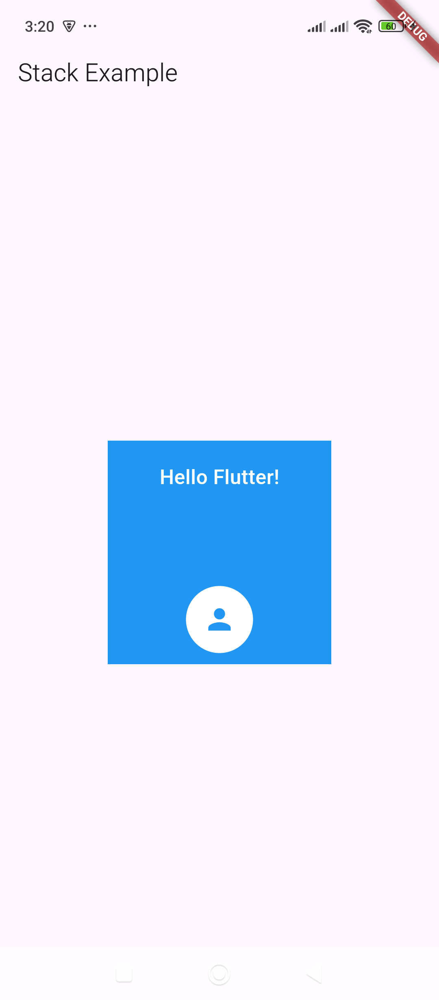

# Stack – Overlays widgets on top of each other.

Here's a simple example of how to use a `Stack` widget in Flutter to overlay widgets on top of each other:  

### **Example: Basic Stack with Positioned Widgets**
```dart
import 'package:flutter/material.dart';

void main() {
  runApp(MyApp());
}

class MyApp extends StatelessWidget {
  @override
  Widget build(BuildContext context) {
    return MaterialApp(
      debugShowCheckedModeBanner: false,
      home: Scaffold(
        appBar: AppBar(title: Text("Stack Example")),
        body: Center(
          child: Stack(
            alignment: Alignment.center,
            children: [
              // Background container
              Container(
                width: 200,
                height: 200,
                color: Colors.blue,
              ),

              // Positioned text on top of the container
              Positioned(
                top: 20,
                child: Text(
                  "Hello Flutter!",
                  style: TextStyle(color: Colors.white, fontSize: 18, fontWeight: FontWeight.bold),
                ),
              ),

              // Circular Avatar on top
              Positioned(
                bottom: 10,
                child: CircleAvatar(
                  radius: 30,
                  backgroundColor: Colors.white,
                  child: Icon(Icons.person, size: 30, color: Colors.blue),
                ),
              ),
            ],
          ),
        ),
      ),
    );
  }
}
```
### **Explanation:**  
1. **`Stack` Widget** – Used to overlay widgets on top of each other.  
2. **Background `Container`** – Acts as the base layer.  
3. **`Positioned` Text** – Placed at the top inside the stack.  
4. **Circular Avatar (`CircleAvatar`)** – Positioned at the bottom.  

### **Output Preview:**  
🟦 Blue box with **"Hello Flutter!"** on top and a **profile icon** at the bottom.

Let me know if you need more variations! 🚀

