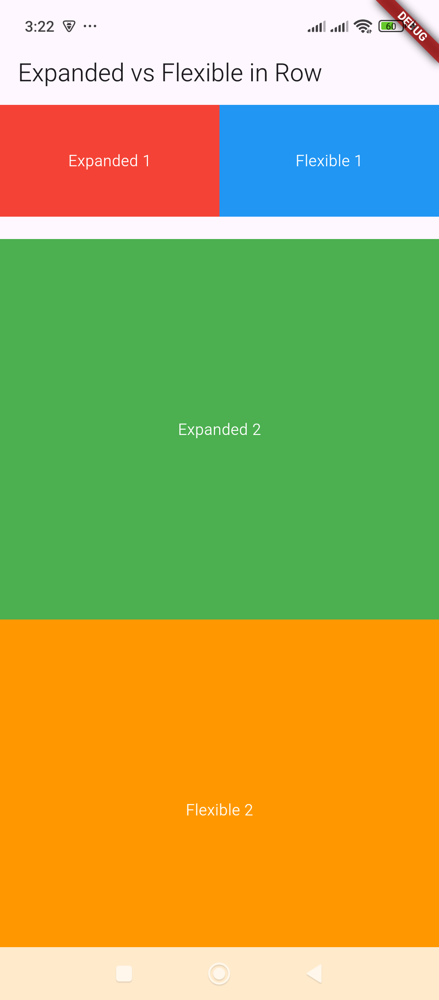

# Expanded & Flexible – Adjust child widgets' sizes within Row and Column.

Here's an example demonstrating how `Expanded` and `Flexible` work inside a `Row` and `Column`:  

---

## 🔹 **Expanded vs. Flexible in Row**  
```dart
import 'package:flutter/material.dart';

void main() {
  runApp(MyApp());
}

class MyApp extends StatelessWidget {
  @override
  Widget build(BuildContext context) {
    return MaterialApp(
      home: Scaffold(
        appBar: AppBar(title: Text("Expanded vs Flexible in Row")),
        body: Column(
          children: [
            // Example using Row
            Row(
              children: [
                Expanded(
                  child: Container(
                    height: 100,
                    color: Colors.red,
                    child: Center(child: Text("Expanded 1", style: TextStyle(color: Colors.white))),
                  ),
                ),
                Flexible(
                  child: Container(
                    height: 100,
                    color: Colors.blue,
                    child: Center(child: Text("Flexible 1", style: TextStyle(color: Colors.white))),
                  ),
                ),
              ],
            ),
            SizedBox(height: 20),

            // Example using Column
            Expanded(
              child: Column(
                children: [
                  Expanded(
                    child: Container(
                      width: double.infinity,
                      color: Colors.green,
                      child: Center(child: Text("Expanded 2", style: TextStyle(color: Colors.white))),
                    ),
                  ),
                  Flexible(
                    child: Container(
                      width: double.infinity,
                      color: Colors.orange,
                      child: Center(child: Text("Flexible 2", style: TextStyle(color: Colors.white))),
                    ),
                  ),
                ],
              ),
            ),
          ],
        ),
      ),
    );
  }
}
```

---

## 🔹 **Differences Between Expanded & Flexible**
1. `Expanded`: Forces the widget to take up all available space within its parent.  
2. `Flexible`: Allows the widget to take up available space but **respects its child's size** if it has a preferred size.  

In the example above:  
- The **first row** has `Expanded` (red) and `Flexible` (blue), so the red box takes up **all** available space, while the blue one only takes the needed space.  
- The **column** shows the same behavior but in a vertical direction.  

Would you like to see any modifications? 😊

