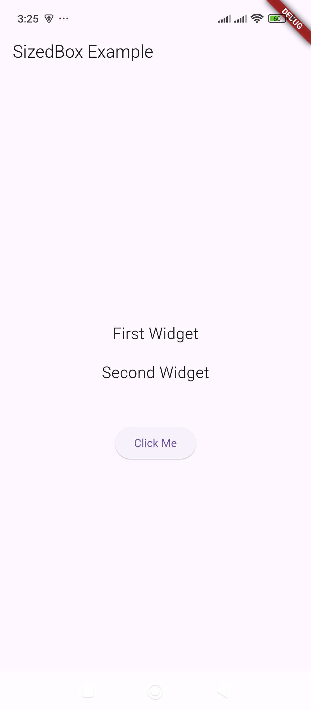

# SizedBox – Provides spacing between widgets.

Here’s an example of how to use `SizedBox` to provide spacing between widgets in Flutter:

### Example:
```dart
import 'package:flutter/material.dart';

void main() {
  runApp(MyApp());
}

class MyApp extends StatelessWidget {
  @override
  Widget build(BuildContext context) {
    return MaterialApp(
      home: Scaffold(
        appBar: AppBar(title: Text('SizedBox Example')),
        body: Center(
          child: Column(
            mainAxisAlignment: MainAxisAlignment.center,
            children: [
              Text('First Widget', style: TextStyle(fontSize: 20)),
              
              // Adding spacing of 20 pixels
              SizedBox(height: 20),

              Text('Second Widget', style: TextStyle(fontSize: 20)),

              // Adding fixed spacing of 50 pixels
              SizedBox(height: 50),

              ElevatedButton(
                onPressed: () {},
                child: Text('Click Me'),
              ),
            ],
          ),
        ),
      ),
    );
  }
}
```

### Explanation:
1. `SizedBox(height: 20)` adds **20 pixels** of vertical space between the first and second text widgets.
2. `SizedBox(height: 50)` adds **50 pixels** of vertical space before the button.
3. `SizedBox(width: 10)` can be used inside a `Row` for horizontal spacing.

Would you like to see more variations? 🚀

