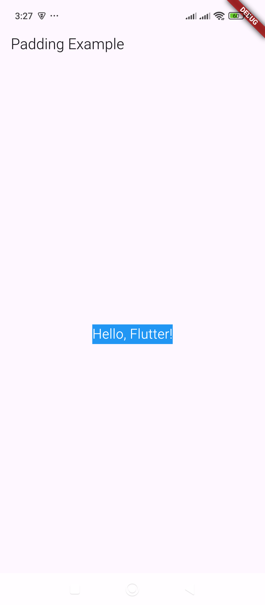

# Padding – Adds spacing inside a widget.

Here’s an example of how to use the `Padding` widget in Flutter:  

### Example: Adding Padding Inside a Container  
```dart
import 'package:flutter/material.dart';

void main() {
  runApp(MyApp());
}

class MyApp extends StatelessWidget {
  @override
  Widget build(BuildContext context) {
    return MaterialApp(
      home: Scaffold(
        appBar: AppBar(title: Text("Padding Example")),
        body: Center(
          child: Padding(
            padding: EdgeInsets.all(20.0), // Adds 20 pixels of padding on all sides
            child: Container(
              color: Colors.blue,
              child: Text(
                "Hello, Flutter!",
                style: TextStyle(color: Colors.white, fontSize: 20),
              ),
            ),
          ),
        ),
      ),
    );
  }
}
```

### Explanation:  
- The `Padding` widget wraps the `Container` and applies **20 pixels** of padding on all sides.  
- The `Container` has a **blue background** with a `Text` widget inside.  
- The text is displayed with a **white color** and **font size of 20**.  

Do you need more variations or custom padding styles? 😊

