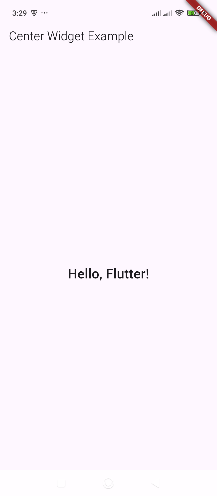

# Center – Centers a widget within its parent.

Here’s a simple example of how to use the `Center` widget in Flutter:  

### Example:
```dart
import 'package:flutter/material.dart';

void main() {
  runApp(MyApp());
}

class MyApp extends StatelessWidget {
  @override
  Widget build(BuildContext context) {
    return MaterialApp(
      home: Scaffold(
        appBar: AppBar(title: Text("Center Widget Example")),
        body: Center(
          child: Text(
            "Hello, Flutter!",
            style: TextStyle(fontSize: 24, fontWeight: FontWeight.bold),
          ),
        ),
      ),
    );
  }
}
```

### Explanation:
- The `Center` widget is used inside the `body` of the `Scaffold`.  
- The `child` of `Center` is a `Text` widget, which will be placed exactly in the middle of the screen.  
- This ensures that whatever widget you place inside `Center` is aligned in the center of its parent.  

Let me know if you need more examples! 🚀

