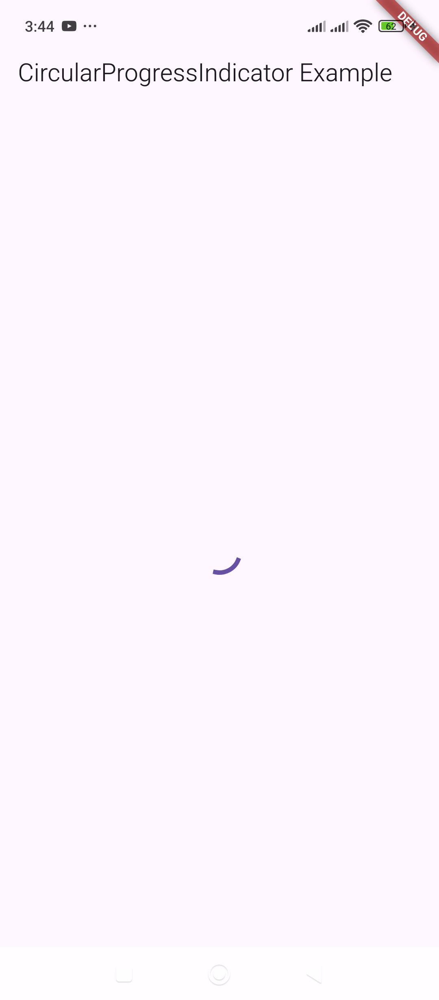
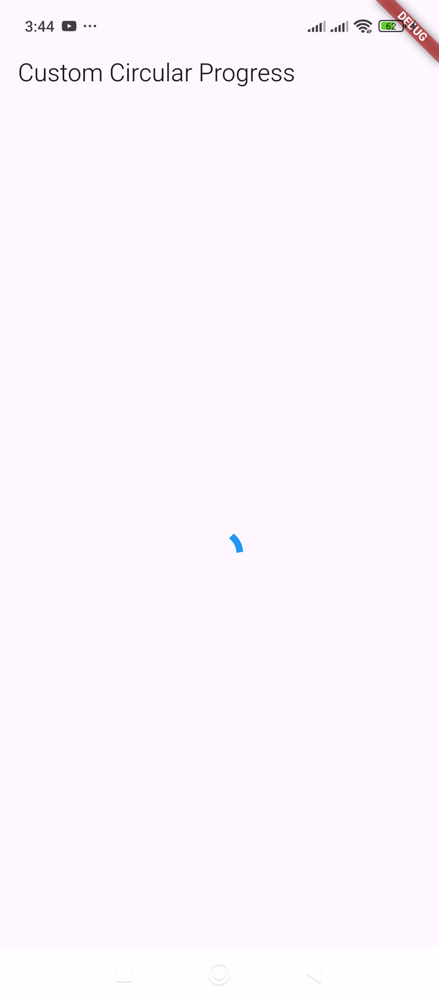
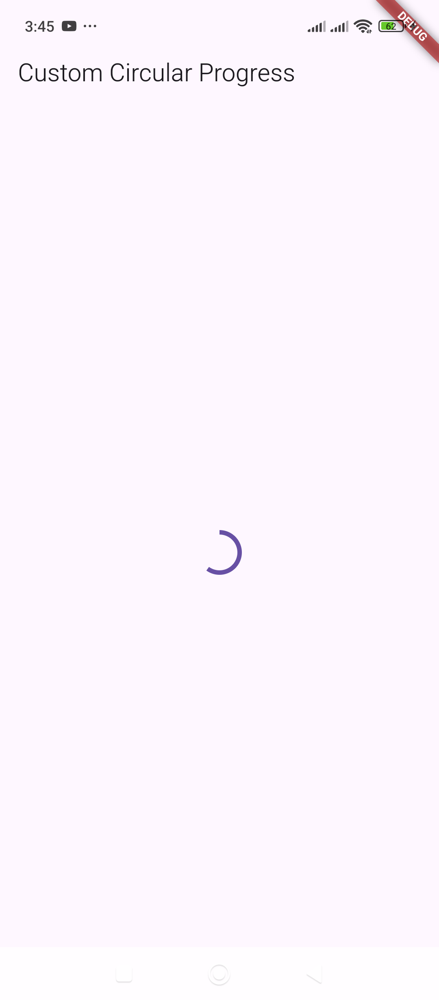
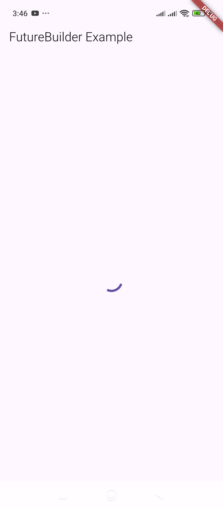
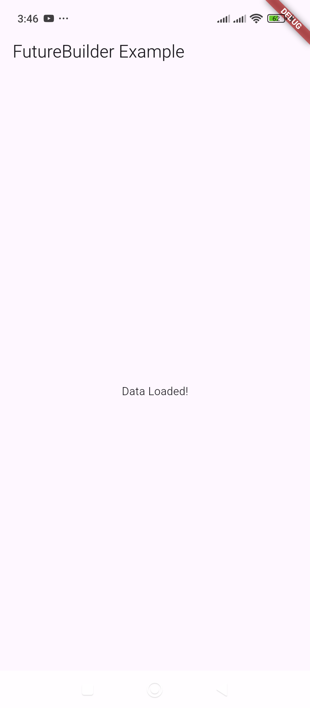

# CircularProgressIndicator – Displays a circular loading spinner.

Here's an example of how to use `CircularProgressIndicator` in Flutter:

### **Basic Example**
```dart
import 'package:flutter/material.dart';

void main() {
  runApp(MyApp());
}

class MyApp extends StatelessWidget {
  @override
  Widget build(BuildContext context) {
    return MaterialApp(
      debugShowCheckedModeBanner: false,
      home: Scaffold(
        appBar: AppBar(title: Text('CircularProgressIndicator Example')),
        body: Center(
          child: CircularProgressIndicator(), // Default spinner
        ),
      ),
    );
  }
}
```

---

### **Customized CircularProgressIndicator**
```dart
import 'package:flutter/material.dart';

void main() {
  runApp(MyApp());
}

class MyApp extends StatelessWidget {
  @override
  Widget build(BuildContext context) {
    return MaterialApp(
      debugShowCheckedModeBanner: false,
      home: Scaffold(
        appBar: AppBar(title: Text('Custom Circular Progress')),
        body: Center(
          child: CircularProgressIndicator(
            valueColor: AlwaysStoppedAnimation<Color>(Colors.blue), // Change color
            strokeWidth: 6.0, // Thickness of the circle
          ),
        ),
      ),
    );
  }
}
```

---

### **Indeterminate vs. Determinate Progress**
#### **Indeterminate (Continuous Spinning)**
```dart
CircularProgressIndicator(); // No value specified, it keeps spinning.
```


#### **Determinate (Fixed Progress)**
```dart
CircularProgressIndicator(value: 0.6); // 60% progress
```


---

### **Using CircularProgressIndicator with FutureBuilder**
```dart
import 'package:flutter/material.dart';
import 'dart:async';

void main() {
  runApp(MyApp());
}

class MyApp extends StatelessWidget {
  Future<String> fetchData() async {
    await Future.delayed(Duration(seconds: 3)); // Simulating network delay
    return "Data Loaded!";
  }

  @override
  Widget build(BuildContext context) {
    return MaterialApp(
      debugShowCheckedModeBanner: false,
      home: Scaffold(
        appBar: AppBar(title: Text('FutureBuilder Example')),
        body: Center(
          child: FutureBuilder<String>(
            future: fetchData(),
            builder: (context, snapshot) {
              if (snapshot.connectionState == ConnectionState.waiting) {
                return CircularProgressIndicator(); // Show loader
              } else if (snapshot.hasError) {
                return Text("Error: ${snapshot.error}");
              } else {
                return Text(snapshot.data ?? "No data");
              }
            },
          ),
        ),
      ),
    );
  }
}
```

Let me know if you need more examples! 🚀


