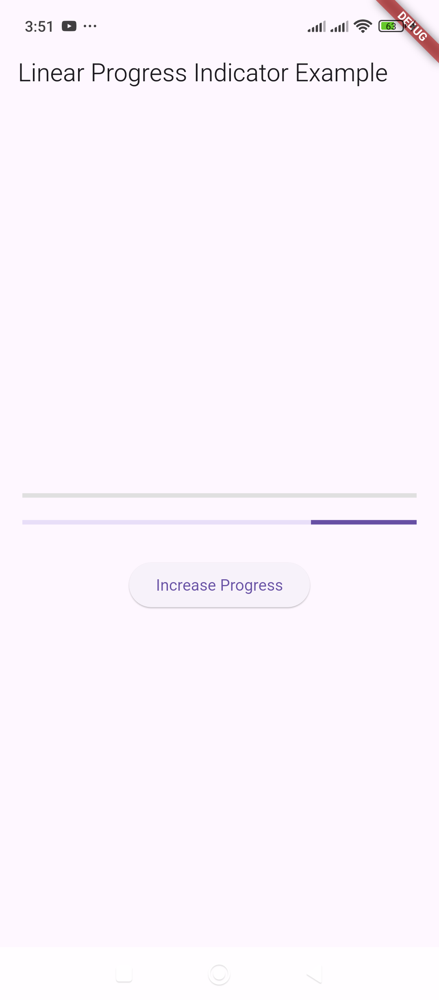

# LinearProgressIndicator – Displays a horizontal loading bar.

Here's an example of how to use `LinearProgressIndicator` in Flutter:

### Example:
```dart
import 'package:flutter/material.dart';

void main() {
  runApp(MyApp());
}

class MyApp extends StatelessWidget {
  @override
  Widget build(BuildContext context) {
    return MaterialApp(
      debugShowCheckedModeBanner: false,
      home: ProgressBarExample(),
    );
  }
}

class ProgressBarExample extends StatefulWidget {
  @override
  _ProgressBarExampleState createState() => _ProgressBarExampleState();
}

class _ProgressBarExampleState extends State<ProgressBarExample> {
  double _progressValue = 0.0;

  void _updateProgress() {
    setState(() {
      _progressValue += 0.1;
      if (_progressValue > 1.0) {
        _progressValue = 0.0; // Reset progress after completion
      }
    });
  }

  @override
  Widget build(BuildContext context) {
    return Scaffold(
      appBar: AppBar(title: Text("Linear Progress Indicator Example")),
      body: Padding(
        padding: EdgeInsets.all(20.0),
        child: Column(
          mainAxisAlignment: MainAxisAlignment.center,
          children: [
            // Determinate Progress Indicator (with progress value)
            LinearProgressIndicator(
              value: _progressValue, // Ranges from 0.0 to 1.0
              backgroundColor: Colors.grey[300],
              valueColor: AlwaysStoppedAnimation<Color>(Colors.blue),
            ),
            SizedBox(height: 20),

            // Indeterminate Progress Indicator (without value)
            LinearProgressIndicator(), // Keeps animating

            SizedBox(height: 30),

            ElevatedButton(
              onPressed: _updateProgress,
              child: Text("Increase Progress"),
            ),
          ],
        ),
      ),
    );
  }
}
```

### Explanation:
1. **Indeterminate `LinearProgressIndicator`** (without `value`)  
   - Continuously animates, useful when the progress duration is unknown.  
2. **Determinate `LinearProgressIndicator`** (with `value`)  
   - Displays a progress percentage from `0.0` to `1.0`.  
   - Clicking the button increases progress, and it resets after reaching `100%`.

Let me know if you need modifications! 🚀

