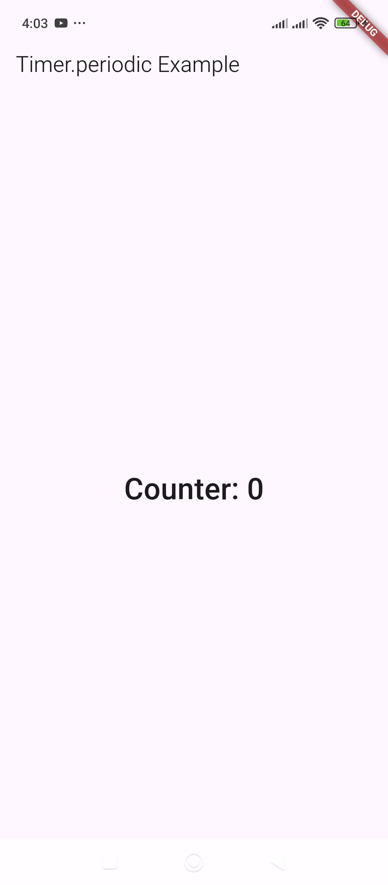
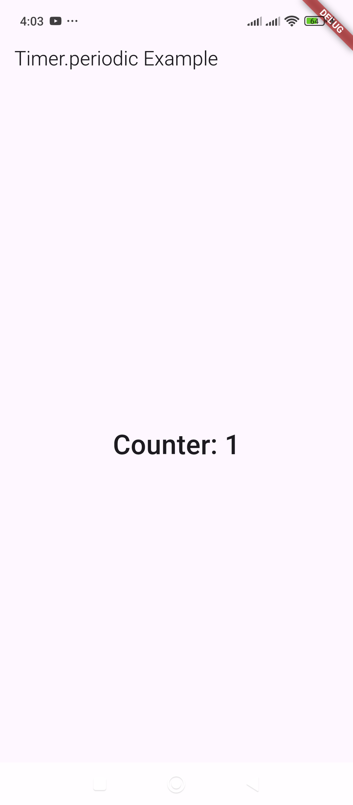

# Timer.periodic – Triggers an event at set intervals.

Here's a **Flutter example** demonstrating how to use `Timer.periodic` to trigger an event at set intervals:  

### **Example: Updating a Counter Every Second**  
This example increments a counter every **one second** using `Timer.periodic`.  

```dart
import 'dart:async';
import 'package:flutter/material.dart';

void main() {
  runApp(MyApp());
}

class MyApp extends StatelessWidget {
  @override
  Widget build(BuildContext context) {
    return MaterialApp(
      debugShowCheckedModeBanner: false,
      home: TimerExample(),
    );
  }
}

class TimerExample extends StatefulWidget {
  @override
  _TimerExampleState createState() => _TimerExampleState();
}

class _TimerExampleState extends State<TimerExample> {
  int _counter = 0;
  Timer? _timer;

  @override
  void initState() {
    super.initState();

    // Start the timer when the widget initializes
    _timer = Timer.periodic(Duration(seconds: 1), (timer) {
      setState(() {
        _counter++; // Increment counter every second
      });
    });
  }

  @override
  void dispose() {
    _timer?.cancel(); // Cancel the timer when the widget is removed
    super.dispose();
  }

  @override
  Widget build(BuildContext context) {
    return Scaffold(
      appBar: AppBar(title: Text("Timer.periodic Example")),
      body: Center(
        child: Text(
          "Counter: $_counter",
          style: TextStyle(fontSize: 30, fontWeight: FontWeight.bold),
        ),
      ),
    );
  }
}
```

### **How It Works:**
1. The timer is created inside `initState()`, calling the callback **every second**.
2. The counter (`_counter`) increments every second.
3. `setState()` updates the UI with the new counter value.
4. The `dispose()` method cancels the timer to prevent memory leaks when the widget is removed.

This approach is useful for **countdowns, animations, periodic API calls, or real-time updates.** 🚀  
Let me know if you need modifications!


