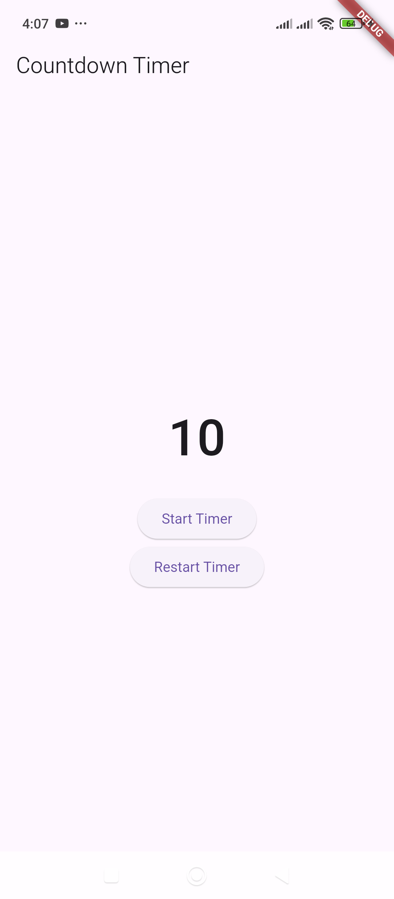
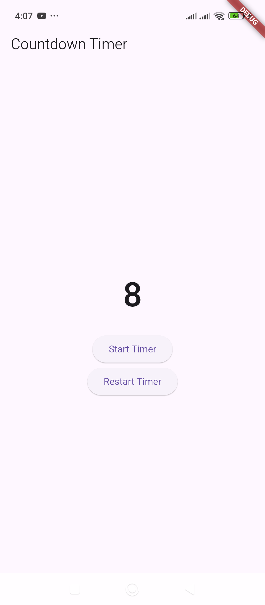

# CountdownTimer – Runs a countdown sequence.

Here’s a simple example of a **Countdown Timer** in Flutter using the `Timer` class from `dart:async`.  

---

### **📌 Features of this Countdown Timer:**
✅ Starts counting down from a given time (e.g., 10 seconds).  
✅ Updates the UI every second.  
✅ Stops automatically at zero.  
✅ Button to restart the countdown.  

---

### **📝 Code Implementation:**
```dart
import 'dart:async';
import 'package:flutter/material.dart';

void main() {
  runApp(CountdownTimerApp());
}

class CountdownTimerApp extends StatelessWidget {
  @override
  Widget build(BuildContext context) {
    return MaterialApp(
      debugShowCheckedModeBanner: false,
      home: CountdownScreen(),
    );
  }
}

class CountdownScreen extends StatefulWidget {
  @override
  _CountdownScreenState createState() => _CountdownScreenState();
}

class _CountdownScreenState extends State<CountdownScreen> {
  int _secondsRemaining = 10; // Change this for a longer countdown
  Timer? _timer;

  void _startTimer() {
    _stopTimer(); // Ensure no previous timer is running

    _timer = Timer.periodic(Duration(seconds: 1), (timer) {
      if (_secondsRemaining > 0) {
        setState(() {
          _secondsRemaining--;
        });
      } else {
        _stopTimer(); // Stop when it reaches zero
      }
    });
  }

  void _stopTimer() {
    if (_timer != null) {
      _timer!.cancel();
      _timer = null;
    }
  }

  void _resetTimer() {
    setState(() {
      _secondsRemaining = 10; // Reset to the initial time
    });
    _startTimer();
  }

  @override
  void dispose() {
    _stopTimer(); // Clean up when widget is disposed
    super.dispose();
  }

  @override
  Widget build(BuildContext context) {
    return Scaffold(
      appBar: AppBar(title: Text("Countdown Timer")),
      body: Center(
        child: Column(
          mainAxisAlignment: MainAxisAlignment.center,
          children: [
            Text(
              "$_secondsRemaining",
              style: TextStyle(fontSize: 50, fontWeight: FontWeight.bold),
            ),
            SizedBox(height: 20),
            ElevatedButton(
              onPressed: _startTimer,
              child: Text("Start Timer"),
            ),
            ElevatedButton(
              onPressed: _resetTimer,
              child: Text("Restart Timer"),
            ),
          ],
        ),
      ),
    );
  }
}
```

---

### **🛠 How It Works:**
1. **`_startTimer()`** → Starts a `Timer.periodic()` that runs every second and decrements `_secondsRemaining`.  
2. **`_stopTimer()`** → Stops the timer when the countdown reaches **0**.  
3. **`_resetTimer()`** → Resets the countdown to **10 seconds** and restarts the timer.  
4. **Automatic Cleanup** → The `dispose()` method ensures the timer stops when the widget is removed.  

---

### **📌 Expected Output:**
- Press **"Start Timer"**, and it will countdown from **10 to 0**.
- Press **"Restart Timer"** to reset and restart the countdown.
- When it reaches **0**, the timer automatically stops.

🚀 **Want to customize it?** Let me know if you need animations, alerts, or additional features! 😊


