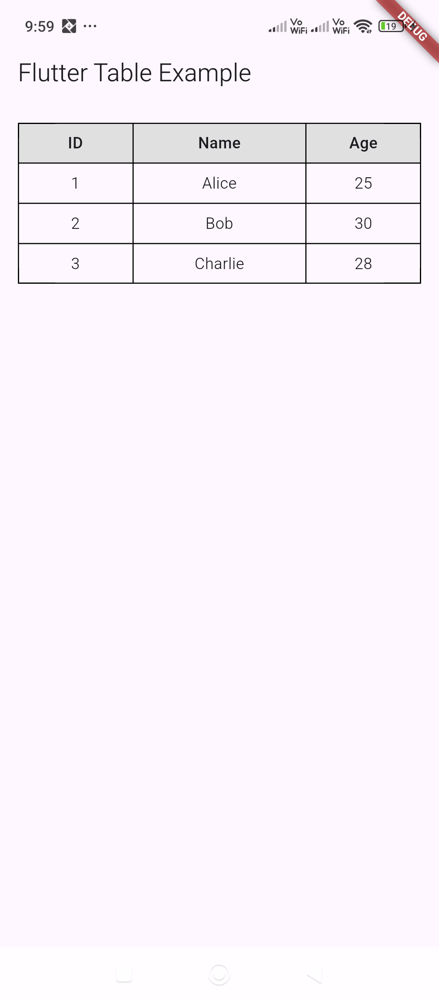

In Flutter, you can create a table with a heading row using the `Table` widget. Here's an example:

```dart
import 'package:flutter/material.dart';

class HomeScreen extends StatefulWidget {

  final String title;

  const HomeScreen({super.key, required this.title});

  @override
  State<HomeScreen> createState() => _HomeScreenState();
}

class _HomeScreenState extends State<HomeScreen> {

  @override
  Widget build(BuildContext context) {
    return Scaffold(
      appBar: AppBar(title: Text("Flutter Table Example")),
      body: Padding(
        padding: EdgeInsets.all(16.0),
        child: Table(
          border: TableBorder.all(),
          columnWidths: {
            0: FlexColumnWidth(2),
            1: FlexColumnWidth(3),
            2: FlexColumnWidth(2),
          },
          children: [
            // Table Header Row
            TableRow(
              decoration: BoxDecoration(color: Colors.grey[300]),
              children: [
                TableCell(
                  child: Padding(
                    padding: EdgeInsets.all(8.0),
                    child: Text(
                      "ID",
                      style: TextStyle(fontWeight: FontWeight.bold),
                      textAlign: TextAlign.center,
                    ),
                  ),
                ),
                TableCell(
                  child: Padding(
                    padding: EdgeInsets.all(8.0),
                    child: Text(
                      "Name",
                      style: TextStyle(fontWeight: FontWeight.bold),
                      textAlign: TextAlign.center,
                    ),
                  ),
                ),
                TableCell(
                  child: Padding(
                    padding: EdgeInsets.all(8.0),
                    child: Text(
                      "Age",
                      style: TextStyle(fontWeight: FontWeight.bold),
                      textAlign: TextAlign.center,
                    ),
                  ),
                ),
              ],
            ),
            // Data Rows
            TableRow(children: [
              tableCell("1"),
              tableCell("Alice"),
              tableCell("25"),
            ]),
            TableRow(children: [
              tableCell("2"),
              tableCell("Bob"),
              tableCell("30"),
            ]),
            TableRow(children: [
              tableCell("3"),
              tableCell("Charlie"),
              tableCell("28"),
            ]),
          ],
        ),
      ),
    );
  }

  Widget tableCell(String text) {
    return Padding(
      padding: EdgeInsets.all(8.0),
      child: Text(
        text,
        textAlign: TextAlign.center,
      ),
    );
  }
}
```

### Explanation:
- The first `TableRow` is used for the **header row** with bold text and a background color.
- The `TableBorder.all()` adds a border around the table.
- `Padding` is used to space out the text inside each `TableCell`.
- The `tableCell` function is a reusable widget to keep the code clean.

Let me know if you need any modifications! 🚀

