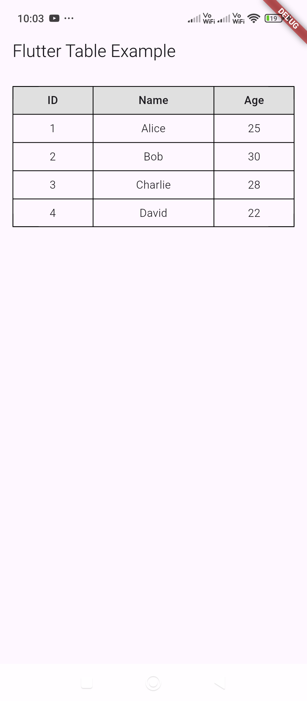

You can use a `List<Map<String, String>>` to store your table data and loop through it dynamically in Flutter. Here's how you can do it:

```dart
import 'package:flutter/material.dart';

class HomeScreen extends StatefulWidget {

  final String title;

  const HomeScreen({super.key, required this.title});

  @override
  State<HomeScreen> createState() => _HomeScreenState();
}

class _HomeScreenState extends State<HomeScreen> {

  final List<Map<String, String>> tableData = [
    {"id": "1", "name": "Alice", "age": "25"},
    {"id": "2", "name": "Bob", "age": "30"},
    {"id": "3", "name": "Charlie", "age": "28"},
    {"id": "4", "name": "David", "age": "22"},
  ];


  @override
  Widget build(BuildContext context) {
    return Scaffold(
      appBar: AppBar(title: Text("Flutter Table Example")),
      body: Padding(
        padding: EdgeInsets.all(16.0),
        child: Table(
          border: TableBorder.all(),
          columnWidths: {
            0: FlexColumnWidth(2),
            1: FlexColumnWidth(3),
            2: FlexColumnWidth(2),
          },
          children: [
            // Table Header Row
            TableRow(
              decoration: BoxDecoration(color: Colors.grey[300]),
              children: [
                tableHeader("ID"),
                tableHeader("Name"),
                tableHeader("Age"),
              ],
            ),
            // Loop through tableData to create rows dynamically
            for (var row in tableData)
              TableRow(children: [
                tableCell(row["id"]!),
                tableCell(row["name"]!),
                tableCell(row["age"]!),
              ]),
          ],
        ),
      ),
    );
  }

  Widget tableHeader(String text) {
    return Padding(
      padding: EdgeInsets.all(8.0),
      child: Text(
        text,
        style: TextStyle(fontWeight: FontWeight.bold),
        textAlign: TextAlign.center,
      ),
    );
  }

  Widget tableCell(String text) {
    return Padding(
      padding: EdgeInsets.all(8.0),
      child: Text(
        text,
        textAlign: TextAlign.center,
      ),
    );
  }
}
```

### Explanation:
- **`tableData`**: A list of maps storing ID, Name, and Age.
- **`for (var row in tableData)`**: Loops through `tableData` to generate rows dynamically.
- **`tableHeader()` and `tableCell()`**: Helper functions to keep the UI clean.
- **Result**: The table grows dynamically based on the `tableData` list.

This approach allows you to manage your data dynamically, and if you add more entries to `tableData`, they will automatically appear in the table.

Let me know if you need any modifications! 🚀

