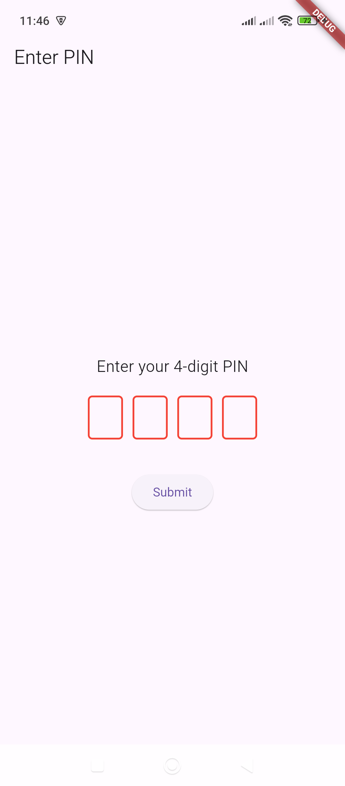
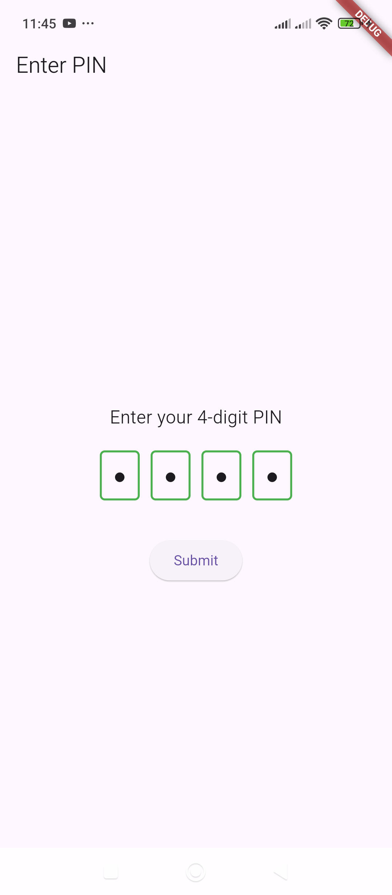

# PinCodeField – Displays a PIN input field.

Here’s a simple **example of a PIN input field** in Flutter using the `pin_code_fields` package.  

### **Step 1: Install the Package**  
Run this command in your terminal:  
```sh
flutter pub add pin_code_fields
```

### **Step 2: Implement the PIN Input Field**  
```dart
import 'package:flutter/material.dart';
import 'package:pin_code_fields/pin_code_fields.dart';

void main() {
  runApp(const MyApp());
}

class MyApp extends StatelessWidget {
  const MyApp({super.key});

  @override
  Widget build(BuildContext context) {
    return MaterialApp(
      debugShowCheckedModeBanner: false,
      home: PinCodeExample(),
    );
  }
}

class PinCodeExample extends StatefulWidget {
  @override
  _PinCodeExampleState createState() => _PinCodeExampleState();
}

class _PinCodeExampleState extends State<PinCodeExample> {
  TextEditingController pinController = TextEditingController();
  String enteredPin = "";

  @override
  Widget build(BuildContext context) {
    return Scaffold(
      appBar: AppBar(title: const Text("Enter PIN")),
      body: Padding(
        padding: const EdgeInsets.all(16.0),
        child: Column(
          mainAxisAlignment: MainAxisAlignment.center,
          children: [
            const Text(
              "Enter your 4-digit PIN",
              style: TextStyle(fontSize: 18),
            ),
            const SizedBox(height: 20),
            
            // PIN Code Field
            PinCodeTextField(
              appContext: context,
              length: 4,
              controller: pinController,
              obscureText: true,
              animationType: AnimationType.fade,
              keyboardType: TextInputType.number,
              pinTheme: PinTheme(
                shape: PinCodeFieldShape.box,
                borderRadius: BorderRadius.circular(5),
                fieldHeight: 50,
                fieldWidth: 40,
                activeFillColor: Colors.blue.shade50,
                inactiveFillColor: Colors.white,
                selectedFillColor: Colors.blue.shade100,
              ),
              onChanged: (value) {
                setState(() {
                  enteredPin = value;
                });
              },
            ),

            const SizedBox(height: 20),

            ElevatedButton(
              onPressed: () {
                if (enteredPin.length == 4) {
                  ScaffoldMessenger.of(context).showSnackBar(
                    SnackBar(content: Text("Entered PIN: $enteredPin")),
                  );
                } else {
                  ScaffoldMessenger.of(context).showSnackBar(
                    const SnackBar(content: Text("Please enter all 4 digits")),
                  );
                }
              },
              child: const Text("Submit"),
            ),
          ],
        ),
      ),
    );
  }
}
```

### **Features in This Example:**
✅ **4-digit PIN input**  
✅ **Obscured text for security**  
✅ **Custom styling (border, color, size)**  
✅ **Validation on button press**  

Would you like any modifications (e.g., 6-digit PIN, different styles)? 🚀


