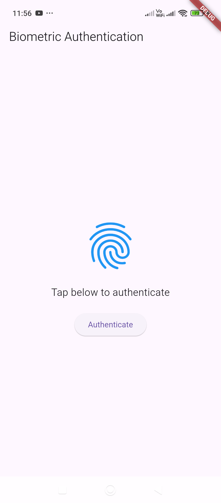

# BiometricAuth – Integrates fingerprint and face unlock.

Here's a **Flutter example** using the `local_auth` package to implement **fingerprint and face unlock** authentication.  

---

### **1️⃣ Install the `local_auth` package**  
Run the following command in your terminal:  
```sh
flutter pub add local_auth
```

---

### **2️⃣ Configure iOS (if applicable)**  
For iOS, update your `ios/Runner/Info.plist` file:  
```xml
<key>NSFaceIDUsageDescription</key>
<string>We use Face ID to authenticate you</string>
```

---

### **3️⃣ Implement Biometric Authentication**
Create a new Flutter screen (`biometric_auth_screen.dart`):  

```dart
import 'package:flutter/material.dart';
import 'package:local_auth/local_auth.dart';

class BiometricAuthScreen extends StatefulWidget {
  @override
  _BiometricAuthScreenState createState() => _BiometricAuthScreenState();
}

class _BiometricAuthScreenState extends State<BiometricAuthScreen> {
  final LocalAuthentication auth = LocalAuthentication();
  bool _isAuthenticated = false;

  Future<void> _authenticate() async {
    try {
      bool authenticated = await auth.authenticate(
        localizedReason: 'Scan your fingerprint or face to authenticate',
        options: const AuthenticationOptions(
          biometricOnly: true,
          stickyAuth: true,
        ),
      );

      setState(() {
        _isAuthenticated = authenticated;
      });

      if (authenticated) {
        ScaffoldMessenger.of(context).showSnackBar(
          const SnackBar(content: Text("Authentication successful!")),
        );
      } else {
        ScaffoldMessenger.of(context).showSnackBar(
          const SnackBar(content: Text("Authentication failed!")),
        );
      }
    } catch (e) {
      print("Error: $e");
      ScaffoldMessenger.of(context).showSnackBar(
        const SnackBar(content: Text("Biometric authentication not available!")),
      );
    }
  }

  @override
  Widget build(BuildContext context) {
    return Scaffold(
      appBar: AppBar(title: const Text("Biometric Authentication")),
      body: Center(
        child: Column(
          mainAxisAlignment: MainAxisAlignment.center,
          children: [
            Icon(
              _isAuthenticated ? Icons.verified : Icons.fingerprint,
              size: 100,
              color: _isAuthenticated ? Colors.green : Colors.blue,
            ),
            const SizedBox(height: 20),
            Text(
              _isAuthenticated
                  ? "Authentication Successful!"
                  : "Tap below to authenticate",
              style: TextStyle(fontSize: 18),
            ),
            const SizedBox(height: 20),
            ElevatedButton(
              onPressed: _authenticate,
              child: const Text("Authenticate"),
            ),
          ],
        ),
      ),
    );
  }
}
```

---

### **4️⃣ Add This Screen to `main.dart`**
Modify `main.dart` to show the BiometricAuthScreen:

```dart
import 'package:flutter/material.dart';
import 'biometric_auth_screen.dart';

void main() {
  runApp(const MyApp());
}

class MyApp extends StatelessWidget {
  const MyApp({Key? key}) : super(key: key);

  @override
  Widget build(BuildContext context) {
    return MaterialApp(
      debugShowCheckedModeBanner: false,
      title: 'Flutter Biometric Auth',
      home: BiometricAuthScreen(),
    );
  }
}
```

---

### **5️⃣ Run the App**
Start your app using:  
```sh
flutter run
```
Now, tap the **Authenticate** button to use **fingerprint or face unlock**.

---

### **🛠 Features in this Example**
✅ Uses `local_auth` for **fingerprint & Face ID**  
✅ Displays an **authentication prompt**  
✅ Shows **success or failure messages**  
✅ Works on **both Android & iOS**  

Let me know if you need enhancements! 🚀🔥

