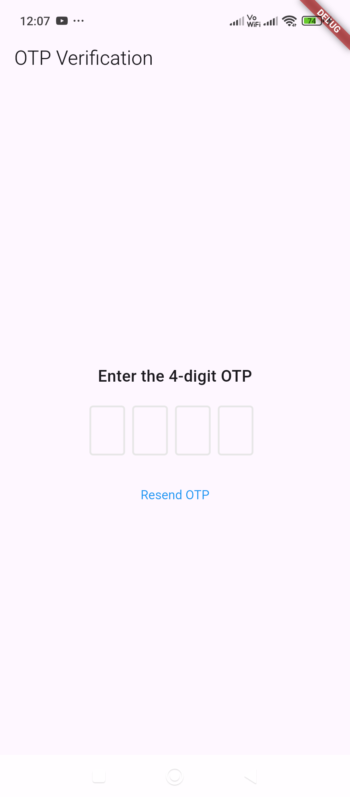
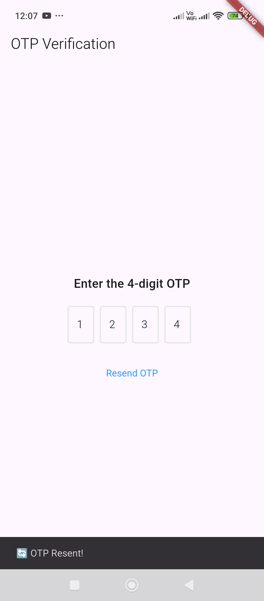

# OneTimePassword – Handles OTP input and validation.

Here's a simple example of an **OTP input and validation** system in Flutter using the `flutter_otp_text_field` package.  

---

### **Steps to Implement:**
1. Install the package:  
   ```sh
   flutter pub add flutter_otp_text_field
   ```
2. Implement the OTP screen in Flutter.  

---

### **Flutter OTP Input & Validation Example**
```dart
import 'package:flutter/material.dart';
import 'package:flutter_otp_text_field/flutter_otp_text_field.dart';

void main() {
  runApp(MyApp());
}

class MyApp extends StatelessWidget {
  @override
  Widget build(BuildContext context) {
    return MaterialApp(
      debugShowCheckedModeBanner: false,
      home: OtpScreen(),
    );
  }
}

class OtpScreen extends StatefulWidget {
  @override
  _OtpScreenState createState() => _OtpScreenState();
}

class _OtpScreenState extends State<OtpScreen> {
  String correctOtp = "1234"; // Example correct OTP

  void verifyOtp(String enteredOtp) {
    if (enteredOtp == correctOtp) {
      ScaffoldMessenger.of(context).showSnackBar(
        SnackBar(content: Text("✅ OTP Verified Successfully!")),
      );
    } else {
      ScaffoldMessenger.of(context).showSnackBar(
        SnackBar(content: Text("❌ Invalid OTP, please try again!")),
      );
    }
  }

  @override
  Widget build(BuildContext context) {
    return Scaffold(
      appBar: AppBar(title: Text("OTP Verification")),
      body: Center(
        child: Padding(
          padding: const EdgeInsets.all(20.0),
          child: Column(
            mainAxisAlignment: MainAxisAlignment.center,
            children: [
              Text("Enter the 4-digit OTP",
                  style: TextStyle(fontSize: 18, fontWeight: FontWeight.bold)),
              SizedBox(height: 20),
              OtpTextField(
                numberOfFields: 4,
                borderColor: Colors.blue,
                showFieldAsBox: true,
                onSubmit: (otp) => verifyOtp(otp), // Validate OTP when submitted
              ),
              SizedBox(height: 20),
              TextButton(
                onPressed: () {
                  ScaffoldMessenger.of(context).showSnackBar(
                    SnackBar(content: Text("🔄 OTP Resent!")),
                  );
                },
                child: Text("Resend OTP", style: TextStyle(color: Colors.blue)),
              ),
            ],
          ),
        ),
      ),
    );
  }
}
```

---

### **How This Works:**
✅ Uses `flutter_otp_text_field` to create a 4-digit OTP input.  
✅ When the user enters the OTP, `onSubmit` verifies it against `correctOtp`.  
✅ Shows a success message if OTP matches, otherwise shows an error.  
✅ Includes a "Resend OTP" button for user convenience.  

---

### **Output:**
📌 Displays an OTP input field.  
📌 Validates the entered OTP on submission.  
📌 Shows success (`✅ OTP Verified Successfully!`) or failure (`❌ Invalid OTP, please try again!`).  

Do you need modifications, like **auto-fetch OTP** from SMS? 🚀



