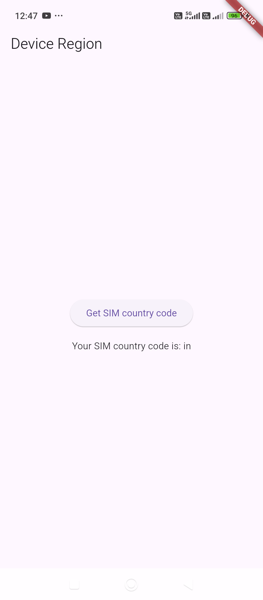

```
https://pub.dev/packages/device_region
```

# `HomeScreen.dart`

```dart
import 'package:device_region/device_region.dart';
import 'package:flutter/material.dart';

class HomeScreen extends StatefulWidget {
  final String title;

  const HomeScreen({super.key, required this.title});

  @override
  State<HomeScreen> createState() => _HomeScreenState();
}

class _HomeScreenState extends State<HomeScreen> {
  String _simRegion = 'Unknown';

  @override
  void initState() {
    super.initState();
    askForSIMCountryCode();
  }

  Future<void> askForSIMCountryCode() async {
    final result = await DeviceRegion.getSIMCountryCode();

    setState(() => _simRegion = result ?? 'Can\'t receive country code');
  }

  @override
  Widget build(BuildContext context) {
    return MaterialApp(
      debugShowCheckedModeBanner: false,
      home: Scaffold(
        appBar: AppBar(
          title: const Text('Device Region'),
        ),
        body: Center(
          child: Column(
            mainAxisAlignment: MainAxisAlignment.center,
            children: [
              ElevatedButton(
                onPressed: askForSIMCountryCode,
                child: const Text('Get SIM country code'),
              ),
              const SizedBox(height: 15),
              Text('Your SIM country code is: $_simRegion\n'),
            ],
          ),
        ),
      ),
    );
  }
}
```

# `main.dart`

```dart
import 'package:flutter/material.dart';
import 'package:untitled/HomeScreen.dart';


void main() async {
  WidgetsFlutterBinding.ensureInitialized();
  runApp(const MyApp());
}

class MyApp extends StatelessWidget {
  const MyApp({super.key});

  // This widget is the root of your application.
  @override
  Widget build(BuildContext context) {
    return MaterialApp(
      home: HomeScreen(title: 'Home',),
    );
  }
}
```

