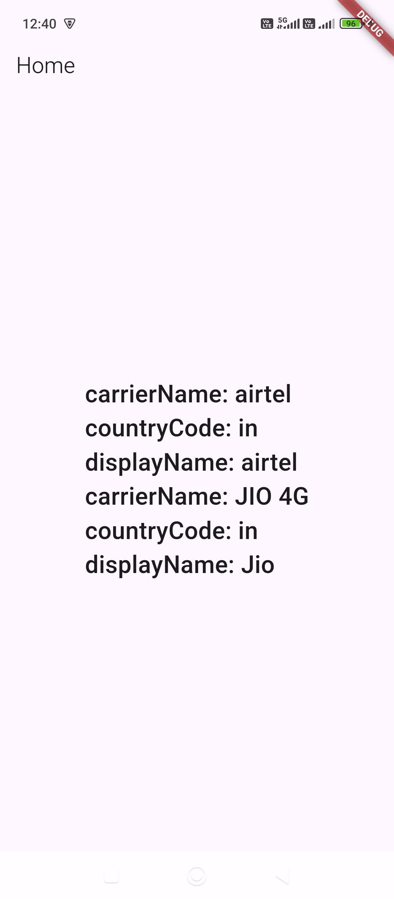

```
https://pub.dev/packages/sim_data
```

# `HomeScreen.dart`

```dart
import 'package:flutter/material.dart';
import 'package:flutter/services.dart';
import 'package:sim_data/sim_data.dart';

class HomeScreen extends StatefulWidget {
  final String title;

  const HomeScreen({super.key, required this.title});

  @override
  State<HomeScreen> createState() => _HomeScreenState();
}

class _HomeScreenState extends State<HomeScreen> {
  String simInfo = "Loading...";

  @override
  void initState() {
    super.initState();
    printSimCardsData();
  }

  Future<void> printSimCardsData() async {
    try {
      SimData simData = await SimDataPlugin.getSimData();

      print(simData.cards.toString());

      String data = "";
      for (var s in simData.cards) {
        data += "carrierName: ${s.carrierName}\n";
        data += "countryCode: ${s.countryCode}\n";
        data += "displayName: ${s.displayName}\n";

        print("carrierName: ${s.carrierName}");
        print("countryCode: ${s.countryCode}");
        print("displayName: ${s.displayName}");
        print("Serial: ${s.serialNumber}");
      }

      setState(() {
        simInfo = data.isEmpty ? "No SIM data found" : data;
      });
    } on PlatformException catch (e) {
      setState(() {
        simInfo = "Error: ${e.message}";
      });
    }
  }

  @override
  Widget build(BuildContext context) {
    return Scaffold(
      appBar: AppBar(
        title: Text(widget.title),
      ),
      body: Center(
        child: Text(simInfo),
      ),
    );
  }
}
```

# `main.dart`

```dart
import 'package:flutter/material.dart';
import 'package:untitled/HomeScreen.dart';


void main() async {
  WidgetsFlutterBinding.ensureInitialized();
  runApp(const MyApp());
}

class MyApp extends StatelessWidget {
  const MyApp({super.key});

  // This widget is the root of your application.
  @override
  Widget build(BuildContext context) {
    return MaterialApp(
      home: HomeScreen(title: 'Home',),
    );
  }
}
```

