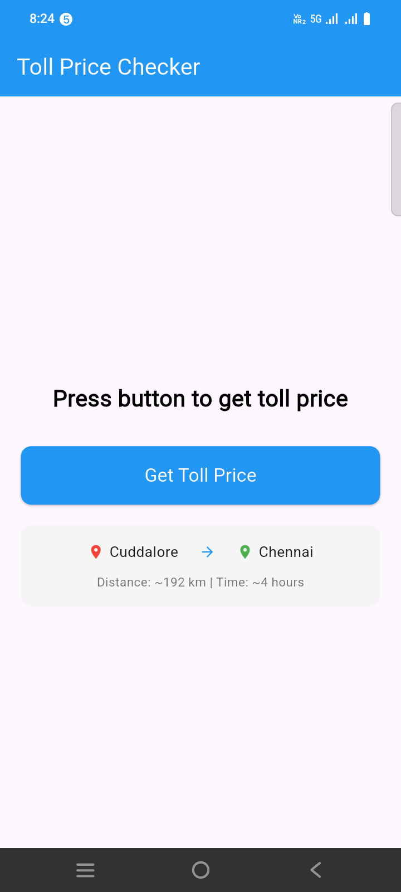
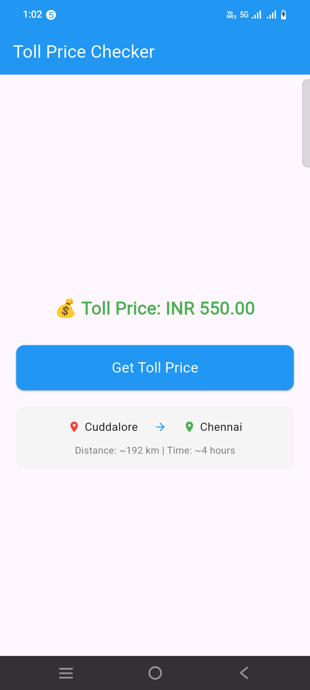

```yaml
geolocator: ^10.1.0
http: any
```

```dart
import 'package:flutter/material.dart';
import 'package:geolocator/geolocator.dart';
import 'package:http/http.dart' as http;
import 'dart:convert';
import 'package:live_order_tracking/config/AppConfig.dart';

class HomeScreen extends StatefulWidget {
  const HomeScreen({super.key});

  @override
  State<HomeScreen> createState() => _HomeScreenState();
}

class _HomeScreenState extends State<HomeScreen> {
  String _tollResult = "Press button to get toll price";
  bool _isLoading = false;

  Future<void> getTollPrice() async {
    final String apiKey = AppConfig.GOOGLE_MAP_API_KEY;

    final Uri url = Uri.parse('https://routes.googleapis.com/directions/v2:computeRoutes');

    final Map<String, String> headers = {
      'Content-Type': 'application/json',
      'X-Goog-Api-Key': apiKey,
      'X-Goog-FieldMask': 'routes.duration,routes.distanceMeters,routes.travelAdvisory.tollInfo',
    };

    final Map<String, dynamic> body = {
      "origin": {
        "location": {
          "latLng": {
            "latitude": 11.7505243,
            "longitude": 79.7492756
          }
        }
      },
      "destination": {
        "location": {
          "latLng": {
            "latitude": 13.088,
            "longitude": 80.278
          }
        }
      },
      "travelMode": "DRIVE",
      "extraComputations": ["TOLLS"],
      "routeModifiers": {
        "vehicleInfo": {
          "emissionType": "GASOLINE"
        },
        // ADD THIS SECTION WITH THE CORRECT PASS ID FOR INDIA
        "tollPasses": [
          "IN_FASTAG" // This is a placeholder; check the docs for the exact ID
        ]
      }
    };

    try {
      final response = await http.post(
        url,
        headers: headers,
        body: jsonEncode(body),
      );

      print("Response Status: ${response.statusCode}");

      if (response.statusCode == 200) {
        final data = jsonDecode(response.body);

        if (data['routes'] != null && data['routes'].isNotEmpty) {
          final route = data['routes'][0];
          final tollInfo = route['travelAdvisory']?['tollInfo'];

          if (tollInfo != null && tollInfo['estimatedPrice'] != null) {
            final prices = tollInfo['estimatedPrice'];

            if (prices.isNotEmpty) {
              final price = prices[0];
              final currency = price['currencyCode'] ?? 'INR';

              // Handle 'units' as String
              dynamic unitsValue = price['units'];
              double tollAmount = 0.0;

              if (unitsValue is String) {
                tollAmount = double.parse(unitsValue);
              } else if (unitsValue is int) {
                tollAmount = unitsValue.toDouble();
              } else if (unitsValue is double) {
                tollAmount = unitsValue;
              }

              // Handle nanos if present
              if (price['nanos'] != null) {
                dynamic nanosValue = price['nanos'];
                double nanos = 0.0;

                if (nanosValue is String) {
                  nanos = double.parse(nanosValue) / 1000000000;
                } else if (nanosValue is int) {
                  nanos = nanosValue / 1000000000;
                } else if (nanosValue is double) {
                  nanos = nanosValue / 1000000000;
                }

                tollAmount += nanos;
              }

              // Format the toll amount
              String formattedAmount = tollAmount.toStringAsFixed(2);

              // Update UI with the toll price using setState
              setState(() {
                _tollResult = "💰 Toll Price: $currency $formattedAmount";
                _isLoading = false;
              });

              print("💰 Toll Price: $currency $formattedAmount");
            } else {
              setState(() {
                _tollResult = "⚠️ No toll prices found";
                _isLoading = false;
              });
            }
          } else {
            setState(() {
              _tollResult = "🛣️ No tolls on this route";
              _isLoading = false;
            });
          }
        } else {
          setState(() {
            _tollResult = "❌ No routes found";
            _isLoading = false;
          });
        }
      } else {
        setState(() {
          _tollResult = "❌ Error: ${response.statusCode}";
          _isLoading = false;
        });
        print("Error: ${response.statusCode}");
        print("Response: ${response.body}");
      }
    } catch (e) {
      setState(() {
        _tollResult = "❌ Exception: $e";
        _isLoading = false;
      });
      print("Exception occurred: $e");
    }
  }

  @override
  Widget build(BuildContext context) {
    return Scaffold(
      appBar: AppBar(
        title: Text("Toll Price Checker"),
        backgroundColor: Colors.blue,
        foregroundColor: Colors.white,
      ),
      body: Center(
        child: Padding(
          padding: const EdgeInsets.all(20.0),
          child: Column(
            mainAxisAlignment: MainAxisAlignment.center,
            children: [
              // Display result with animation
              AnimatedSwitcher(
                duration: Duration(milliseconds: 300),
                child: _isLoading
                    ? Column(
                  children: [
                    CircularProgressIndicator(),
                    SizedBox(height: 20),
                    Text(
                      "Fetching toll information...",
                      style: TextStyle(fontSize: 16, color: Colors.grey[600]),
                    ),
                  ],
                )
                    : Text(
                  _tollResult,
                  key: ValueKey(_tollResult),
                  textAlign: TextAlign.center,
                  style: TextStyle(
                    fontSize: 22,
                    fontWeight: FontWeight.bold,
                    color: _tollResult.contains('💰')
                        ? Colors.green
                        : _tollResult.contains('❌') || _tollResult.contains('⚠️')
                        ? Colors.red
                        : Colors.black,
                  ),
                ),
              ),

              SizedBox(height: 30),

              ElevatedButton(
                style: ElevatedButton.styleFrom(
                  backgroundColor: Colors.blue,
                  foregroundColor: Colors.white,
                  padding: EdgeInsets.symmetric(horizontal: 30, vertical: 15),
                  minimumSize: Size(double.infinity, 50),
                  shape: RoundedRectangleBorder(
                    borderRadius: BorderRadius.circular(10),
                  ),
                ),
                onPressed: _isLoading ? null : () {
                  setState(() {
                    _isLoading = true;
                    _tollResult = "⏳ Loading...";
                  });
                  getTollPrice();
                },
                child: _isLoading
                    ? SizedBox(
                  height: 20,
                  width: 20,
                  child: CircularProgressIndicator(
                    strokeWidth: 2,
                    color: Colors.white,
                  ),
                )
                    : Text(
                  "Get Toll Price",
                  style: TextStyle(fontSize: 18),
                ),
              ),

              SizedBox(height: 20),

              Container(
                padding: EdgeInsets.all(15),
                decoration: BoxDecoration(
                  color: Colors.grey[100],
                  borderRadius: BorderRadius.circular(10),
                ),
                child: Column(
                  children: [
                    Row(
                      mainAxisAlignment: MainAxisAlignment.center,
                      children: [
                        Icon(Icons.location_on, color: Colors.red, size: 16),
                        SizedBox(width: 5),
                        Text(
                          "Cuddalore",
                          style: TextStyle(fontSize: 14),
                        ),
                        SizedBox(width: 20),
                        Icon(Icons.arrow_forward, color: Colors.blue, size: 16),
                        SizedBox(width: 20),
                        Icon(Icons.location_on, color: Colors.green, size: 16),
                        SizedBox(width: 5),
                        Text(
                          "Chennai",
                          style: TextStyle(fontSize: 14),
                        ),
                      ],
                    ),
                    SizedBox(height: 10),
                    Text(
                      "Distance: ~192 km | Time: ~4 hours",
                      style: TextStyle(fontSize: 12, color: Colors.grey[600]),
                    ),
                  ],
                ),
              ),
            ],
          ),
        ),
      ),
    );
  }
}
```

