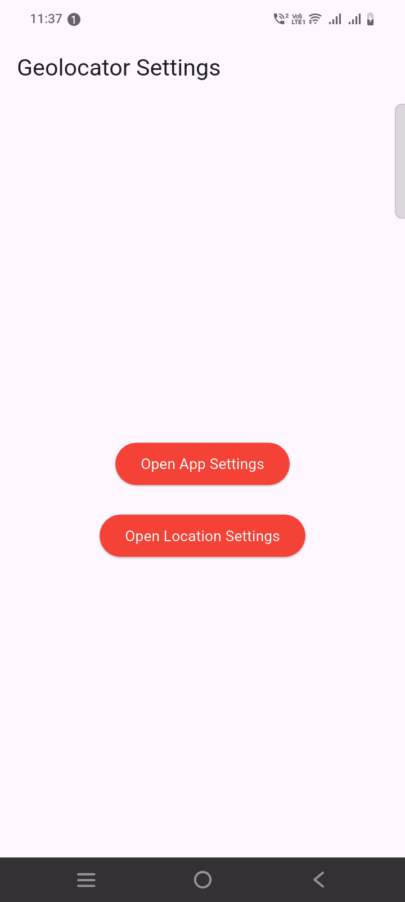

```yaml
geolocator: ^10.1.0
```

```dart
import 'package:flutter/material.dart';
import 'package:geolocator/geolocator.dart';

class HomeScreen extends StatefulWidget {
  const HomeScreen({super.key});

  @override
  State<HomeScreen> createState() => _HomeScreenState();
}

class _HomeScreenState extends State<HomeScreen> {

  @override
  Widget build(BuildContext context) {
    return Scaffold(
      appBar: AppBar(title: Text("Geolocator Settings"),),
      body: Center(
        child: Column(
          mainAxisAlignment: MainAxisAlignment.center,
          children: [
            ElevatedButton(
                style: ElevatedButton.styleFrom(backgroundColor: Colors.red, foregroundColor: Colors.white),
                onPressed: () async {
                  await Geolocator.openAppSettings();
                },
                child: Text("Open App Settings")
            ),
            SizedBox(height: 20,),
            ElevatedButton(
                style: ElevatedButton.styleFrom(backgroundColor: Colors.red, foregroundColor: Colors.white),
                onPressed: () async {
                  await Geolocator.openLocationSettings();
                },
                child: Text("Open Location Settings")
            ),
          ],
        ),
      ),
    );
  }
}
```
