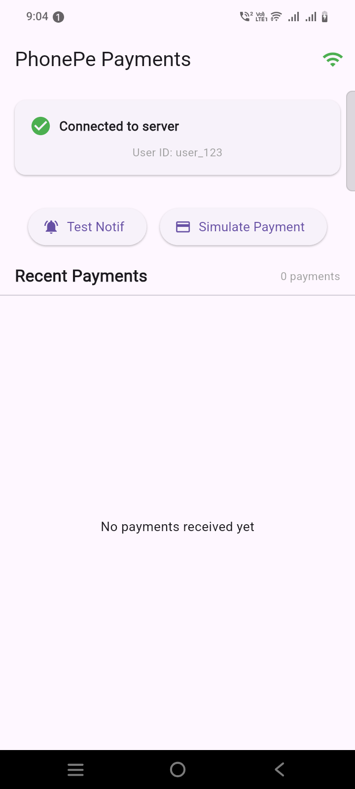
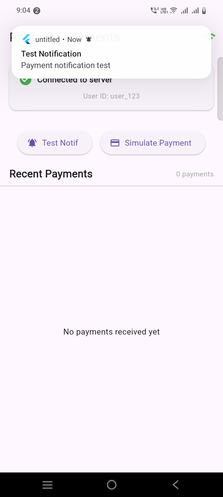
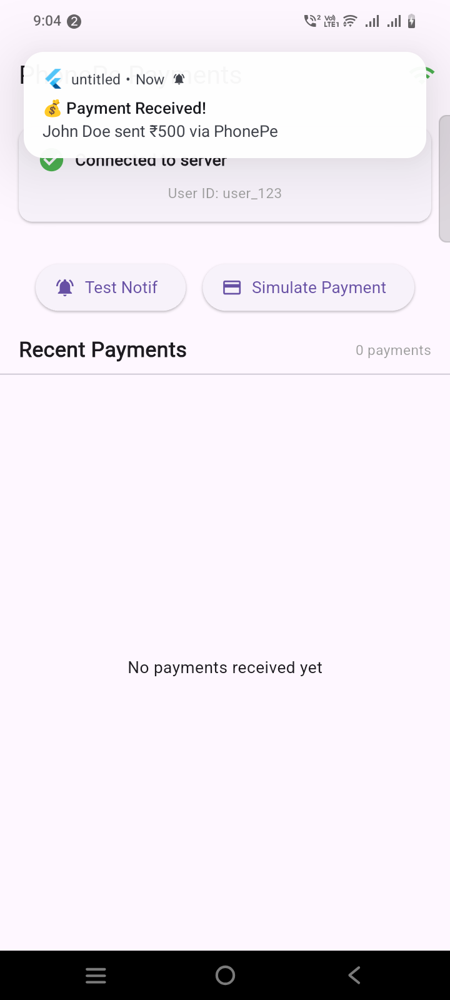
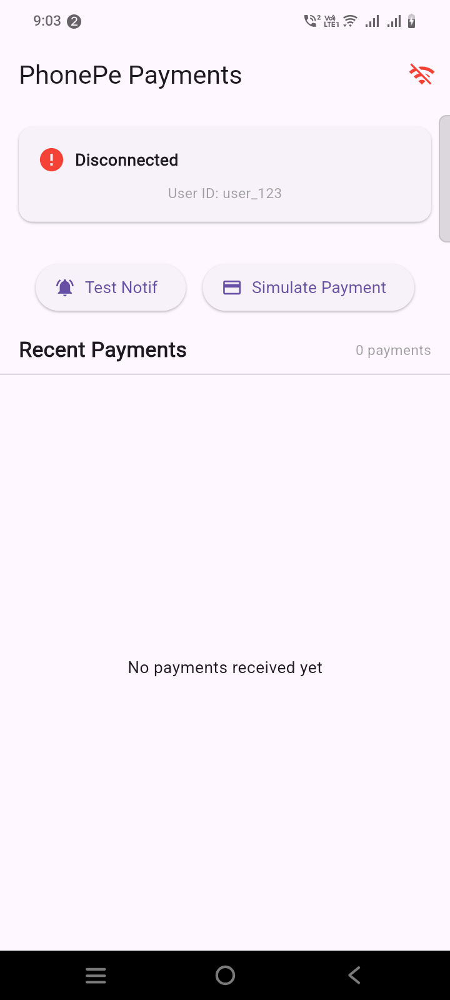

Looking at your code, I can see you're setting up a Flutter app with local notifications. However, I notice you mentioned "Node Server PhonePe Money Received API socket io" in your query but your code shows only local notification setup without any Socket.IO integration.

Let me help you complete your implementation with both **Socket.IO client integration** for real-time PhonePe payment notifications and **local notifications**.

## Complete Implementation

### 1. First, add required dependencies to `pubspec.yaml`:

```yaml
dependencies:
  flutter:
    sdk: flutter
  socket_io_client: ^2.0.3+1
  flutter_local_notifications: ^17.0.0
  permission_handler: ^11.3.0
  provider: ^6.1.1 # Optional, for state management
```

### 2. Updated `NotificationService.dart` with Socket.IO integration:

```dart
import 'package:flutter_local_notifications/flutter_local_notifications.dart';
import 'package:permission_handler/permission_handler.dart';
import 'package:socket_io_client/socket_io_client.dart' as IO;

class NotificationService {
  // Singleton instance
  static final NotificationService _instance = NotificationService._internal();
  factory NotificationService() => _instance;
  NotificationService._internal();

  final _notificationsPlugin = FlutterLocalNotificationsPlugin();
  bool _isInitialized = false;
  IO.Socket? _socket;
  
  // Callback for when payment is received
  Function(Map<String, dynamic>)? onPaymentReceived;

  bool get isInitialized => _isInitialized;

  Future<void> _requestPermissions() async {
    // For Android 13+
    if (await Permission.notification.isDenied) {
      final status = await Permission.notification.request();
      print('Notification permission status: $status');
    }
  }

  // Initialize
  Future<void> initNotification() async {
    if (_isInitialized) return;

    await _requestPermissions();

    const initSettingsAndroid = AndroidInitializationSettings('@mipmap/ic_launcher');
    const initSettingsIOS = DarwinInitializationSettings(
      requestAlertPermission: true,
      requestBadgePermission: true,
      requestSoundPermission: true,
    );

    const initSettings = InitializationSettings(
      android: initSettingsAndroid,
      iOS: initSettingsIOS,
    );

    await _notificationsPlugin.initialize(settings: initSettings);
    _isInitialized = true;
    print('✅ Notification service initialized');
  }

  // Notification Detail Setup
  NotificationDetails notificationDetails() {
    return const NotificationDetails(
      android: AndroidNotificationDetails(
        'payment_channel_id',
        'Payment Notifications',
        channelDescription: 'Real-time payment notifications',
        importance: Importance.max,
        priority: Priority.high,
        enableVibration: true,
        playSound: true,
      ),
      iOS: DarwinNotificationDetails(
        presentAlert: true,
        presentBadge: true,
        presentSound: true,
      ),
    );
  }

  // Show Notification
  Future<void> showNotification({
    int id = 0,
    String? title,
    String? body,
    Map<String, String>? payload,
  }) async {
    try {
      if (!_isInitialized) {
        await initNotification();
      }

      final int notificationId = id == 0
          ? DateTime.now().millisecondsSinceEpoch ~/ 1000
          : id;

      print('📤 Showing notification: $title - $body (ID: $notificationId)');

      await _notificationsPlugin.show(
        notificationId,
        title,
        body,
        notificationDetails(),
        payload: payload?.toString(),
      );

      print('✅ Notification shown successfully');
    } catch (e) {
      print('❌ Error showing notification: $e');
    }
  }

  // ========== SOCKET.IO INTEGRATION ==========
  
  void connectToServer({
    required String serverUrl,
    Map<String, dynamic>? query,
    String? userId,
  }) {
    if (_socket != null && _socket!.connected) {
      print('⚠️ Socket already connected');
      return;
    }

    try {
      print('🔄 Connecting to server: $serverUrl');
      
      // Configure socket options
      _socket = IO.io(serverUrl, <String, dynamic>{
        'transports': ['websocket'],
        'autoConnect': true,
        'query': {
          'userId': userId ?? '',
          ...?query,
        },
        'extraHeaders': {
          'client': 'flutter_app',
          'platform': 'mobile',
        },
      });

      // Connection events
      _socket!.onConnect((_) {
        print('✅ Socket connected successfully');
        
        // Emit join event with user ID
        if (userId != null && userId.isNotEmpty) {
          _socket!.emit('join', {'userId': userId});
        }
      });

      _socket!.onConnectError((error) {
        print('❌ Socket connection error: $error');
      });

      _socket!.onDisconnect((_) {
        print('⚠️ Socket disconnected');
      });

      _socket!.onError((error) {
        print('❌ Socket error: $error');
      });

      // ========== PAYMENT EVENT LISTENERS ==========
      
      // Listen for PhonePe payment received events
      _socket!.on('payment_received', (data) {
        print('💰 Payment Received: $data');
        _handlePaymentReceived(data);
      });

      // Listen for payment status updates
      _socket!.on('payment_status_updated', (data) {
        print('🔄 Payment Status Updated: $data');
        _handlePaymentStatusUpdate(data);
      });

      // Listen for transaction failures
      _socket!.on('transaction_failed', (data) {
        print('❌ Transaction Failed: $data');
        _handleTransactionFailed(data);
      });

      // Connect the socket
      _socket!.connect();

    } catch (e) {
      print('❌ Error connecting to socket server: $e');
    }
  }

  // Handle payment received event
  void _handlePaymentReceived(Map<String, dynamic> data) {
    try {
      // Extract payment details
      final String amount = data['amount']?.toString() ?? '0.00';
      final String transactionId = data['transactionId'] ?? 'N/A';
      final String payerName = data['payerName'] ?? 'Someone';
      final String payerPhone = data['payerPhone'] ?? '';
      final String paymentMode = data['paymentMode'] ?? 'PhonePe';
      final String status = data['status'] ?? 'Success';

      // Show notification
      showNotification(
        title: '💰 Payment Received!',
        body: '$payerName sent ₹$amount via $paymentMode',
        payload: {
          'transactionId': transactionId,
          'amount': amount,
          'payerName': payerName,
        },
      );

      // Call the callback if registered
      if (onPaymentReceived != null) {
        onPaymentReceived!(data);
      }

    } catch (e) {
      print('❌ Error handling payment: $e');
    }
  }

  void _handlePaymentStatusUpdate(Map<String, dynamic> data) {
    // Handle status updates
    final String status = data['status'] ?? 'unknown';
    final String transactionId = data['transactionId'] ?? '';

    if (status == 'Pending') {
      showNotification(
        title: '⏳ Payment Pending',
        body: 'Transaction $transactionId is pending',
      );
    } else if (status == 'Processing') {
      showNotification(
        title: '⏳ Processing Payment',
        body: 'Transaction $transactionId is being processed',
      );
    }
  }

  void _handleTransactionFailed(Map<String, dynamic> data) {
    final String transactionId = data['transactionId'] ?? '';
    final String reason = data['reason'] ?? 'Unknown error';

    showNotification(
      title: '❌ Transaction Failed',
      body: 'Transaction $transactionId failed: $reason',
    );
  }

  // Send acknowledgment to server
  void acknowledgePayment(String transactionId, bool success) {
    if (_socket != null && _socket!.connected) {
      _socket!.emit('payment_acknowledged', {
        'transactionId': transactionId,
        'success': success,
        'timestamp': DateTime.now().toIso8601String(),
      });
    }
  }

  // Disconnect socket
  void disconnect() {
    if (_socket != null) {
      _socket!.disconnect();
      _socket!.dispose();
      _socket = null;
      print('🔌 Socket disconnected');
    }
  }

  // Reconnect socket
  void reconnect() {
    if (_socket != null && !_socket!.connected) {
      _socket!.connect();
      print('🔄 Reconnecting socket...');
    }
  }

  // Check connection status
  bool get isConnected => _socket != null && _socket!.connected;

  // For debugging - check if channel exists
  Future<void> checkChannelExists() async {
    try {
      final bool? exists = await _notificationsPlugin
          .resolvePlatformSpecificImplementation<
              AndroidFlutterLocalNotificationsPlugin>()
          ?.areNotificationsEnabled();
      print('🔔 Notifications enabled: $exists');
    } catch (e) {
      print('❌ Error checking channel: $e');
    }
  }
}
```

### 3. Updated `HomeScreen.dart` with Socket.IO integration:

```dart
import 'package:flutter/material.dart';
import 'package:untitled/NotificationService.dart';

class HomeScreen extends StatefulWidget {
  const HomeScreen({super.key});

  @override
  State<HomeScreen> createState() => _HomeScreenState();
}

class _HomeScreenState extends State<HomeScreen> {
  final NotificationService _notificationService = NotificationService();
  
  // Socket connection details
  final String _serverUrl = 'http://your-node-server.com:3000'; // Replace with your server URL
  final String _userId = 'user_123'; // Replace with actual user ID
  
  bool _isConnected = false;
  List<Map<String, dynamic>> _recentPayments = [];

  @override
  void initState() {
    super.initState();
    _initNotifications();
    _setupSocketCallbacks();
    _connectToServer();
  }

  Future<void> _initNotifications() async {
    await _notificationService.initNotification();
    await _notificationService.checkChannelExists();
  }

  void _setupSocketCallbacks() {
    // Set callback for when payment is received
    _notificationService.onPaymentReceived = (data) {
      setState(() {
        // Add to recent payments list
        _recentPayments.insert(0, {
          'amount': data['amount'] ?? '0',
          'payerName': data['payerName'] ?? 'Unknown',
          'transactionId': data['transactionId'] ?? '',
          'timestamp': DateTime.now(),
        });
        
        // Keep only last 10 payments
        if (_recentPayments.length > 10) {
          _recentPayments.removeLast();
        }
      });
    };
  }

  void _connectToServer() {
    _notificationService.connectToServer(
      serverUrl: _serverUrl,
      userId: _userId,
    );
    
    // Update connection status periodically
    Future.delayed(const Duration(seconds: 2), () {
      setState(() {
        _isConnected = _notificationService.isConnected;
      });
    });
  }

  void _disconnectFromServer() {
    _notificationService.disconnect();
    setState(() {
      _isConnected = false;
    });
  }

  void _reconnectToServer() {
    _notificationService.reconnect();
    Future.delayed(const Duration(seconds: 1), () {
      setState(() {
        _isConnected = _notificationService.isConnected;
      });
    });
  }

  @override
  void dispose() {
    _notificationService.disconnect();
    super.dispose();
  }

  @override
  Widget build(BuildContext context) {
    return Scaffold(
      appBar: AppBar(
        title: const Text('PhonePe Payments'),
        actions: [
          IconButton(
            icon: Icon(
              _isConnected ? Icons.wifi : Icons.wifi_off,
              color: _isConnected ? Colors.green : Colors.red,
            ),
            onPressed: _isConnected ? _disconnectFromServer : _reconnectToServer,
          ),
        ],
      ),
      body: Column(
        children: [
          // Connection status card
          Card(
            margin: const EdgeInsets.all(16),
            child: Padding(
              padding: const EdgeInsets.all(16),
              child: Column(
                children: [
                  Row(
                    children: [
                      Icon(
                        _isConnected ? Icons.check_circle : Icons.error,
                        color: _isConnected ? Colors.green : Colors.red,
                      ),
                      const SizedBox(width: 8),
                      Text(
                        _isConnected ? 'Connected to server' : 'Disconnected',
                        style: const TextStyle(fontWeight: FontWeight.bold),
                      ),
                    ],
                  ),
                  const SizedBox(height: 8),
                  Text(
                    'User ID: $_userId',
                    style: const TextStyle(fontSize: 12, color: Colors.grey),
                  ),
                ],
              ),
            ),
          ),

          // Notification test buttons
          Padding(
            padding: const EdgeInsets.all(16),
            child: Row(
              mainAxisAlignment: MainAxisAlignment.spaceEvenly,
              children: [
                ElevatedButton.icon(
                  onPressed: () {
                    _notificationService.showNotification(
                      title: "Test Notification",
                      body: "Payment notification test",
                    );
                  },
                  icon: const Icon(Icons.notifications_active),
                  label: const Text("Test Notif"),
                ),
                ElevatedButton.icon(
                  onPressed: () {
                    // Simulate payment received
                    _notificationService.showNotification(
                      title: "💰 Payment Received!",
                      body: "John Doe sent ₹500 via PhonePe",
                    );
                  },
                  icon: const Icon(Icons.payment),
                  label: const Text("Simulate Payment"),
                ),
              ],
            ),
          ),

          // Recent payments list
          Padding(
            padding: const EdgeInsets.symmetric(horizontal: 16),
            child: Row(
              mainAxisAlignment: MainAxisAlignment.spaceBetween,
              children: [
                const Text(
                  'Recent Payments',
                  style: TextStyle(fontSize: 18, fontWeight: FontWeight.bold),
                ),
                Text(
                  '${_recentPayments.length} payments',
                  style: const TextStyle(fontSize: 12, color: Colors.grey),
                ),
              ],
            ),
          ),
          const Divider(),
          
          Expanded(
            child: _recentPayments.isEmpty
                ? const Center(
                    child: Text('No payments received yet'),
                  )
                : ListView.builder(
                    itemCount: _recentPayments.length,
                    itemBuilder: (context, index) {
                      final payment = _recentPayments[index];
                      return ListTile(
                        leading: CircleAvatar(
                          backgroundColor: Colors.green[100],
                          child: const Icon(Icons.payment, color: Colors.green),
                        ),
                        title: Text(
                          '₹${payment['amount']} from ${payment['payerName']}',
                          style: const TextStyle(fontWeight: FontWeight.bold),
                        ),
                        subtitle: Text(
                          'Transaction: ${payment['transactionId']}',
                          style: const TextStyle(fontSize: 12, color: Colors.grey),
                        ),
                        trailing: Text(
                          _formatTime(payment['timestamp']),
                          style: const TextStyle(fontSize: 12, color: Colors.grey),
                        ),
                      );
                    },
                  ),
          ),
        ],
      ),
    );
  }

  String _formatTime(dynamic time) {
    if (time == null) return 'Just now';
    final now = DateTime.now();
    final diff = now.difference(time);
    
    if (diff.inSeconds < 60) {
      return 'Just now';
    } else if (diff.inMinutes < 60) {
      return '${diff.inMinutes}m ago';
    } else if (diff.inHours < 24) {
      return '${diff.inHours}h ago';
    } else {
      return '${diff.inDays}d ago';
    }
  }
}
```

### 4. Optional: Create a Payment Service for better organization:

```dart
// payment_service.dart
import 'dart:convert';
import 'package:socket_io_client/socket_io_client.dart' as IO;

class PaymentService {
  IO.Socket? _socket;
  
  void connect({
    required String serverUrl,
    required String userId,
    Function(Map<String, dynamic>)? onPaymentReceived,
    Function(String)? onError,
    Function()? onConnected,
    Function()? onDisconnected,
  }) {
    _socket = IO.io(serverUrl, <String, dynamic>{
      'transports': ['websocket'],
      'autoConnect': true,
      'query': {'userId': userId},
    });

    _socket!.onConnect((_) {
      print('Connected to payment server');
      _socket!.emit('join', {'userId': userId});
      if (onConnected != null) onConnected();
    });

    _socket!.on('payment_received', (data) {
      print('Payment received: $data');
      if (onPaymentReceived != null) {
        onPaymentReceived(data);
      }
    });

    _socket!.onDisconnect((_) {
      print('Disconnected from payment server');
      if (onDisconnected != null) onDisconnected();
    });

    _socket!.onError((error) {
      print('Socket error: $error');
      if (onError != null) onError(error.toString());
    });
  }

  void disconnect() {
    if (_socket != null) {
      _socket!.disconnect();
      _socket!.dispose();
      _socket = null;
    }
  }

  bool get isConnected => _socket != null && _socket!.connected;
}
```

### 5. Node.js Server Example (for reference):

```env
PORT=3000
HOST=192.168.1.211
```

```
npm i express dotenv socket.io
```

```javascript
// server.js
const express = require('express');
const http = require('http');
const socketIo = require('socket.io');

require('dotenv').config();

const app = express();
const server = http.createServer(app);
const io = socketIo(server, {
  cors: {
    origin: "*",
    methods: ["GET", "POST"]
  }
});

// Store connected users
const connectedUsers = new Map();

io.on('connection', (socket) => {
  console.log('New client connected:', socket.id);

  // Handle user join
  socket.on('join', (data) => {
    const { userId } = data;
    connectedUsers.set(userId, socket.id);
    console.log(`User ${userId} joined with socket ${socket.id}`);
    
    // Send initial data if needed
    socket.emit('connected', { status: 'success', userId });
  });

  // Handle payment received from PhonePe webhook
  socket.on('payment_received', (data) => {
    console.log('Payment received event:', data);
    // Broadcast to specific user or all users
    const { userId } = data;
    if (userId && connectedUsers.has(userId)) {
      const targetSocketId = connectedUsers.get(userId);
      io.to(targetSocketId).emit('payment_received', data);
    } else {
      // Broadcast to all connected clients
      io.emit('payment_received', data);
    }
  });

  // Handle payment acknowledgment
  socket.on('payment_acknowledged', (data) => {
    console.log('Payment acknowledged:', data);
    // Process acknowledgment
  });

  socket.on('disconnect', () => {
    // Remove user from connected users
    for (const [userId, socketId] of connectedUsers.entries()) {
      if (socketId === socket.id) {
        connectedUsers.delete(userId);
        console.log(`User ${userId} disconnected`);
        break;
      }
    }
  });
});

// Simulate PhonePe webhook (for testing)
app.post('/webhook/phonepe', (req, res) => {
  const paymentData = {
    userId: 'user_123',
    amount: '500',
    transactionId: 'TXN' + Date.now(),
    payerName: 'John Doe',
    payerPhone: '+919876543210',
    paymentMode: 'PhonePe',
    status: 'Success',
    timestamp: new Date().toISOString()
  };
  
  // Emit to connected clients
  io.emit('payment_received', paymentData);
  res.status(200).json({ status: 'success' });
});

const PORT = process.env.PORT || 3000;
const HOST = process.env.HOST || '0.0.0.0';

server.listen(PORT, () => {
  console.log(`Server is running on http://${HOST}:${PORT}`);
});
```

## Key Features Implemented:

1. **Real-time payment notifications** via Socket.IO
2. **Local push notifications** for payment events
3. **Connection status management**
4. **Recent payments list** in the UI
5. **Automatic reconnection** handling
6. **Permission handling** for Android 13+
7. **Unique notification IDs** to prevent conflicts

## Testing:

1. Start your Node.js server
2. Run the Flutter app
3. Click "Simulate Payment" or trigger webhook from Node.js server
4. You should see both push notification and UI update

Make sure to replace `'http://your-node-server.com:3000'` with your actual Node.js server URL.




