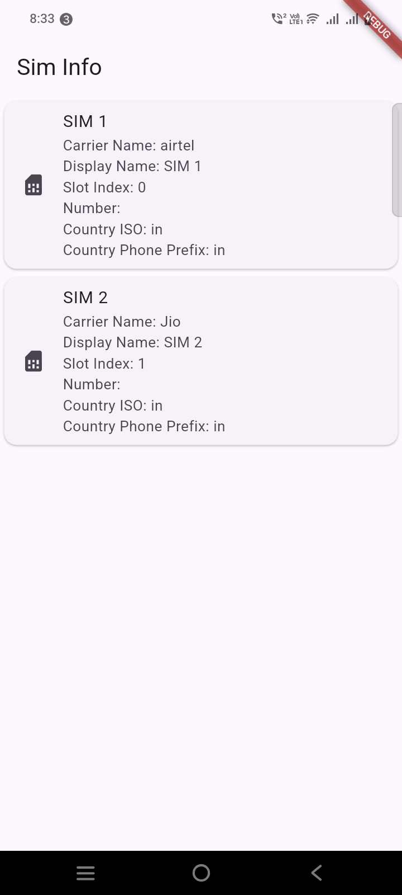

```dart
import 'dart:async';

import 'package:flutter/material.dart';
import 'package:flutter/services.dart';
import 'package:permission_handler/permission_handler.dart';
import 'package:sim_card_info/sim_card_info.dart';
import 'package:sim_card_info/sim_info.dart';

void main() {
  runApp(const MyApp());
}

class MyApp extends StatefulWidget {
  const MyApp({super.key});

  @override
  State<MyApp> createState() => _MyAppState();
}

class _MyAppState extends State<MyApp> {
  List<SimInfo>? _simInfo;
  final _simCardInfoPlugin = SimCardInfo();
  bool isSupported = true;

  @override
  void initState() {
    super.initState();

    initSimInfoState();
  }

  // Platform messages are asynchronous, so we initialize in an async method.
  Future<void> initSimInfoState() async {
    await Permission.phone.request();
    List<SimInfo>? simCardInfo;
    // Platform messages may fail, so we use a try/catch PlatformException.
    // We also handle the message potentially returning null.
    try {
      simCardInfo = await _simCardInfoPlugin.getSimInfo() ?? [];
    } on PlatformException {
      simCardInfo = [];
      setState(() {
        isSupported = false;
      });
    }

    // If the widget was removed from the tree while the asynchronous platform
    // message was in flight, we want to discard the reply rather than calling
    // setState to update our non-existent appearance.
    if (!mounted) return;
    setState(() {
      _simInfo = simCardInfo;
    });
  }

  @override
  Widget build(BuildContext context) {
    return MaterialApp(
      theme: ThemeData(
        colorSchemeSeed: Colors.deepPurple,
        useMaterial3: true,
      ),
      home: Scaffold(
        appBar: AppBar(
          title: const Text('Sim Info'),
        ),
        body: _buildBody(),
      ),
    );
  }

  Widget _buildBody() {
    if (!isSupported) {
      return const Center(
        child: Text('Sim Info not supported'),
      );
    }
    if (_simInfo == null) {
      return const Center(
        child: CircularProgressIndicator(),
      );
    }
    return ListView.builder(
      itemCount: _simInfo?.length ?? 0,
      itemBuilder: (context, index) {
        final simInfo = _simInfo![index];
        return Card(
          child: ListTile(
            onTap: () {
              Navigator.push(
                context,
                MaterialPageRoute(builder: (context) => const SecondPage()),
              );
            },
            leading: const Icon(Icons.sim_card),
            title: Text('SIM ${index + 1}'),
            subtitle: Column(
              crossAxisAlignment: CrossAxisAlignment.start,
              children: [
                Text('Carrier Name: ${simInfo.carrierName}'),
                Text('Display Name: ${simInfo.displayName}'),
                Text('Slot Index: ${simInfo.slotIndex}'),
                Text('Number: ${simInfo.number}'),
                Text('Country ISO: ${simInfo.countryIso}'),
                Text('Country Phone Prefix: ${simInfo.countryPhonePrefix}'),
              ],
            ),
          ),
        );
      },
    );
  }
}

class SecondPage extends StatelessWidget {
  const SecondPage({super.key});

  @override
  Widget build(BuildContext context) {
    return Scaffold(
      body: Center(
        child: ElevatedButton(
          onPressed: () {
            Navigator.pop(context);
          },
          child: const Text('Go back!'),
        ),
      ),
    );
  }
}
```

