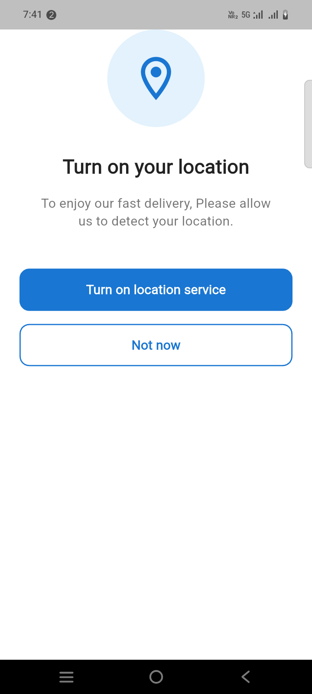
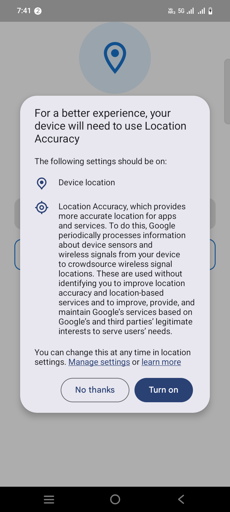
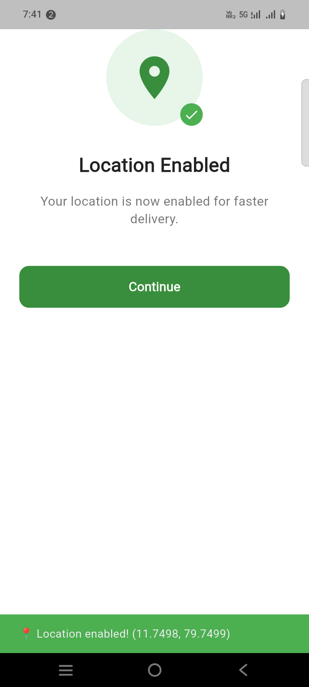

```dart
import 'package:flutter/material.dart';
import 'package:geolocator/geolocator.dart';
import 'package:permission_handler/permission_handler.dart';

class LocationDisclosureScreen extends StatefulWidget {
  const LocationDisclosureScreen({super.key});

  @override
  State<LocationDisclosureScreen> createState() => _LocationDisclosureScreenState();
}

class _LocationDisclosureScreenState extends State<LocationDisclosureScreen> {
  bool _isLoading = false;
  bool _locationEnabled = false;

  @override
  Widget build(BuildContext context) {
    return Scaffold(
      backgroundColor: Colors.white,
      body: SafeArea(
        child: Padding(
          padding: const EdgeInsets.symmetric(horizontal: 24.0),
          child: Column(
            mainAxisAlignment: MainAxisAlignment.center,
            crossAxisAlignment: CrossAxisAlignment.center,
            children: [
              // Location icon with status indicator
              Stack(
                children: [
                  Container(
                    width: 120,
                    height: 120,
                    decoration: BoxDecoration(
                      color: _locationEnabled
                          ? Colors.green.shade50
                          : Colors.blue.shade50,
                      shape: BoxShape.circle,
                    ),
                    child: Icon(
                      _locationEnabled
                          ? Icons.location_on
                          : Icons.location_on_outlined,
                      size: 64,
                      color: _locationEnabled
                          ? Colors.green.shade700
                          : Colors.blue.shade700,
                    ),
                  ),
                  if (_locationEnabled)
                    Positioned(
                      right: 0,
                      bottom: 0,
                      child: Container(
                        padding: const EdgeInsets.all(4),
                        decoration: const BoxDecoration(
                          color: Colors.green,
                          shape: BoxShape.circle,
                        ),
                        child: const Icon(
                          Icons.check,
                          color: Colors.white,
                          size: 20,
                        ),
                      ),
                    ),
                ],
              ),
              const SizedBox(height: 32),
              // Title
              Text(
                _locationEnabled ? 'Location Enabled' : 'Turn on your location',
                style: const TextStyle(
                  fontSize: 24,
                  fontWeight: FontWeight.bold,
                  color: Colors.black87,
                ),
              ),
              const SizedBox(height: 16),
              // Description
              Padding(
                padding: const EdgeInsets.symmetric(horizontal: 16.0),
                child: Text(
                  _locationEnabled
                      ? 'Your location is now enabled for faster delivery.'
                      : 'To enjoy our fast delivery, Please allow us to detect your location.',
                  textAlign: TextAlign.center,
                  style: TextStyle(
                    fontSize: 16,
                    color: Colors.grey.shade600,
                    height: 1.4,
                  ),
                ),
              ),
              const SizedBox(height: 48),
              // Primary button: "Turn on location service" or "Location Enabled"
              if (!_locationEnabled)
                SizedBox(
                  width: double.infinity,
                  height: 52,
                  child: ElevatedButton(
                    onPressed: _isLoading ? null : _enableLocation,
                    style: ElevatedButton.styleFrom(
                      backgroundColor: Colors.blue.shade700,
                      foregroundColor: Colors.white,
                      shape: RoundedRectangleBorder(
                        borderRadius: BorderRadius.circular(12),
                      ),
                      elevation: 0,
                    ),
                    child: _isLoading
                        ? const SizedBox(
                      height: 24,
                      width: 24,
                      child: CircularProgressIndicator(
                        strokeWidth: 2.5,
                        valueColor: AlwaysStoppedAnimation<Color>(
                          Colors.white,
                        ),
                      ),
                    )
                        : const Text(
                      'Turn on location service',
                      style: TextStyle(
                        fontSize: 16,
                        fontWeight: FontWeight.w600,
                      ),
                    ),
                  ),
                )
              else
                SizedBox(
                  width: double.infinity,
                  height: 52,
                  child: ElevatedButton(
                    onPressed: () {
                      // Navigate to next screen or show success
                      ScaffoldMessenger.of(context).showSnackBar(
                        const SnackBar(
                          content: Text('Location enabled successfully!'),
                          backgroundColor: Colors.green,
                        ),
                      );
                    },
                    style: ElevatedButton.styleFrom(
                      backgroundColor: Colors.green.shade700,
                      foregroundColor: Colors.white,
                      shape: RoundedRectangleBorder(
                        borderRadius: BorderRadius.circular(12),
                      ),
                      elevation: 0,
                    ),
                    child: const Text(
                      'Continue',
                      style: TextStyle(
                        fontSize: 16,
                        fontWeight: FontWeight.w600,
                      ),
                    ),
                  ),
                ),
              const SizedBox(height: 16),
              // Secondary button: "Not now" (hide if location is enabled)
              if (!_locationEnabled)
                SizedBox(
                  width: double.infinity,
                  height: 52,
                  child: OutlinedButton(
                    onPressed: _isLoading ? null : () {
                      // Handle "Not now" action
                      Navigator.pop(context);
                    },
                    style: OutlinedButton.styleFrom(
                      foregroundColor: Colors.blue.shade700,
                      side: BorderSide(
                        color: Colors.blue.shade700,
                        width: 1.5,
                      ),
                      shape: RoundedRectangleBorder(
                        borderRadius: BorderRadius.circular(12),
                      ),
                    ),
                    child: const Text(
                      'Not now',
                      style: TextStyle(
                        fontSize: 16,
                        fontWeight: FontWeight.w600,
                      ),
                    ),
                  ),
                ),
              const Spacer(flex: 2),
            ],
          ),
        ),
      ),
    );
  }

  // Method to enable location
  Future<void> _enableLocation() async {
    setState(() {
      _isLoading = true;
    });

    try {
      // Check if location services are enabled
      bool serviceEnabled = await Geolocator.isLocationServiceEnabled();
      if (!serviceEnabled) {
        // Request to enable location services
        serviceEnabled = await Geolocator.openLocationSettings();
        if (!serviceEnabled) {
          // User didn't enable location
          if (mounted) {
            setState(() {
              _isLoading = false;
            });
            _showErrorDialog('Location services are required for this feature.');
          }
          return;
        }
      }

      // Check permission status
      PermissionStatus permissionStatus = await Permission.location.status;
      if (permissionStatus.isDenied) {
        // Request permission
        permissionStatus = await Permission.location.request();
        if (permissionStatus.isDenied) {
          if (mounted) {
            setState(() {
              _isLoading = false;
            });
            _showErrorDialog(
              'Location permission is required. Please enable it in settings.',
            );
          }
          return;
        }
      }

      if (permissionStatus.isPermanentlyDenied) {
        // Permission permanently denied, open app settings
        if (mounted) {
          setState(() {
            _isLoading = false;
          });
          _showPermissionDeniedDialog();
        }
        return;
      }

      // Get current position to confirm location is available
      Position position = await Geolocator.getCurrentPosition(
        desiredAccuracy: LocationAccuracy.high,
      );

      // Location enabled successfully
      if (mounted) {
        setState(() {
          _locationEnabled = true;
          _isLoading = false;
        });

        // Show success message
        ScaffoldMessenger.of(context).showSnackBar(
          SnackBar(
            content: Text(
              '📍 Location enabled! (${position.latitude.toStringAsFixed(4)}, ${position.longitude.toStringAsFixed(4)})',
            ),
            backgroundColor: Colors.green,
            duration: const Duration(seconds: 3),
          ),
        );
      }
    } catch (e) {
      if (mounted) {
        setState(() {
          _isLoading = false;
        });
        _showErrorDialog('Failed to enable location: ${e.toString()}');
      }
    }
  }

  // Error dialog
  void _showErrorDialog(String message) {
    showDialog(
      context: context,
      builder: (BuildContext context) {
        return AlertDialog(
          title: const Text('Error'),
          content: Text(message),
          actions: [
            TextButton(
              onPressed: () {
                Navigator.pop(context);
              },
              child: const Text('OK'),
            ),
          ],
        );
      },
    );
  }

  // Permission permanently denied dialog
  void _showPermissionDeniedDialog() {
    showDialog(
      context: context,
      builder: (BuildContext context) {
        return AlertDialog(
          title: const Text('Permission Required'),
          content: const Text(
            'Location permission is permanently denied. Please enable it from app settings.',
          ),
          actions: [
            TextButton(
              onPressed: () {
                Navigator.pop(context);
              },
              child: const Text('Cancel'),
            ),
            TextButton(
              onPressed: () {
                Navigator.pop(context);
                // Open app settings
                openAppSettings();
              },
              child: const Text('Open Settings'),
            ),
          ],
        );
      },
    );
  }

  @override
  void dispose() {
    super.dispose();
  }
}
```


