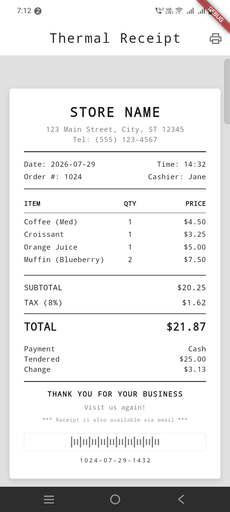
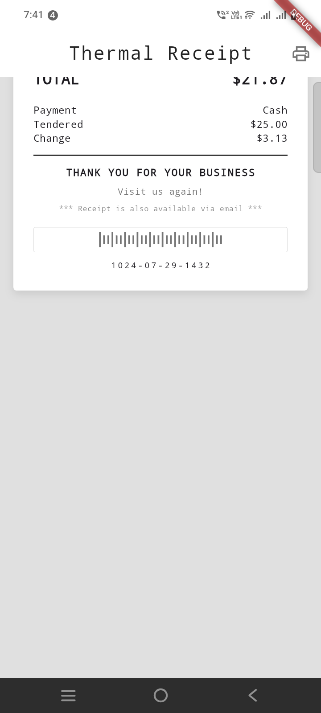

Here's the updated code with only the slide-up animation and printing overlay:

```dart
import 'package:flutter/material.dart';

void main() => runApp(const ThermalReceiptApp());

class ThermalReceiptApp extends StatelessWidget {
  const ThermalReceiptApp({super.key});

  @override
  Widget build(BuildContext context) {
    return MaterialApp(
      title: 'Thermal Receipt',
      theme: ThemeData(
        fontFamily: 'monospace',
        useMaterial3: true,
        brightness: Brightness.light,
      ),
      home: const ReceiptPage(),
    );
  }
}

class ReceiptPage extends StatefulWidget {
  const ReceiptPage({super.key});

  @override
  State<ReceiptPage> createState() => _ReceiptPageState();
}

class _ReceiptPageState extends State<ReceiptPage>
    with SingleTickerProviderStateMixin {
  late AnimationController _controller;
  late Animation<double> _slideAnimation;

  bool _isPrinting = false;

  @override
  void initState() {
    super.initState();
    _controller = AnimationController(
      // duration: const Duration(milliseconds: 800),
      duration: const Duration(milliseconds: 3500),
      vsync: this,
    );

    _slideAnimation = Tween<double>(
      begin: 0,
      // end: -500,
      end: -900,
    ).animate(CurvedAnimation(
      parent: _controller,
      curve: Curves.easeInOut,
    ));

    _controller.addStatusListener((status) {
      if (status == AnimationStatus.completed) {
        Future.delayed(const Duration(milliseconds: 500), () {
          setState(() {
            _isPrinting = false;
          });
          _controller.reset();
        });
      }
    });
  }

  @override
  void dispose() {
    _controller.dispose();
    super.dispose();
  }

  void _printReceipt() {
    if (_isPrinting) return;
    setState(() {
      _isPrinting = true;
    });
    _controller.forward(from: 0);
  }

  @override
  Widget build(BuildContext context) {
    return Scaffold(
      backgroundColor: Colors.grey[300],
      appBar: AppBar(
        backgroundColor: Colors.white,
        elevation: 0,
        title: const Text(
          'Thermal Receipt',
          style: TextStyle(
            fontWeight: FontWeight.w300,
            letterSpacing: 1.5,
            color: Colors.black87,
          ),
        ),
        centerTitle: true,
        actions: [
          IconButton(
            icon: const Icon(Icons.print_outlined, color: Colors.black54),
            onPressed: _printReceipt,
          ),
        ],
      ),
      body: Center(
        child: SingleChildScrollView(
          padding: const EdgeInsets.all(16.0),
          child: Stack(
            alignment: Alignment.center,
            children: [
              // Main container with slide animation
              AnimatedBuilder(
                animation: _controller,
                builder: (context, child) {
                  return Transform.translate(
                    offset: Offset(0, _slideAnimation.value),
                    child: Container(
                      constraints: const BoxConstraints(maxWidth: 400),
                      decoration: BoxDecoration(
                        color: Colors.white,
                        borderRadius: BorderRadius.circular(4),
                        boxShadow: [
                          BoxShadow(
                            color: Colors.black.withOpacity(0.1),
                            blurRadius: 8,
                            offset: const Offset(0, 4),
                          ),
                        ],
                      ),
                      child: const ReceiptContent(),
                    ),
                  );
                },
              ),

              // Loading overlay when printing
              // if (_isPrinting)
              //   Container(
              //     constraints: const BoxConstraints(maxWidth: 400),
              //     height: MediaQuery.of(context).size.height * 0.7,
              //     decoration: BoxDecoration(
              //       color: Colors.white.withOpacity(0.85),
              //       borderRadius: BorderRadius.circular(4),
              //     ),
              //     child: const Column(
              //       mainAxisAlignment: MainAxisAlignment.center,
              //       children: [
              //         SizedBox(
              //           width: 40,
              //           height: 40,
              //           child: CircularProgressIndicator(
              //             strokeWidth: 3,
              //             valueColor: AlwaysStoppedAnimation<Color>(
              //               Colors.black87,
              //             ),
              //           ),
              //         ),
              //         SizedBox(height: 16),
              //         Text(
              //           'Printing...',
              //           style: TextStyle(
              //             fontSize: 16,
              //             color: Colors.black87,
              //             fontWeight: FontWeight.w500,
              //             letterSpacing: 1.2,
              //           ),
              //         ),
              //         SizedBox(height: 8),
              //         Text(
              //           'Please wait',
              //           style: TextStyle(
              //             fontSize: 12,
              //             color: Colors.black54,
              //           ),
              //         ),
              //       ],
              //     ),
              //   ),
            ],
          ),
        ),
      ),
    );
  }
}

class ReceiptContent extends StatelessWidget {
  const ReceiptContent({super.key});

  @override
  Widget build(BuildContext context) {
    return Padding(
      padding: const EdgeInsets.all(24.0),
      child: Column(
        crossAxisAlignment: CrossAxisAlignment.stretch,
        children: [
          // --- Header ---
          const Center(
            child: Text(
              'STORE NAME',
              style: TextStyle(
                fontSize: 22,
                fontWeight: FontWeight.bold,
                letterSpacing: 2,
              ),
            ),
          ),
          const SizedBox(height: 4),
          const Center(
            child: Text(
              '123 Main Street, City, ST 12345',
              style: TextStyle(fontSize: 12, color: Colors.black54),
            ),
          ),
          const Center(
            child: Text(
              'Tel: (555) 123-4567',
              style: TextStyle(fontSize: 12, color: Colors.black54),
            ),
          ),
          const Divider(
            height: 24,
            thickness: 1.5,
            color: Colors.black87,
          ),

          // --- Date & Time ---
          Row(
            mainAxisAlignment: MainAxisAlignment.spaceBetween,
            children: const [
              Text('Date: 2026-07-29', style: TextStyle(fontSize: 12)),
              Text('Time: 14:32', style: TextStyle(fontSize: 12)),
            ],
          ),
          const SizedBox(height: 4),
          Row(
            mainAxisAlignment: MainAxisAlignment.spaceBetween,
            children: const [
              Text('Order #: 1024', style: TextStyle(fontSize: 12)),
              Text('Cashier: Jane', style: TextStyle(fontSize: 12)),
            ],
          ),
          const Divider(
            height: 24,
            thickness: 1.0,
            color: Colors.black87,
          ),

          // --- Column Headers ---
          Padding(
            padding: const EdgeInsets.symmetric(vertical: 4.0),
            child: Row(
              children: const [
                Expanded(
                  flex: 3,
                  child: Text('ITEM',
                      style: TextStyle(
                          fontSize: 11, fontWeight: FontWeight.w600)),
                ),
                Expanded(
                  flex: 1,
                  child: Text('QTY',
                      textAlign: TextAlign.center,
                      style: TextStyle(
                          fontSize: 11, fontWeight: FontWeight.w600)),
                ),
                Expanded(
                  flex: 2,
                  child: Text('PRICE',
                      textAlign: TextAlign.right,
                      style: TextStyle(
                          fontSize: 11, fontWeight: FontWeight.w600)),
                ),
              ],
            ),
          ),
          const Divider(
            height: 8,
            thickness: 0.5,
            color: Colors.black87,
          ),

          // --- Items ---
          _buildItem('Coffee (Med)', '1', '\$4.50'),
          _buildItem('Croissant', '1', '\$3.25'),
          _buildItem('Orange Juice', '1', '\$5.00'),
          _buildItem('Muffin (Blueberry)', '2', '\$7.50'),
          const SizedBox(height: 8),

          // --- Subtotal, Tax, Total ---
          const Divider(
            height: 16,
            thickness: 1.0,
            color: Colors.black87,
          ),
          _buildTotalRow('SUBTOTAL', '\$20.25'),
          _buildTotalRow('TAX (8%)', '\$1.62'),
          const Divider(
            height: 12,
            thickness: 1.0,
            color: Colors.black87,
          ),
          _buildTotalRow('TOTAL', '\$21.87', isBold: true, fontSize: 18.0),

          const SizedBox(height: 12),

          // --- Payment ---
          Row(
            mainAxisAlignment: MainAxisAlignment.spaceBetween,
            children: const [
              Text('Payment', style: TextStyle(fontSize: 12)),
              Text('Cash', style: TextStyle(fontSize: 12)),
            ],
          ),
          Row(
            mainAxisAlignment: MainAxisAlignment.spaceBetween,
            children: const [
              Text('Tendered', style: TextStyle(fontSize: 12)),
              Text('\$25.00', style: TextStyle(fontSize: 12)),
            ],
          ),
          Row(
            mainAxisAlignment: MainAxisAlignment.spaceBetween,
            children: const [
              Text('Change', style: TextStyle(fontSize: 12)),
              Text('\$3.13', style: TextStyle(fontSize: 12)),
            ],
          ),

          const Divider(
            height: 24,
            thickness: 1.5,
            color: Colors.black87,
          ),

          // --- Footer ---
          const Center(
            child: Text(
              'THANK YOU FOR YOUR BUSINESS',
              style: TextStyle(
                fontSize: 12,
                fontWeight: FontWeight.bold,
                letterSpacing: 1.2,
              ),
            ),
          ),
          const SizedBox(height: 6),
          const Center(
            child: Text(
              'Visit us again!',
              style: TextStyle(fontSize: 11, color: Colors.black54),
            ),
          ),
          const SizedBox(height: 6),
          const Center(
            child: Text(
              '*** Receipt is also available via email ***',
              style: TextStyle(fontSize: 9, color: Colors.black45),
            ),
          ),
          const SizedBox(height: 16),

          // --- Barcode placeholder ---
          Container(
            height: 30,
            decoration: BoxDecoration(
              border: Border.all(color: Colors.black12, width: 0.5),
              borderRadius: BorderRadius.circular(2),
            ),
            child: Center(
              child: Row(
                mainAxisAlignment: MainAxisAlignment.center,
                children: List.generate(
                  30,
                      (index) => Container(
                    width: 2,
                    height: index % 3 == 0 ? 18 : 10,
                    color: Colors.black54,
                    margin: const EdgeInsets.symmetric(horizontal: 1.5),
                  ),
                ),
              ),
            ),
          ),
          const SizedBox(height: 8),
          const Center(
            child: Text(
              '1024-07-29-1432',
              style: TextStyle(fontSize: 10, letterSpacing: 2),
            ),
          ),
        ],
      ),
    );
  }

  Widget _buildItem(String name, String qty, String price) {
    return Padding(
      padding: const EdgeInsets.symmetric(vertical: 2.0),
      child: Row(
        crossAxisAlignment: CrossAxisAlignment.start,
        children: [
          Expanded(
            flex: 3,
            child: Text(
              name,
              style: const TextStyle(fontSize: 12),
              overflow: TextOverflow.ellipsis,
            ),
          ),
          Expanded(
            flex: 1,
            child: Text(
              qty,
              textAlign: TextAlign.center,
              style: const TextStyle(fontSize: 12),
            ),
          ),
          Expanded(
            flex: 2,
            child: Text(
              price,
              textAlign: TextAlign.right,
              style: const TextStyle(fontSize: 12),
            ),
          ),
        ],
      ),
    );
  }

  Widget _buildTotalRow(String label, String amount,
      {bool isBold = false, double fontSize = 13.0}) {
    return Padding(
      padding: const EdgeInsets.symmetric(vertical: 3.0),
      child: Row(
        mainAxisAlignment: MainAxisAlignment.spaceBetween,
        children: [
          Text(
            label,
            style: TextStyle(
              fontSize: fontSize,
              fontWeight: isBold ? FontWeight.bold : FontWeight.normal,
            ),
          ),
          Text(
            amount,
            style: TextStyle(
              fontSize: fontSize,
              fontWeight: isBold ? FontWeight.bold : FontWeight.normal,
            ),
          ),
        ],
      ),
    );
  }
}
```

### What Changed:

1. **Removed fade animation** - No more opacity changes
2. **Removed scale animation** - No more shrinking
3. **Kept only slide-up animation** - The receipt simply moves upward
4. **Keep the printing overlay** - Shows "Printing..." with spinner
5. **Simplified the code** - Only `_slideAnimation` remains

Now when you press the print button:
- The receipt slides up smoothly
- The "Printing..." overlay appears on top
- After 1.3 seconds, the receipt resets to its original position
- Ready for the next print action


