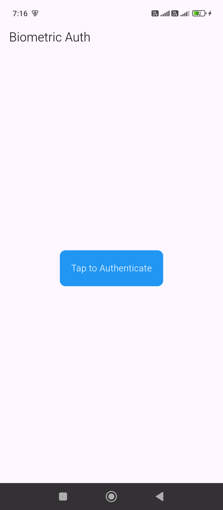
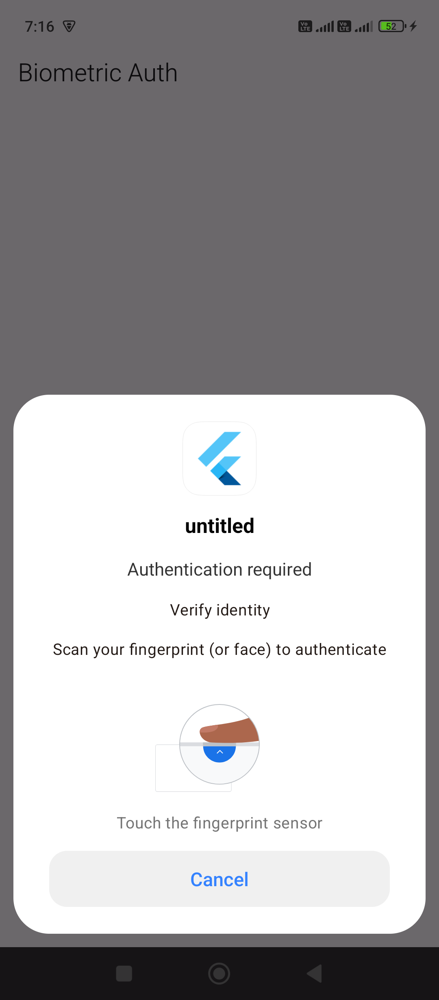
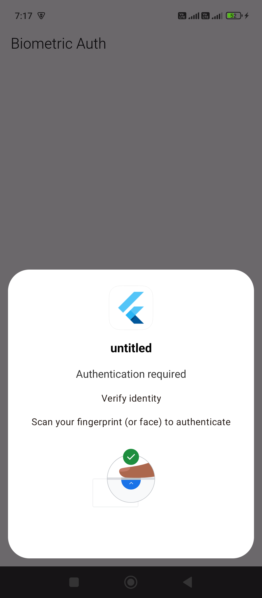

```dart
import 'package:flutter/material.dart';
import 'package:local_auth/local_auth.dart';

class HomeScreen extends StatefulWidget {
  const HomeScreen({super.key});

  @override
  State<HomeScreen> createState() => _HomeScreenState();
}

class _HomeScreenState extends State<HomeScreen> {
  final LocalAuthentication localAuth = LocalAuthentication();

  Future<void> _authenticate() async {
    try {
      bool canCheck = await localAuth.canCheckBiometrics;

      if (!canCheck) {
        _showMessage("Biometric not available");
        return;
      }

      bool authenticated = await localAuth.authenticate(
        localizedReason: 'Scan your fingerprint (or face) to authenticate',
        options: const AuthenticationOptions(
          biometricOnly: true,
          stickyAuth: true,
        ),
      );

      if (authenticated) {
        _showMessage("Authentication Success ✅");
      } else {
        _showMessage("Authentication Failed ❌");
      }
    } catch (e) {
      _showMessage("Error: $e");
      print("Error: $e");
    }
  }

  void _showMessage(String message) {
    ScaffoldMessenger.of(context).showSnackBar(
      SnackBar(content: Text(message)),
    );
  }

  @override
  Widget build(BuildContext context) {
    return Scaffold(
      appBar: AppBar(title: const Text("Biometric Auth")),
      body: SafeArea(
        child: Center(
          child: GestureDetector(
            onTap: _authenticate,
            child: Container(
              padding: const EdgeInsets.all(20),
              decoration: BoxDecoration(
                color: Colors.blue,
                borderRadius: BorderRadius.circular(10),
              ),
              child: const Text(
                "Tap to Authenticate",
                style: TextStyle(color: Colors.white, fontSize: 16),
              ),
            ),
          ),
        ),
      ),
    );
  }
}
```

That error is very specific and common with `local_auth` 👇

> **`no_fragment_activity` → your Android app is not using `FragmentActivity`**

---

## ✅ Why this happens

The `local_auth` plugin requires your `MainActivity` to extend:

👉 `FlutterFragmentActivity`
NOT the default `FlutterActivity`

---

## 🔧 Fix (Very Important)

### 👉 Open this file:

```
android/app/src/main/kotlin/.../MainActivity.kt
```

### ❌ Your current code (probably like this):

```kotlin
import io.flutter.embedding.android.FlutterActivity

class MainActivity: FlutterActivity() {
}
```

---

### ✅ Change it to:

```kotlin
import io.flutter.embedding.android.FlutterFragmentActivity

class MainActivity: FlutterFragmentActivity() {
}
```

---

## 🧠 Why this is needed

* Biometrics (fingerprint/face) use Android fragments internally
* `FlutterActivity` does NOT support fragments
* `FlutterFragmentActivity` does ✅

---

## 🚀 After changing

Run these commands:

```bash
flutter clean
flutter pub get
flutter run
```

---

## ⚠️ If you're using Java instead of Kotlin

Then update:

```
android/app/src/main/java/.../MainActivity.java
```

```java
import io.flutter.embedding.android.FlutterFragmentActivity;

public class MainActivity extends FlutterFragmentActivity {
}
```

---

## ✅ Done

This will fix the error immediately.

---

If you want next-level behavior, I can help you:

* Auto trigger biometric on app open 🔐
* Lock app when minimized
* Add PIN fallback if biometric fails

Just tell 👍



